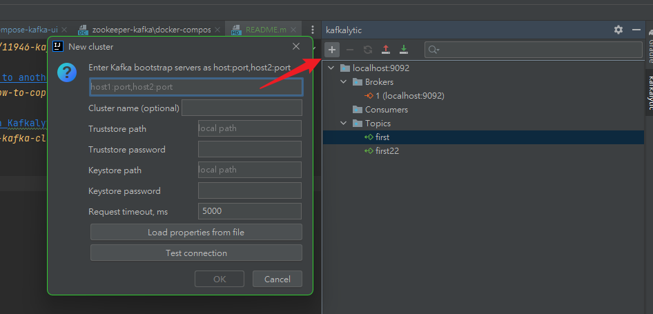

# [intellij Kafkalytic](https://plugins.jetbrains.com/plugin/11946-kafkalytic)

- [Apache Kafka: How to copy messages from one topic/cluster to another with Kafkalytic plugin for IntelliJ IDEA or PyCharm](https://medium.com/@danila.ermakov/apache-kafka-how-to-copy-messages-from-one-topic-cluster-to-another-with-kafkalytic-plugin-for-7d27955ab2d5)
- [How to generate test messages in Apache Kafka cluster with Kafkalytic plugin for IntelliJ IDEA](https://medium.com/@danila.ermakov/how-to-generate-test-messages-in-apache-kafka-cluster-with-kafkalytic-plugin-for-intellij-idea-58cff17adb37)

