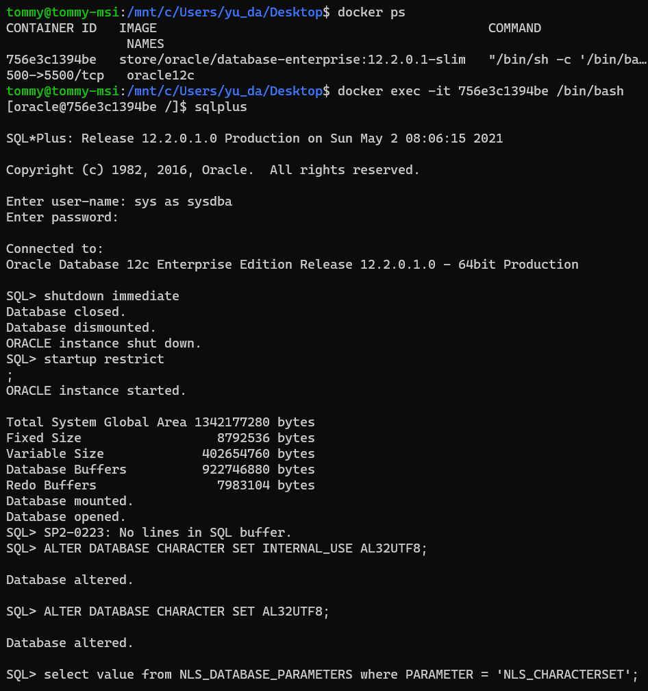
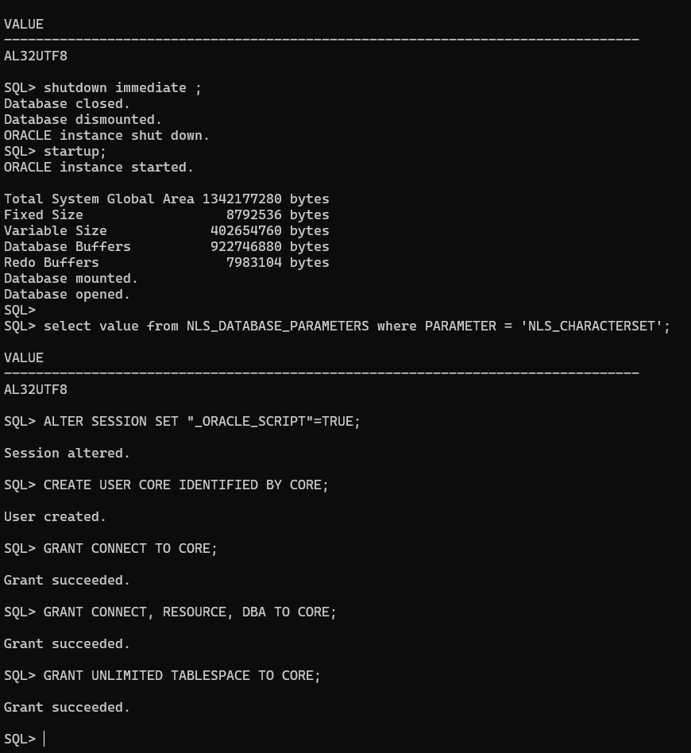
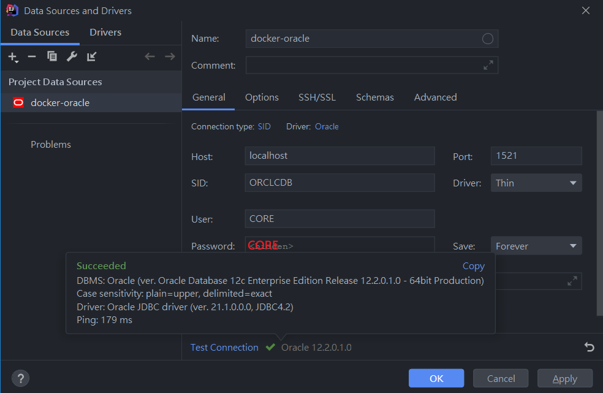

[docker-oracle-12c](https://ithelp.ithome.com.tw/articles/10229655)

## 變更oracle charset





> conn> sqlplus sys as sysdba / Oradoc_db1

```oraclesqlplus
shutdown immediate;
---------------------------------------
startup restrict;
ALTER DATABASE CHARACTER SET INTERNAL_USE AL32UTF8;
ALTER DATABASE CHARACTER SET AL32UTF8;
select value
from NLS_DATABASE_PARAMETERS
where PARAMETER = 'NLS_CHARACTERSET';
shutdown immediate;
---------------------------------------
startup;
select value
from NLS_DATABASE_PARAMETERS
where PARAMETER = 'NLS_CHARACTERSET';
---------------------------------------
ALTER SESSION SET "_ORACLE_SCRIPT"= TRUE;
CREATE USER CORE IDENTIFIED BY CORE;
GRANT CONNECT TO CORE;
GRANT CONNECT, RESOURCE, DBA TO CORE;
GRANT UNLIMITED TABLESPACE TO CORE;

```

## 連線 oracle CORE / CORE 大寫

- 使用者名稱：sys
- 密碼：Oradoc_db1
- 角色：SYSDBA
- SID：ORCLCDB





