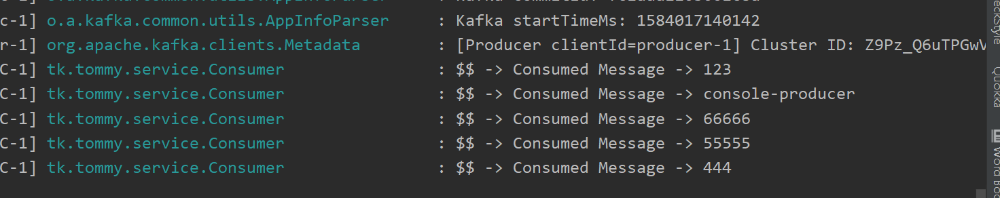

# kafka command
## describe
```shell script
bash-4.4# bin/kafka-topics.sh --describe --topic users --zookeeper zookeeper:2181
Topic:users     PartitionCount:1        ReplicationFactor:1     Configs:
        Topic: users    Partition: 0    Leader: 1001    Replicas: 1001  Isr: 1001

```

## create
```shell script
bash-4.4# bin/kafka-topics.sh --create --zookeeper zookeeper:2181 --topic secound --partitions 2 --replication-factor 3
Error while executing topic command : Replication factor: 3 larger than available brokers: 1.
[2020-03-12 13:07:18,779] ERROR org.apache.kafka.common.errors.InvalidReplicationFactorException: Replication factor: 3 larger than available brokers: 1.
 (kafka.admin.TopicCommand$)

```

## kafka-console-producer.sh
```shell script
bash-4.4# bin/kafka-console-producer.sh --topic users --broker-list localhost:9092
>console-producer
>66666
>55555
>444
>
```



## 重新撈取
```shell script
bash-4.4# bin/kafka-console-consumer.sh --topic users --bootstrap-server localhost:9092 --from-beginning 
123
console-producer
66666
55555
444
```