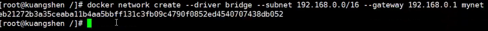

# docker Dockerfile command


[List of Docker Commands](https://phoenixnap.com/kb/list-of-docker-commands-cheat-sheet)


## dockerfile 命令
```shell
 
FROM #基础镜镜像，一切从这里开始构建
MAINTAINER #镜像是谁写的，姓名+邮箱
RUN #镜像构建的时候需要运行的命令
ADD #步骤：tomcat镜像，这个tomcat压缩包！添加内容
WORKDIR #镜像的工作目录
VOLUME #挂载的目录
EXPOSE #保留端口配置
CMD #指定这个容器启动的时候要运行的命令，只有最后一个会生效，可被替代
ENTRYPOINT #指定这个容器启动的时候要运行的命令，可以追加命令
ONBUILD #当构建一个被继承DockerFile这个时候就会运行ONBUILD的指令。触发指令
COPY #类似ADD，将我们文件拷贝到镜像中
ENV #构建的时候设置环境变量

```

docker build --progress=plain -t mycentos .
docker build -t mycentos .

> docker build .

> docker run

> docker push


## docker network
> docker network --help
```shell
Usage:  docker network COMMAND

Manage networks

Commands:
  connect     Connect a container to a network
  create      Create a network
  disconnect  Disconnect a container from a network
  inspect     Display detailed information on one or more networks
  ls          List networks
  prune       Remove all unused networks
  rm          Remove one or more networks

Run 'docker network COMMAND --help' for more information on a command.

```

> docker network create --help
```shell
Usage:  docker network create [OPTIONS] NETWORK

Create a network

Options:
      --attachable           Enable manual container attachment
      --aux-address map      Auxiliary IPv4 or IPv6 addresses used by Network driver (default map[])
      --config-from string   The network from which to copy the configuration
      --config-only          Create a configuration only network
  -d, --driver string        Driver to manage the Network (default "bridge")
      --gateway strings      IPv4 or IPv6 Gateway for the master subnet
      --ingress              Create swarm routing-mesh network
      --internal             Restrict external access to the network
      --ip-range strings     Allocate container ip from a sub-range
      --ipam-driver string   IP Address Management Driver (default "default")
      --ipam-opt map         Set IPAM driver specific options (default map[])
      --ipv6                 Enable IPv6 networking
      --label list           Set metadata on a network
  -o, --opt map              Set driver specific options (default map[])
      --scope string         Control the network's scope
      --subnet strings       Subnet in CIDR format that represents a network segment
```


