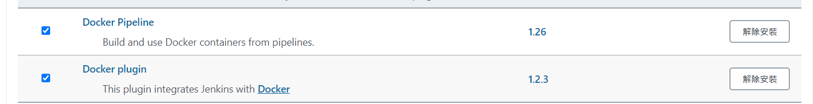

# jenkins

[jenkins github](https://github.com/jenkinsci/docker/blob/master/README.md)

[jenkins 用户文档中心](https://www.jenkins.io/zh/doc/book/pipeline/)

[docker hub](https://hub.docker.com/r/jenkins/jenkins/tags)

[Jenkins Agent Docker image](https://github.com/jenkinsci/docker-agent)

## 

## 

[running-docker-in-docker-on-windows](https://tomgregory.com/running-docker-in-docker-on-windows/)

