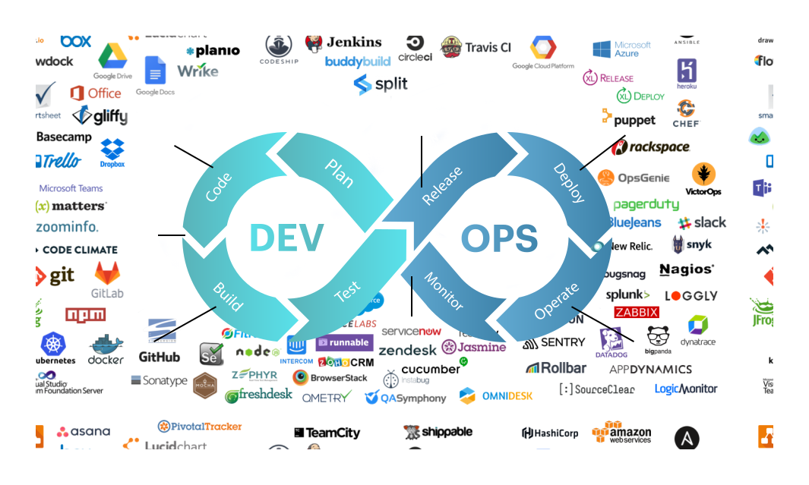

# devops : 練習筆記項目

##### do not click me , this is `Okteto`

[筆記](https://yudady.github.io/)

#### 1\. Continuous Deployment Tools

- [AWS CodeDeploy](https://aws.amazon.com/codedeploy/)
- [Jenkins](https://www.jenkins.io/)
- [Octopus Deploy](https://octopus.com/)
- [TeamCity](https://www.jetbrains.com/teamcity/)
- [GitLab](https://about.gitlab.com/)
- [DeployBot](https://deploybot.com/)

#### 2\. Continuous Integration Tools

- [Bamboo](https://www.atlassian.com/software/bamboo)
- [Buddy](https://buddy.works/)
- [Circle CI](https://circleci.com/)
- [Travis CI](https://travis-ci.org/)
- [Bit Bucket](https://bitbucket.org/)
- [Microsoft Azure](https://azure.microsoft.com/en-us/)

#### 3\. Test Automation Tools

- [Kobiton](https://kobiton.com/)
- [Katalon Studio](https://www.katalon.com/)
- [Selenium](https://www.selenium.dev/)
- [UFT](https://www.microfocus.com/en-us/products/uft-one/overview)
- [TestComplete](https://smartbear.com/product/testcomplete/overview/)
- [LambdaTest](https://www.lambdatest.com/)
- [TestProject](https://testproject.io/)

#### 4\. Monitoring Tools in DevOps

- [Raygun](https://raygun.com/)
- [Nagios](https://www.nagios.org/)
- [StatusPage](https://www.atlassian.com/software/statuspage)
- [Splunk](https://www.splunk.com/)
- [Prometheus](https://prometheus.io/)
- [AppDynamics](https://www.appdynamics.com/)

#### 5\. Continuous Feedback Tools

- [GetFeedback](https://www.getfeedback.com/en/)
- [Pendo](https://www.pendo.io/)
- [Jira Service Management](https://www.atlassian.com/software/jira/service-management)

#### 6\. DevOps Deployment Tools

- [UrbanCode Deploy](https://www.ibm.com/cloud/urbancode?)
- [DeployBot](https://deploybot.com/)
- [Codenvy](https://developers.redhat.com/products/codeready-workspaces/overview)
- [GoCD](https://www.gocd.org/)
- [Automic](https://www.broadcom.com/)

#### 7\. Configuration Management Tool

- [CFEngine](https://cfengine.com/)
- [Chef](https://www.chef.io/)
- [Puppet](https://puppet.com/)
- [Salt](https://www.vmware.com/support/acquisitions/saltstack.html)
- [Ansible](https://www.ansible.com/)

#### 8\. Version Control Tools

- [Git](https://git-scm.com/)
- [CVS](https://www.nongnu.org/cvs/)
- [SVN](https://subversion.apache.org/)
- [Mercurial](https://www.mercurial-scm.org/)
- [Monotone](https://www.monotone.ca/)

#### 9\. Azure DevOps Tools

- [Azure Kubernetes Services (AKS)](https://azure.microsoft.com/en-in/services/kubernetes-service/)
- [Visual Studio](https://azure.microsoft.com/en-in/products/visual-studio/)
- [Azure Pipeline](https://azure.microsoft.com/en-in/services/devops/pipelines/)
- [GitHub](https://azure.microsoft.com/en-in/products/github/)
- [Azure Monitor](https://azure.microsoft.com/en-in/services/monitor/)
- [Azure Boards](https://azure.microsoft.com/en-in/services/devops/boards/)

#### 10\. DevOps Automation Tools

- [Gradle](https://gradle.org/)
- [Docker](https://www.docker.com/)
- [ELK](https://www.elastic.co/what-is/elk-stack)
- [Terraform](https://www.terraform.io/)
- [Vagrant](https://www.vagrantup.com/)
- [Kubernetes](https://kubernetes.io/)
- [OverOps](https://www.overops.com/)

## 起動 mkdocs-live-reload

> mkdocs serve

## my free domain

* yudady.ml
* yudady.cf
* yudady.gq

