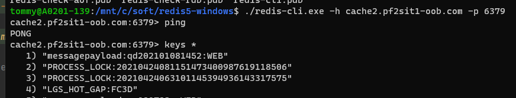
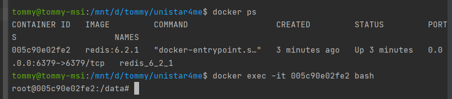
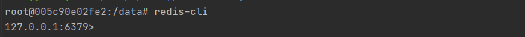
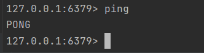

# command

## [RedisDesktopManager windows gui client](https://drive.google.com/drive/u/0/folders/1QRF9ysVsaqnKIa_0QFoERKXFU0Krqx4_)

```shell
redis-cli.exe -h cache2.pf2sit1-oob.com -p 6379
`````



```shell
docker exec -it 005c90e02fe2 bash
```


```shell
redis-cli
```


```shell
ping
```



