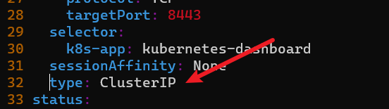
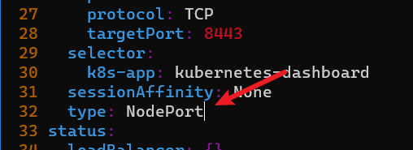
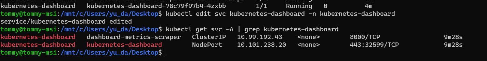
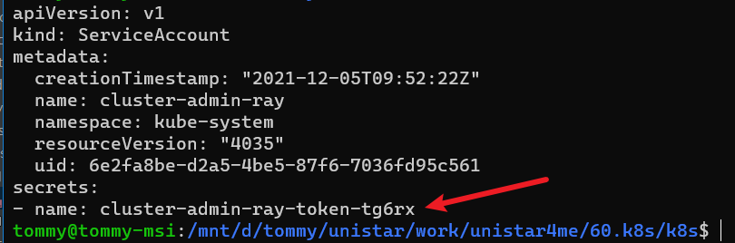
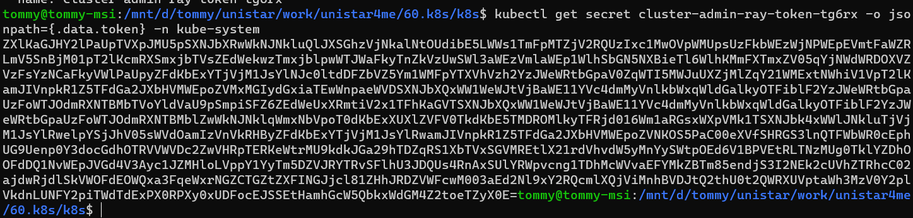

# [部署 Dashboard UI](https://kubernetes.io/zh/docs/tasks/access-application-cluster/web-ui-dashboard/)

> 默认情况下不会部署 Dashboard。可以通过以下命令部署：

```shell
kubectl apply -f https://raw.githubusercontent.com/kubernetes/dashboard/v2.2.0/aio/deploy/recommended.yaml

# 端口 export
kubectl edit svc kubernetes-dashboard -n kubernetes-dashboard
# 修改 => Type : `NodePort`


# 檢查開放端口，使用外往連接
[root@master k8s]# kubectl get svc -A | grep kubernetes-dashboard
kubernetes-dashboard   dashboard-metrics-scraper   ClusterIP   10.96.144.115   <none>        8000/TCP                 45m
kubernetes-dashboard   kubernetes-dashboard        NodePort    10.96.243.112   <none>        443:30712/TCP            45m
```
[kubernetes-dashboard](https://192.168.100.129:30712/)







# 建立 role
因為 Kubernetes 預設就幫我們建立了 cluster-admin 這個 role, 所以我們就不用再自己另外建立, 直接使用即可


建立 dashboard-user.yaml 檔
```yaml


kind: ClusterRoleBinding
apiVersion: rbac.authorization.k8s.io/v1
metadata:
  name: cluster-admin-binding
  annotations:
    rbac.authorization.kubernetes.io/autoupdate: "true"
roleRef:
  # 這邊我們並沒有特別建立這個 cluster role, 因為這是 Kubernetes 預設建立的
  kind: ClusterRole
  name: cluster-admin
  apiGroup: rbac.authorization.k8s.io
subjects:
- kind: ServiceAccount
  name: cluster-admin-tommy
  namespace: kube-system


```

```shell
kubectl create -f dashboard-user.yaml
```

# [取得 Server Account 的 token](https://medium.com/learn-or-die/kubernetes-dashboard-%E4%BD%BF%E7%94%A8%E8%87%AA%E5%AE%9A%E7%BE%A9-service-account-%E7%99%BB%E5%85%A5-b136669fff34)
上面已經完成綁定, 接下來我們便要取得 service account 的 token
首先, 我們先來看看 service account

```shell

# 建立 service account
# 那我們就建立一個 service account, 名為 cluster-admin-tommy
[root@master k8s]# kubectl create sa cluster-admin-tommy -n kube-system
serviceaccount/cluster-admin-tommy created

# get token
[root@master k8s]# kubectl get sa cluster-admin-tommy -n kube-system -o=yaml
apiVersion: v1
kind: ServiceAccount
metadata:
  creationTimestamp: "2021-12-08T12:58:18Z"
  name: cluster-admin-tommy
  namespace: kube-system
  resourceVersion: "10482"
  uid: 207c0bd4-5f9b-4d13-b4df-b5b0c16d5835
secrets:
- name: cluster-admin-tommy-token-4rnb4
[root@master k8s]#


##################
[root@master k8s]# kubectl get secret cluster-admin-tommy-token-4rnb4 -o jsonpath={.data.token} -n kube-system | base64 -d

eyJhbGciOiJSUzI1NiIsImtpZCI6IjJrbXNINTBwemtVQmI4UDRFaWY4R3hMc0NHLTltSTZhNE5sWFpmWXp2eVkifQ.eyJpc3MiOiJrdWJlcm5ldGVzL3NlcnZpY2VhY2NvdW50Iiwia3ViZXJuZXRlcy5pby9zZXJ2aWNlYWNjb3VudC9uYW1lc3BhY2UiOiJrdWJlLXN5c3RlbSIsImt1YmVybmV0ZXMuaW8vc2VydmljZWFjY291bnQvc2VjcmV0Lm5hbWUiOiJjbHVzdGVyLWFkbWluLXRvbW15LXRva2VuLTRybmI0Iiwia3ViZXJuZXRlcy5pby9zZXJ2aWNlYWNjb3VudC9zZXJ2aWNlLWFjY291bnQubmFtZSI6ImNsdXN0ZXItYWRtaW4tdG9tbXkiLCJrdWJlcm5ldGVzLmlvL3NlcnZpY2VhY2NvdW50L3NlcnZpY2UtYWNjb3VudC51aWQiOiIyMDdjMGJkNC01ZjliLTRkMTMtYjRkZi1iNWIwYzE2ZDU4MzUiLCJzdWIiOiJzeXN0ZW06c2VydmljZWFjY291bnQ6a3ViZS1zeXN0ZW06Y2x1c3Rlci1hZG1pbi10b21teSJ9.Ub344dEjc8K270MrNlkNWlnj5XZrr2Rb8mbrt8-G-_2d3QPtx9FTCVtb7FoEDdxFuMMTzatmmiGiuOjX4m1u7HMgjHqNIBW3MOS777vysTJ6jlgHa0fQE0vu6XNfh5P_enCysQ0EUCeEQrGGBFvGvxdRg4IHaK4UPy7XKUxu6HHb6KWiCXroMIH5EV1ymAqUmoeBOQLRAmcOdsc4w4VOv91xQycMA5xIC6XUiMlSi6C8Nyvnam1Llyllr4iV2Ws8tzFoMnfU56dKE_JaAHMs59O_j-PpyDx-ToXf67whevY4GDufyBdjDKIuyZkXl4I7O1xqqJjQeJPkJLGbR1XH7w


```





