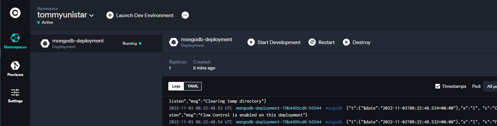

# okteto

- **🏷️Tags** :   #2022-11 #devops 
- Link: [Okteto CLI | Okteto 文檔](https://www.okteto.com/docs/cloud/okteto-cli/)

## 緣起

- youtober nana 介紹
- use github account login :     **tommyunistar**    :    (企業帳號)

## 是什麼

- k8s 開發環境

## 去哪下載

- scoop install okteto

## 📝 怎麼玩

[Install and Configure | Okteto Documentation](https://www.okteto.com/docs/getting-started/)

```shell
okteto context use https://cloud.okteto.com

okteto context list

```

---

```shell

$ okteto --help
Okteto - Remote Development Environments powered by Kubernetes

Usage:
  okteto.exe [command]

Available Commands:
  analytics       Enable / Disable analytics
  build           Build and push the images defined in the 'build' section of your okteto manifest
  completion      Generate the autocompletion script for the specified shell
  context         Set the default context
  deploy          Execute locally the list of commands specified in the 'deploy' section of your okteto manifest
  destroy         Destroy everything created by the 'okteto deploy' command
  doctor          Generate a zip file with the okteto logs
  down            Deactivate your development container
  endpoints       Show endpoints for an environment
  exec            Execute a command in your development container
  help            Help about any command
  init            Automatically generate your okteto manifest
  # 下載 k8s credentials
  kubeconfig      Download credentials for the Kubernetes cluster selected via 'okteto context'
  namespace       Configure the current namespace of the okteto context
  pipeline        Pipeline management commands
  preview         Preview environment management commands
  status          Status of the synchronization process
  up              Launch your development environment
  update          Update Okteto CLI version
  version         View the version of the okteto binary

```

### k8s context switch


### test pod

```shell
$ kubectl apply -f ./mongodb.yaml
deployment.apps/mongodb-deployment created
service/mongodb-service created
```



### helm

[Development Environments | Okteto Documentation](https://www.okteto.com/docs/using-dev-envs/)

```shell
git clone https://github.com/okteto/movies-with-helm
cd movies-with-helm

okteto up

```


---

## https://cloud.okteto.com

> open cloud console
