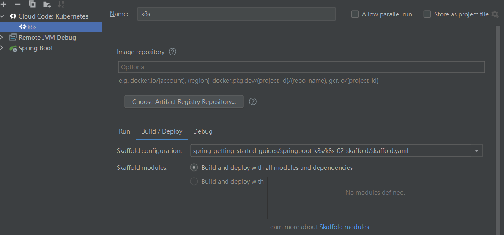

# skaffold

- **🏷️Tags** :   #2022-11 #devops  #k8s #docker
- Link: [Skaffold 2.0 Documentation | Skaffold](https://skaffold.dev/docs/)

## 緣起

- github 逛街看到的

## 是什麼

- docker image auto build tools 
- k8s local auto deploy
- Skaffold- 简化本地开发 kubernetes 应用的神器

## 去哪下載

- choco install skaffold
- [GoogleContainerTools/skaffold: Easy and Repeatable Kubernetes Development](https://github.com/GoogleContainerTools/skaffold)

## 📝 怎麼玩

- skdffold dev
- [buildpacks](buildpacks.md) enable building a container image from source code without the need for a Dockerfile.

[skaffold/examples at main · GoogleContainerTools/skaffold](https://github.com/GoogleContainerTools/skaffold/tree/main/examples)

### [Cloud Code for IntelliJ](https://cloud.google.com/code/docs/intellij/quickstart-k8s)

> install location : C:\ProgramData\chocolatey\lib\skaffold

use [minikube](../400-devops/k8s/minikube.md) 本地開發

