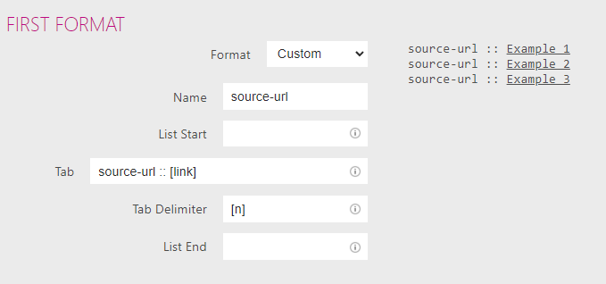

# TabCopy

source-url :: [TabCopy - Chrome 線上應用程式商店](https://chrome.google.com/webstore/detail/tabcopy/micdllihgoppmejpecmkilggmaagfdmb?hl=zh-TW)

## chrome 設定

> [!info]
> Fancy Mode
> 
> source-url :: [link]

``` code
有兩個模式：Simple Mode/Fancy Mode
在 Simple Mode 選用 Markdown 格式
[title] 會擷取網頁標題
[url] 擷取網
[link]
Fancy Mode 可設定 3 個格式，將其中一個換成 Custom，Tab 內容設定如下：
```



---
