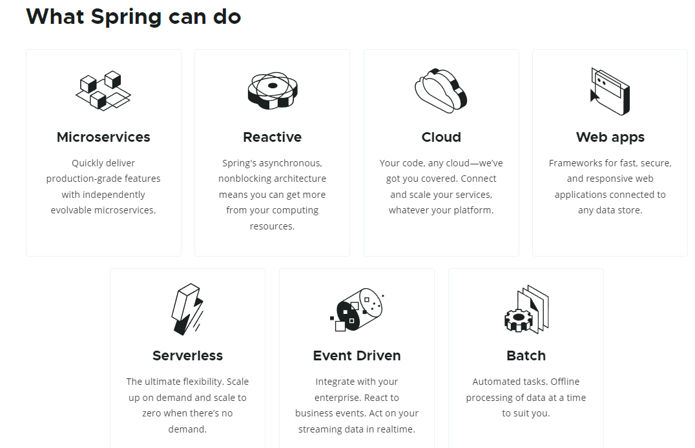

---

# 尚矽谷 -SpringBoot2 核心技術

---

source-url :: [Spring | Home](https://spring.io/)

source-url :: [【尚硅谷】SpringBoot2核心技术与响应式编程 - YouTube](https://www.youtube.com/playlist?list=PLmOn9nNkQxJFKh2PMfWbGT7RVuMowsx-u)

source-url :: [SpringBoot2核心技術與響應式編程· 語雀](https://www.yuque.com/atguigu/springboot)

---

## What Spring can do

- **Microservices**:Quickly deliver production grade features with independently evolvable microservices.
- **Reactive**:Spring's asynchronous, nonblocking architecture means you can get more from your computing resources.
- **Cloud**:Your code, any cloud—we’ve got you covered. Connect and scale your services, whatever your platform.
- **Web apps**:Frameworks for fast, secure, and responsive web applications connected to any data store.
- **Serverless**:The ultimate flexibility. Scale up on demand and scale to zero when there’s no demand.
- **Event Driven**:Integrate with your enterprise. React to business events. Act on your streaming data in realtime.
- **Batch**:Automated tasks. Offline processing of data at a time to suit you.

---

- [x] 01、基础入门 SpringBoot2 课程介绍.mp4
- [x] 02、基础入门 Spring 生态圈.mp4
- [x] 03、基础入门 SpringBoot 的大时代背景.mp4
- [x] 04、基础入门 SpringBoot 官方文档架构.mp4
	-  source-url :: [Spring Boot Reference Documentation](https://docs.spring.io/spring-boot/docs/current/reference/html/)
- [x] 05、基础入门 SpringBoot HelloWorld.mp4
	- source-url :: [Getting Started](https://docs.spring.io/spring-boot/docs/current/reference/html/getting-started.html#getting-started.first-application.run)
	- source-url :: [Common Application Properties](https://docs.spring.io/spring-boot/docs/current/reference/html/application-properties.html#appendix.application-properties.server)
	- source-url :: [getting-started.first-application.executable-jar](https://docs.spring.io/spring-boot/docs/current/reference/html/getting-started.html#getting-started.first-application.executable-jar)
- [x] 06、基础入门 SpringBoot 依赖管理特性.mp4
- [x] 07、基础入门 SpringBoot 自动配置特性.mp4
- [ ] 08、底层注解 @Configuration 详解.mp4
- [ ] 09、底层注解 @Import 导入组件.mp4
- [ ] 10、底层注解 @Conditional 条件装配.mp4
- [ ] 11、底层注解 @ImportResource 导入 Spring 配置文件.mp4
- [ ] 12、底层注解 @ConfigurationProperties 配置绑定.mp4
- [ ] 13、自动配置【源码分析】 自动包规则原理.mp4
- [ ] 14、自动配置【源码分析】 初始加载自动配置类.mp4
- [ ] 15、自动配置【源码分析】 自动配置流程.mp4
- [ ] 16、最佳实践 SpringBoot 应用如何编写.mp4
- [ ] 17、最佳实践 Lombok 简化开发.mp4
- [ ] 18、最佳实践 dev tools.mp4
- [ ] 19、最佳实践 Spring Initailizr.mp4
- [ ] 20、配置文件 yaml 的用法.mp4
- [ ] 21、配置文件 自定义类绑定的配置提示.mp4
- [ ] 22、web 场景 web 开发简介.mp4
- [ ] 23、web 场景 静态资源规则与定制化.mp4
- [ ] 24、web 场景 welcome 与 favicon 功能.mp4
- [ ] 25、web 场景 【源码分析】 静态资源原理.mp4
- [ ] 26、请求处理 【源码分析】 Rest 映射及源码解析.mp4
- [ ] 27、请求处理 【源码分析】 怎么改变默认的 method.mp4
- [ ] 28、请求处理 【源码分析】 请求映射原理.mp4
- [ ] 29、请求处理 常用参数注解使用.mp4
- [ ] 30、请求处理 @RequestAttribute.mp4
- [ ] 31、请求处理 @MatrixVariable 与 UrlPathHelper.mp4
- [ ] 32、请求处理 【源码分析】 各种类型参数解析原理.mp4
- [ ] 33、请求处理 【源码分析】 Servlet API 参数解析原理.mp4
- [ ] 34、请求处理 【源码分析】 Model、Map 原理.mp4
- [ ] 35、请求处理 【源码分析】 自定义参数绑定原理.mp4
- [ ] 36、请求处理 【源码分析】 自定义 Converter 原理.mp4
- [ ] 37、响应处理 【源码分析】 ReturnValueHandler 原理.mp4
- [ ] 38、响应处理 【源码分析】 HTTPMessageConverter 原理.mp4
- [ ] 39、响应处理 【源码分析】 内容协商原理.mp4
- [ ] 40、响应处理 【源码分析】 基于请求参数的内容协商原理.mp4
- [ ] 41、响应处理 【源码分析】 自定义 MessageConverter.mp4
- [ ] 42、响应处理 【源码分析】 浏览器与 PostMan 内容协商完全适配.mp4
- [ ] 43、视图解析 Thymeleaf 初体验.mp4
- [ ] 44、web 实验 后台管理系统基本功能.mp4
- [ ] 45、web 实验 抽取公共页面.mp4
- [ ] 46、web 实验 遍历数据与页面 bug 修改.mp4
- [ ] 47、视图解析 【源码分析】 视图解析器与视图.mp4
- [ ] 48、拦截器 登录检查与静态资源放行.mp4
- [ ] 49、拦截器 【源码分析】 拦截器的执行时机和原理.mp4
- [ ] 50、文件上传 单文件与多文件上传的使用.mp4
- [ ] 51、文件上传 【源码流程】文件上传参数解析器.mp4
- [ ] 52、错误处理 SpringBoot 默认错误处理机制.mp4
- [ ] 53、错误处理 【源码分析】底层组件功能分析.mp4
- [ ] 54、错误处理 【源码流程】异常处理流程.mp4
- [ ] 55、错误处理 【源码流程】几种异常处理原理.mp4
- [ ] 56、原生组件注入 原生注解与 Spring 方式注入.mp4
- [ ] 57、原生组件注入 【源码分析】DispatcherServlet 注入原理.mp4
- [ ] 58、嵌入式 Servlet 容器 【源码分析】切换 web 服务器与定制化.mp4
- [ ] 59、定制化原理 SpringBoot 定制化组件的几种方式.mp4
- [ ] 60、数据访问 数据库场景的自动配置分析与整合测试.mp4
- [ ] 61、数据访问 自定义方式整合 druid 数据源.mp4
- [ ] 62、数据访问 druid 数据源 starter 整合方式.mp4
- [ ] 63、数据访问 整合 mybatis 配置版.mp4
- [ ] 64、数据访问 整合 Mybatis 注解配置混合版.mp4
- [ ] 65、数据访问 整合 MyBatisPlus 操作数据库.mp4
- [ ] 66、数据访问 crud 实验 数据列表展示【补录】.mp4
- [ ] 67、数据访问 crud 实验 分页数据展示.mp4
- [ ] 68、数据访问 crud 实验 删除用户完成.mp4
- [ ] 69、数据访问 准备阿里云 redis 环境.mp4
- [ ] 70、数据访问 redis 操作与统计小实验.mp4
- [ ] 71、单元测试 Junit5 简介.mp4
- [ ] 72、单元测试 常用测试注解.mp4
- [ ] 73、单元测试 断言机制.mp4
- [ ] 74、单元测试 前置条件.mp4
- [ ] 75、单元测试 嵌套测试.mp4
- [ ] 76、单元测试 参数化测试.mp4
- [x] 77、指标监控 SpringBoot Actuator 与 Endpoint.mp4
	- source-url :: [Production-ready Features](https://docs.spring.io/spring-boot/docs/current/reference/html/actuator.html#actuator)
	- source-url :: [Metrics Micrometer](https://docs.spring.io/spring-boot/docs/current/reference/html/actuator.html#actuator.metrics)
	- source-url :: [actuator.metrics.export.elastic](https://docs.spring.io/spring-boot/docs/current/reference/html/actuator.html#actuator.metrics.export.elastic)
- [ ] 78、指标监控 开启与禁用.mp4
- [ ] 79、指标监控 定制 Endpoint.mp4
- [ ] 80、指标监控 Boot Admin Server.mp4
- [ ] 81、高级特性 Profile 环境切换.mp4
- [ ] 82、高级特性 配置加载优先级.mp4
- [ ] 83、高级特性 自定义 starter 细节.mp4
- [ ] 84、原理解析 SpringApplication 创建初始化流程.mp4
- [ ] 85、原理解析 SpringBoot 完整启动过程.mp4
- [ ] 86、原理解析 自定义事件监听组件.mp4
- [ ] 87、后会有期.mp4

## 分解步驟: 把技能做最大程度的細分，分成若干小步驟

---

## input

## output

---

## reference

---

## checklist

- [ ] **制定目标**：要为你的 20 小时确定一个可行的目标，知道你自己要做什么。比如，你想实现参照静物能画出一定程度的写生作品
- [ ] **技能学习**：花 1-3 小时去学习素描的基础知识。比如，你要去了解完成一幅基本的素描，你需要练习观察，构图，上调，透视，明暗等等（技能分解）。你需要给自己明确 1-3 幅临摹的图或者要画的静物，你打算将 20 小时如何分解，分别在最近的多少天内每天多少小时哪个时间段去执行，最终想要达到什么效果。
- [ ] **技能习得**：再次明晰你的目标（最好根据 SMART 原则）.在最初的几次实践中，你要练习和体会理论上分解的技能点，去尝试学会它。这是技能习得的过程。可能会花费你 2-5 小时。
- [ ] **技能训练**：反复练习技能习得部分中你刚学会的画画技能，反复练习来提升你的水平，用 15 个小时或者以上。

---
