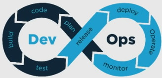
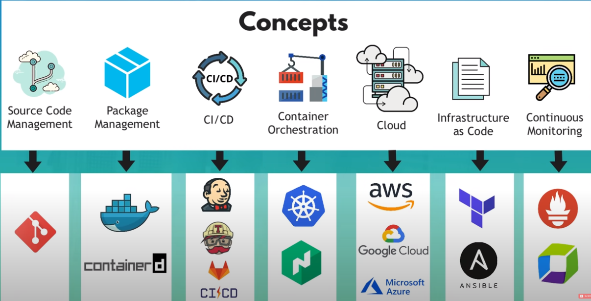
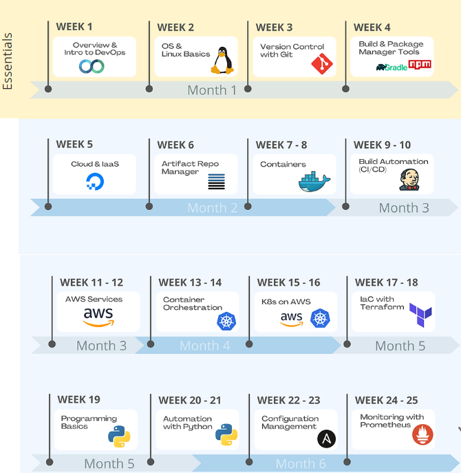

# 000-MOC-devops

- [[DevOps_Roadmap_by_TWN.01.pdf]] : DevOps Engineer 
- [github-action](github-action.md) : CI/CD
- [free-domain](free-domain.md) : 免費域名 + DNS
- [ngrok](ngrok.md) : proxy server
- [vscode-devcontainer](vscode-devcontainer.md) : 快速安裝開發環境
- [[podman|podman]] :  docker container 替代品

---

## [How I learn new technologies as a DevOps Engineer (without being overwhelmed)](https://www.youtube.com/watch?v=Cthla7KqU04)

### **DevOps Bootcamp**

