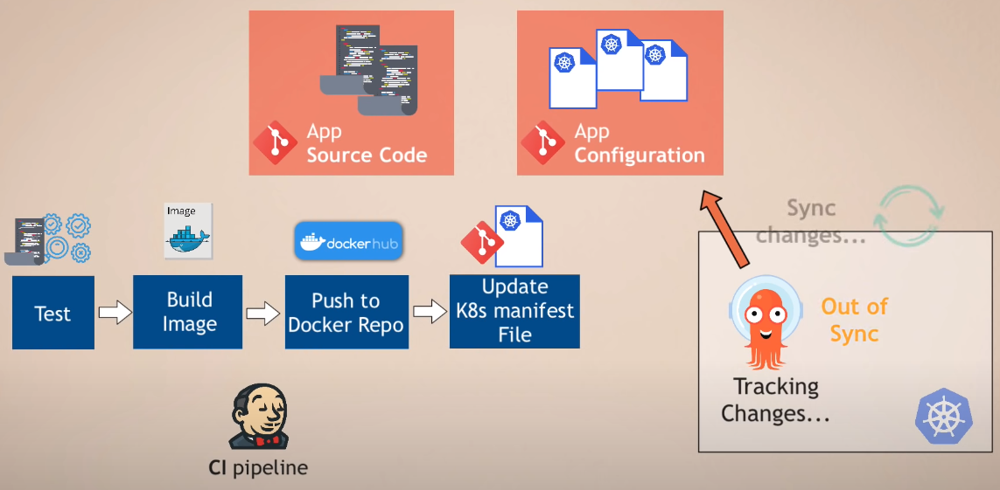

# ArgoCD

- **🏷️Tags** :   #2022-11 #devops 
- Link: [argo-cd/README.md at master · argoproj/argo-cd](https://github.com/argoproj/argo-cd/blob/master/README.md)
- [argoproj/argocd-example-apps: Example Apps to Demonstrate Argo CD](https://github.com/argoproj/argocd-example-apps)

##### ArgoCD

<iframe title="ArgoCD Tutorial for Beginners | GitOps CD for Kubernetes" src="https://www.youtube.com/embed/MeU5_k9ssrs?feature=oembed" height="113" width="200" allowfullscreen="" allow="fullscreen" style="aspect-ratio: 1.76991 / 1; width: 100%; height: 100%;"></iframe>

##### GitOPS

<iframe title="What is GitOps, How GitOps works and Why it's so useful" src="https://www.youtube.com/embed/f5EpcWp0THw?feature=oembed" height="113" width="200" allowfullscreen="" allow="fullscreen" style="aspect-ratio: 1.76991 / 1; width: 100%; height: 100%;"></iframe>

https://www.bilibili.com/video/BV17F411h7Zh/?p=1&amp;spm_id_from=pageDriver&amp;vd_source=6bd04a20c72eb5cca642210346af7081

## 緣起

- Continuous Delivery

## 是什麼

- [Getting Started - Argo CD - Declarative GitOps CD for Kubernetes](https://argo-cd.readthedocs.io/en/stable/getting_started/)

## 去哪下載

- choco install argocd-cli

## 📝 怎麼玩

- kubectl patch svc argocd-server -n argocd -p '{"spec": {"type": "LoadBalancer"}}'
- kubectl port-forward svc/argocd-server -n argocd 8080:443
- kubectl -n argocd get secret argocd-initial-admin-secret -o jsonpath="{.data.password}" | base64 -d; echo

