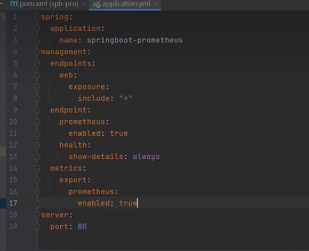

# prometheus

- **🏷️Tags** :   #2022-10 #devops 
- Link: [Instrumenting a Go application | Prometheus](https://prometheus.io/docs/guides/go-application/) : 官網
- [Prometheus 中文文档 - prometheus](https://hulining.gitbook.io/prometheus/)  : 翻譯
- [Compatibility - Prometheus Operator](https://prometheus-operator.dev/docs/operator/compatibility/) : k8s helm [github](https://github.com/prometheus-operator/prometheus-operator)

## 緣起

- k8s 監控軟體 



  
  

https://www.tutorialworks.com/spring-boot-prometheus-micrometer/  

  
  
<dependency>  
  <groupId>io.micrometer</groupId>  
  <artifactId>micrometer-registry-prometheus</artifactId>  
  <scope>runtime</scope>  
</dependency>

https://www.bilibili.com/video/BV1LA4y1D7JE/?spm_id_from=333.337.search-card.all.click&vd_source=6bd04a20c72eb5cca642210346af7081


- ## Prometheus helm charts
- Link: [prometheus-community helm-charts](https://github.com/prometheus-community/helm-charts/tree/main/charts/prometheus)

### commands used

```shell

helm repo add prometheus-community https://prometheus-community.github.io/helm-charts
helm repo update

helm install prometheus prometheus-community/prometheus

> ######################

$ helm install prometheus prometheus-community/prometheus
NAME: prometheus
LAST DEPLOYED: Tue Nov  1 14:49:58 2022
NAMESPACE: default
STATUS: deployed
REVISION: 1
TEST SUITE: None
NOTES:
The Prometheus server can be accessed via port 80 on the following DNS name from within your cluster:
prometheus-server.default.svc.cluster.local


Get the Prometheus server URL by running these commands in the same shell:
  export POD_NAME=$(kubectl get pods --namespace default -l "app=prometheus,component=server" -o jsonpath="{.items[0].metadata.name}")
  kubectl --namespace default port-forward $POD_NAME 9090


The Prometheus alertmanager can be accessed via port 80 on the following DNS name from within your cluster:
prometheus-alertmanager.default.svc.cluster.local


Get the Alertmanager URL by running these commands in the same shell:
  export POD_NAME=$(kubectl get pods --namespace default -l "app=prometheus,component=alertmanager" -o jsonpath="{.items[0].metadata.name}")
  kubectl --namespace default port-forward $POD_NAME 9093
#################################################################################
######   WARNING: Pod Security Policy has been moved to a global property.  #####
######            use .Values.podSecurityPolicy.enabled with pod-based      #####
######            annotations                                               #####
######            (e.g. .Values.nodeExporter.podSecurityPolicy.annotations) #####
#################################################################################


The Prometheus PushGateway can be accessed via port 9091 on the following DNS name from within your cluster:
prometheus-pushgateway.default.svc.cluster.local


Get the PushGateway URL by running these commands in the same shell:
  export POD_NAME=$(kubectl get pods --namespace default -l "app=prometheus,component=pushgateway" -o jsonpath="{.items[0].metadata.name}")
  kubectl --namespace default port-forward $POD_NAME 9091

For more information on running Prometheus, visit:
https://prometheus.io/

> #################################

$ helm list
NAME            NAMESPACE       REVISION        UPDATED                                 STATUS          CHART                   APP VERSION
prometheus      default         1               2022-11-01 14:49:58.3782659 +0800 CST   deployed        prometheus-15.17.0      2.39.1

> #################################

$ kubectl get pods
NAME                                             READY   STATUS    RESTARTS   AGE
prometheus-alertmanager-6c7575777d-jlc9d         2/2     Running   0          19m
prometheus-kube-state-metrics-7b6b8d7bf5-c8b6s   1/1     Running   0          19m
prometheus-node-exporter-rz5r9                   1/1     Running   0          19m
prometheus-pushgateway-759c6ddc94-dbxzd          1/1     Running   0          19m
prometheus-server-c7fcfd576-6t9hh                2/2     Running   0          19m


```

## Grafana helm charts

- **🏷️Tags** :   #2022-11 #todo 
- Link: [Grafana Community Kubernetes Helm Charts | helm-charts](https://grafana.github.io/helm-charts/)

```shell

helm repo add grafana https://grafana.github.io/helm-charts
helm repo update

> ##############################

$ helm install grafana grafana/grafana
NAME: grafana
LAST DEPLOYED: Tue Nov  1 15:49:51 2022
NAMESPACE: default
STATUS: deployed
REVISION: 1
NOTES:
1. Get your 'admin' user password by running:

   kubectl get secret --namespace default grafana -o jsonpath="{.data.admin-password}" | base64 --decode ; echo

2. The Grafana server can be accessed via port 80 on the following DNS name from within your cluster:

   grafana.default.svc.cluster.local

   Get the Grafana URL to visit by running these commands in the same shell:

     export POD_NAME=$(kubectl get pods --namespace default -l "app.kubernetes.io/name=grafana,app.kubernetes.io/instance=grafana" -o jsonpath="{.items[0].metadata.name}")
     
     kubectl --namespace default port-forward $POD_NAME 3000

3. Login with the password from step 1 and the username: admin
#################################################################################
######   WARNING: Persistence is disabled!!! You will lose your data when   #####
######            the Grafana pod is terminated.                            #####
#################################################################################


ZPrAEPSksP2dSCoOTNZwo4aAZ5lUOKokx4R3kDok


> ########

$ kubectl get svc
NAME                            TYPE        CLUSTER-IP       EXTERNAL-IP   PORT(S)        AGE
prometheus-server               ClusterIP   10.111.94.209    <none>        80/TCP         66m


grafana 找 prometheus 使用 http://prometheus-server:80 OR http://10.111.94.209:80

import 6417 
```

### search Dashboard

[Dashboards | Grafana Labs](https://grafana.com/grafana/dashboards/?search=Kubernetes)

### reference

Grafana playlist: https://www.youtube.com/playlist?list=PLVx1qovxj-akOGKSoQ5sGc5ZRfH8Tpnow

Prometheus Playlist: https://www.youtube.com/playlist?list=PLVx1qovxj-anCTn6um3BDsoHnIr0O2tz3

---
