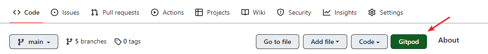

# gitpod

- **🏷️Tags** :   #2022-10 #tools  #devops  
- Link: [Gitpod: Always ready to code.](https://www.gitpod.io/)

## 緣起

- 研究 zipkin 點到這個功能

## 是什麼



- brower 開發工具 (vscode ...)
- Your project’s `.gitpod.yml` and optional `.gitpod.Dockerfile`
- [workspace-images](https://github.com/gitpod-io/workspace-images)  ：選擇開發的 docker image 
- [Gitpod Documentation - Educate, Configure, Develop](https://www.gitpod.io/docs/introduction)

### 1. 收費狀況

- 50 hours/month
- Public & private repos
- 4 parallel workspaces
- 30min inactivity timeout

## 去哪下載

- install chrome plugin

## 📝 怎麼玩

### Start your first workspace

The best way to configure Gitpod is by using Gitpod - you could perform the following steps in your local environment as well, but we may as well experience ephemeral developer environments right from the beginning.

1.  In a browser, navigate to your project’s GitHub, GitLab or Bitbucket page.
2.  In the browser’s address bar, prefix the entire URL with `gitpod.io/#` and press Enter.
    -   For example, `gitpod.io/#https://github.com/gitpod-io/website`
    -   We recommend you [install the Gitpod browser extension](https://www.gitpod.io/docs/configure/user-settings/browser-extension) to make this a one-click operation.
3.  Sign in with one of the listed providers and let the workspace start up.

### 客制化 環境：but 預設就有很多功能 (mvn gradle java) , 所以不需要加

```bash
touch .gitpod.yml

	image:
	  file: .gitpod.Dockerfile

touch .gitpod.Dockerfile

	FROM gitpod/workspace-full
	USER gitpod
	RUN bash -c ". /home/gitpod/.sdkman/bin/sdkman-init.sh && \
	    sdk install java 17.0.3-ms && \
	    sdk default java 17.0.3-ms"


```
