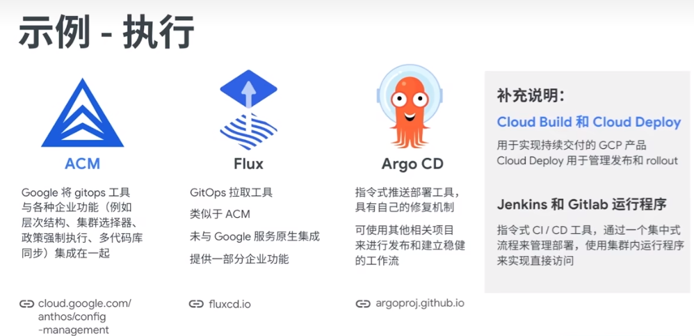

# k8s

- **🏷️Tags** :   #2022-10 #devops  #k8s 
- Link: [1-pvc-demo.yml](https://raw.githubusercontent.com/yudady/yudady.github.io/main/devops-k8s/k8s-learning/07.pv-pvc/1-pvc-demo.yml)

## command

### contexts-command

```shell
# 查詢 contexts
kubectl config get-contexts

# 切換 contexts
kubectl config use-context xxxxxxxxxxx

```

### port-forward

> [!INFO] ### port-forward 
> kubectl port-forward mysql-dp-8dfb795cf-2hkgm 3306:3306 --address 0.0.0.0

## service

- type: LoadBalancer  
- type: ClusterIP  
- type: NodePort

## ingress

[kubernetes/ingress-nginx](https://github.com/kubernetes/ingress-nginx) : from [github](../github/000-MOC-GitHub.md)

[Helm NGINX Ingress](https://docs.nginx.com/nginx-ingress-controller/installation/installation-with-helm/) : from [helm](helm.md)

## dashboard

[kubernetes/dashboard](https://github.com/kubernetes/dashboard) : from [github](../github/000-MOC-GitHub.md)

[kubernetes-dashboard](https://artifacthub.io/packages/helm/k8s-dashboard/kubernetes-dashboard) : from [helm](helm.md)

## tools

- [draft](../draft.md) : xxx
- [minikube](minikube.md) : k8s
- [skaffold](../skaffold.md) : k8s 開發工具


