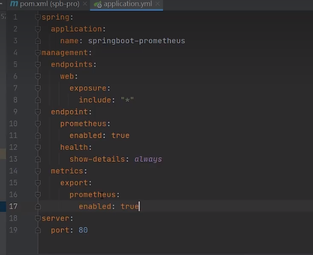

# prometheus

- **🏷️Tags** :   #2022-10 #devops 
- Link: [Instrumenting a Go application | Prometheus](https://prometheus.io/docs/guides/go-application/) : 官網
- [Prometheus 中文文档 - prometheus](https://hulining.gitbook.io/prometheus/)  : 翻譯
- [Compatibility - Prometheus Operator](https://prometheus-operator.dev/docs/operator/compatibility/) : k8s helm [github](https://github.com/prometheus-operator/prometheus-operator)

## 緣起

- k8s 監控軟體 

## 是什麼

- 

## 去哪下載

- 

## 📝 怎麼玩

  
  
https://www.tutorialworks.com/spring-boot-prometheus-micrometer/  
  
  
<dependency>  
  <groupId>io.micrometer</groupId>  
  <artifactId>micrometer-registry-prometheus</artifactId>  
  <scope>runtime</scope>  
</dependency>

https://www.bilibili.com/video/BV1LA4y1D7JE/?spm_id_from=333.337.search-card.all.click&vd_source=6bd04a20c72eb5cca642210346af7081

