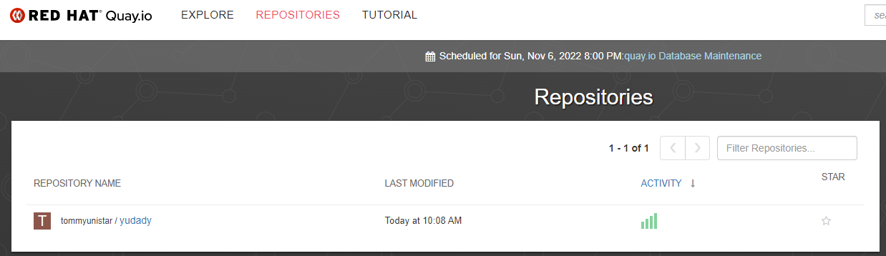

# query-io

- **🏷️Tags** :   #2022-11 #devops 
- Link: [Tutorial · Quay](https://quay.io/tutorial/)

## 緣起

- 

## 是什麼

- docker registory

## 📝 怎麼玩

```shell
docker login quay.io
Username: tommyunistar
Password: ( password here)
Email: tommy.lin@yxunistar.com

$ docker run busybox echo "fun" > newfile

$ docker ps -l

$ docker commit e23d4b149bf0 quay.io/tommyunistar/yudady

$ docker push quay.io/tommyunistar/yudady
Using default tag: latest
The push refers to repository [quay.io/tommyunistar/yudady]
0438ade5aeea: Pushed
latest: digest: sha256:a9cab2b897d041caa37df4a87e29eb5bf4745ad0b11e5ab59ab4aea1969a334c size: 527
```


