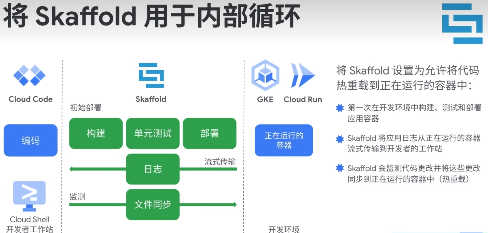
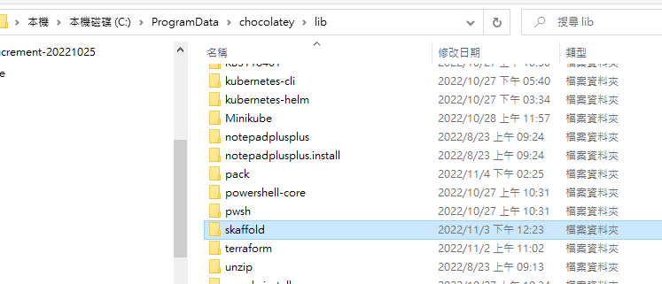
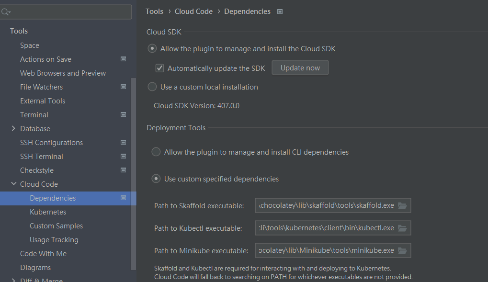
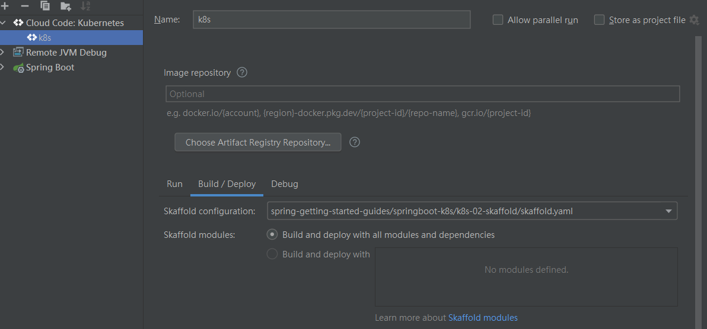
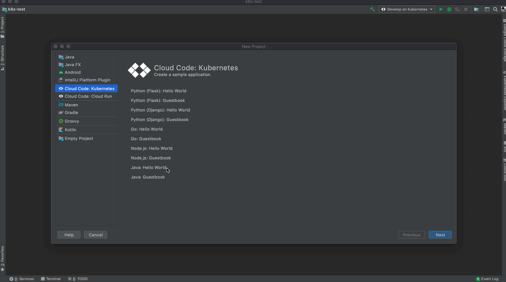

# skaffold

- **🏷️Tags** :   #2022-11 #devops 
- Link: [Skaffold 2.0 Documentation | Skaffold](https://skaffold.dev/docs/)

<iframe title="Speedy build for your java application images with JIB! by Mohammed Aboullaite" src="https://www.youtube.com/embed/bkC1spGOI7Y?feature=oembed" height="113" width="200" allowfullscreen="" allow="fullscreen" style="aspect-ratio: 1.76991 / 1; width: 100%; height: 100%;"></iframe>

## 緣起

- github 逛街看到的

## 是什麼

- [docker](container/docker.md) image auto build tools 
- [k8s](k8s/k8s.md) local auto deploy
- Skaffold- 简化本地开发 kubernetes 应用的神器

## 去哪下載

- choco install skaffold
- [GoogleContainerTools/skaffold: Easy and Repeatable Kubernetes Development](https://github.com/GoogleContainerTools/skaffold)

## 📝 怎麼玩

- skdffold dev
- [pack](pack.md) enable building a container image from source code without the need for a Dockerfile.

[skaffold/examples at main · GoogleContainerTools/skaffold](https://github.com/GoogleContainerTools/skaffold/tree/main/examples)

[Cloud Code for IntelliJ](https://cloud.google.com/code/docs/intellij/quickstart-k8s)

> install location : C:\ProgramData\chocolatey\lib\skaffold

use [minikube](k8s/minikube.md) 本地開發

