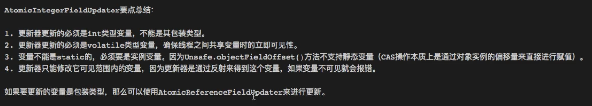

# 簡介
- 自旋鎖
- 原子性


<!--more-->
# 內容

```java
public abstract class AbstractReferenceCountedByteBuf extends AbstractByteBuf {

    private static final AtomicIntegerFieldUpdater<AbstractReferenceCountedByteBuf> refCntUpdater =
            AtomicIntegerFieldUpdater.newUpdater(AbstractReferenceCountedByteBuf.class, "refCnt");

    private volatile int refCnt = 1;

    private ByteBuf retain0(int increment) {
        for (;;) {
            int refCnt = this.refCnt;
            final int nextCnt = refCnt + increment;

            // Ensure we not resurrect (which means the refCnt was 0) and also that we encountered an overflow.
            if (nextCnt <= increment) {
                throw new IllegalReferenceCountException(refCnt, increment);
            }
            if (refCntUpdater.compareAndSet(this, refCnt, nextCnt)) {
                break;
            }
        }
        return this;
    }
    
    private boolean release0(int decrement) {
        for (;;) {
            int refCnt = this.refCnt;
            if (refCnt < decrement) {
                throw new IllegalReferenceCountException(refCnt, -decrement);
            }

            if (refCntUpdater.compareAndSet(this, refCnt, refCnt - decrement)) {
                if (refCnt == decrement) {
                    deallocate();
                    return true;
                }
                return false;
            }
        }
    }
```




# 參考資料


