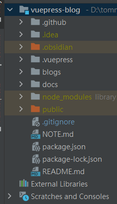
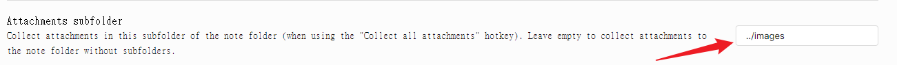
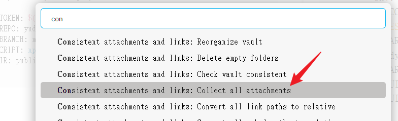

# 安裝vuepress-blog

[vuepress-blog-theme-reco](https://github.com/vuepress-reco/vuepress-theme-reco/blob/main/docs/README.md)

```shell
# 初始化，并选择 2.x
npm install @vuepress-reco/theme-cli@1.0.7 -g
theme-cli init
```

## 更改設定config.js

```ts
module.exports = {
    theme: 'reco',
    title: "Tommy-好記性不如爛筆頭",
    description: "紙上得來終覺淺，絕知此事要躬行",
    dest: 'public',
    head: require("./head"),
    themeConfig: {
        nav: require("./nav"),
        // sidebar: require("./sidebar"),
        sidebar: 'auto',
        type: 'blog',
        blogConfig: require("./blogConfig"), // 博客设置
        friendLink: require("./friendLink"),
        logo: '/logo.png',
        // 搜索设置
        search: true,
        searchMaxSuggestions: 10,
        // 自动形成侧边导航

        lastUpdated: 'Last Updated', // 最后更新时间

        author: 'tommy', // 作者
        // 作者头像
        authorAvatar: '/avatar.png',
        // 备案号
        record: '',
        // 项目开始时间
        startYear: '2018'
   
    },
    markdown: {
        lineNumbers: true
    }
}  

```

## 添加github Action

```shell
# This is a basic workflow to help you get started with Actions

name: CI

on:
  # 每当 push 到 main 分支时触发部署
  push:
    branches: [ main ]
  # 手动触发部署
  workflow_dispatch:

jobs:
  docs:
    runs-on: ubuntu-latest

    strategy:
      matrix:
        node-version: [16.3.0]
        # See supported Node.js release schedule at https://nodejs.org/en/about/releases/

    steps:
      - name: checkout
        uses: actions/checkout@v3
        with:
          # “最近更新时间” 等 git 日志相关信息，需要拉取全部提交记录
          fetch-depth: 0

      - name: Use Node.js ${{ matrix.node-version }}
        uses: actions/setup-node@v3
        with:
          node-version: ${{ matrix.node-version }}

      - name: clean and install
        run: |
          rm -rf ./public
          npm install -D

      # 运行构建脚本
      - name: vuepress-deploy
        uses: jenkey2011/vuepress-deploy@master
        env:
          ACCESS_TOKEN: ${{ secrets.ACCESS_TOKEN }}
          TARGET_REPO: yudady/yudady.github.io
          TARGET_BRANCH: master
          BUILD_SCRIPT: npm run build
          BUILD_DIR: public

```

## 路徑
- 不能有中文
- 圖片連結需要相對路徑

## 結構




## 路徑圖片

### 相對路徑處理方式:**[obsidian-consistent-attachments-and-links](https://github.com/dy-sh/obsidian-consistent-attachments-and-links)**

注意：需要關閉一些obsidian基本設定







