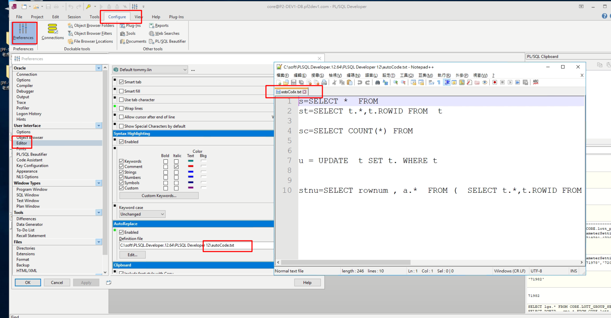
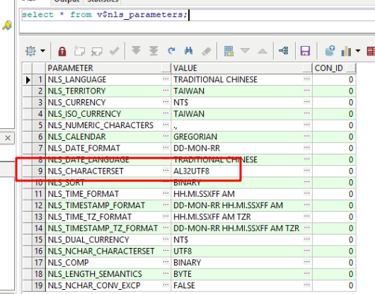
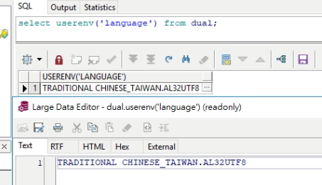
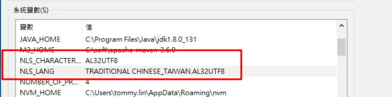

# 簡介

筆記

<!--more-->
# 內容

## mavne install oracle

```sh
mvn install:install-file
-Dfile=C:/soft/git/git.pf2/pf2/lib/ojdbc7-12.1.0.2.jar
-DgroupId=com.oracle -DartifactId=ojdbc7
-Dversion=12.1.0.2 -Dpackaging=jar
```


## oracle jdbc used sid or serviceName  
> jdbc:oracle:thin:@DB.PF2DEV1-OOB.COM:1521`:`sid
> jdbc:oracle:thin:@DB.PF2DEV1-OOB.COM:1521`/`serviceName


## plsql autoComplate
自動補全



## plsql亂碼

> select * from v$nls_parameters;


> select userenv('language') from dual;





## why ?? 這樣不會亂碼
```bat
set NLS_LANG=AMERICAN_AMERICA.AL32UTF8
START plsqldev.exe
```

## 解決日期亂碼
```sql
alter session set nls_date_format='YYYY-MM-DD HH24:MI:SS';
alter session set NLS_TIMESTAMP_FORMAT='YYYY-MM-DD HH24:MI:SS:FF6'; 
```

# 參考資料

