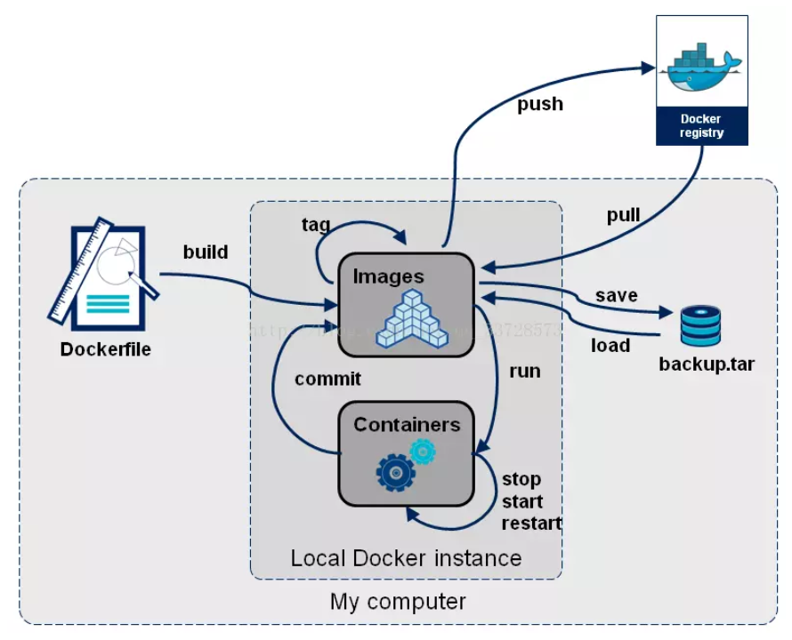
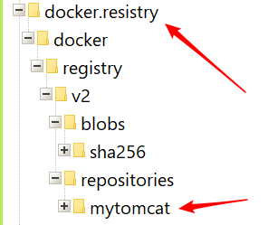

# 簡介

> 編寫dockerfile推送倉庫



<!--more-->
# 內容

## 準備文件（Dockerfile）資料（jdk-8u91-linux-x64.tar.gz）
```s
$ tree
.
├── Dockerfile
└── jdk-8u91-linux-x64.tar.gz
```

## Dockerfile
```s
FROM centos:7

LABEL maintainer="yu_dady@yahoo.com.tw"

RUN yum install -y wget

RUN cd /

ADD jdk-8u91-linux-x64.tar.gz /

RUN wget http://apache.stu.edu.tw/tomcat/tomcat-8/v8.5.35/bin/apache-tomcat-8.5.35.tar.gz
RUN tar zxvf apache-tomcat-8.5.35.tar.gz

ENV JAVA_HOME=/jdk1.8.0_91
ENV PATH=$PATH:$JAVA_HOME/bin

CMD ["/apache-tomcat-8.5.35/bin/catalina.sh", "run"]

EXPOSE 8080

```

## 命令（執行Dockerfile）
- docker build -t mytomcat . --no-cache
- docker run -p 8080:8080 mytomcat
- docker run -it mytomcat /bin/bash

## push images
- docker tag mytomcat yudady/mytomcat
- docker push yudady/mytomcat

> docker images
```s
REPOSITORY          TAG                 IMAGE ID            CREATED             SIZE
mytomcat            latest              2b548e4d1b4f        29 minutes ago      689MB
yudady/mytomcat     latest              2b548e4d1b4f        29 minutes ago      689MB
centos              7                   75835a67d134        7 weeks ago         200MB
```


# Docker Registry Server(私有昌庫)
1. 開啟SERVER
> docker run -d -p 5000:5000 -v C:/docker.resistry:/var/lib/registry --name registry registry:2




```s
Unable to find image 'registry:2' locally
2: Pulling from library/registry
d6a5679aa3cf: Pull complete
ad0eac849f8f: Pull complete
2261ba058a15: Pull complete
f296fda86f10: Pull complete
bcd4a541795b: Pull complete
Digest: sha256:5a156ff125e5a12ac7fdec2b90b7e2ae5120fa249cf62248337b6d04abc574c8
Status: Downloaded newer image for registry:2
e76569695d6ff4004dee5ab7afb254b9144bb660bf019bbfe9955ecc2ca7a49f
```

> docker tag mytomcat 127.0.0.1:5000/mytomcat
> docker push 127.0.0.1:5000/mytomcat

```s
The push refers to repository [127.0.0.1:5000/mytomcat]
bd8355a71fe6: Pushed
39db275004bb: Pushed
0a512cf664ac: Pushed
0409432264f4: Pushed
f972d139738d: Pushed
latest: digest: sha256:0b0ac11ee2908db1619858b30e4e2759051214faa2ed914f13980af34d6c7987 size: 1376
```

> docker images

```s
REPOSITORY                 TAG                 IMAGE ID            CREATED             SIZE
127.0.0.1:5000/mytomcat    latest              2b548e4d1b4f        40 minutes ago      689MB
mytomcat                   latest              2b548e4d1b4f        40 minutes ago      689MB
yudady/mytomcat            latest              2b548e4d1b4f        40 minutes ago      689MB
docker4w/nsenter-dockerd   latest              2f1c802f322f        6 weeks ago         187kB
centos                     7                   75835a67d134        7 weeks ago         200MB
registry                   2                   2e2f252f3c88        2 months ago        33.3MB
```

--------------

1. 檢查當前有哪些鏡像

> docker images

```s
REPOSITORY                 TAG                 IMAGE ID            CREATED             SIZE
docker4w/nsenter-dockerd   latest              2f1c802f322f        6 weeks ago         187kB
centos                     7                   75835a67d134        7 weeks ago         200MB
registry                   2                   2e2f252f3c88        2 months ago        33.3MB

```

2. 拉取鏡像
> docker pull 127.0.0.1:5000/mytomcat

```s
Using default tag: latest
latest: Pulling from mytomcat
aeb7866da422: Already exists
6fed30f67426: Pull complete
6990651c4913: Pull complete
2477fd32d186: Pull complete
3883789f5fce: Pull complete
Digest: sha256:0b0ac11ee2908db1619858b30e4e2759051214faa2ed914f13980af34d6c7987
Status: Downloaded newer image for 127.0.0.1:5000/mytomcat:latest
```

3. 檢查拉取是否成功
> docker images

```s
REPOSITORY                 TAG                 IMAGE ID            CREATED             SIZE
127.0.0.1:5000/mytomcat    latest              2b548e4d1b4f        About an hour ago   689MB
docker4w/nsenter-dockerd   latest              2f1c802f322f        6 weeks ago         187kB
centos                     7                   75835a67d134        7 weeks ago         200MB
registry                   2                   2e2f252f3c88        2 months ago        33.3MB
```


## 查詢 registor 有哪些鏡像

> curl -X GET http://127.0.0.1:5000/v2/_catalog

```s
{"repositories":["mytomcat"]}
```

## hyper/docker-registry-web(倉庫 WEB UI )

```s
docker run -d -p 5000:5000 --name registry registry:2

docker run -d -p 8080:8080 --name registry-web --link registry -e REGISTRY_URL=http://127.0.0.1:5000/v2 -e REGISTRY_NAME=127.0.0.1:5000  hyper/docker-registry-web
```


### [參考文檔.hyper/docker-registry-web](https://hub.docker.com/r/hyper/docker-registry-web/)

```s
docker run -d -p 5000:5000 --name registry-srv registry:2
docker run -it -p 8080:8080 --name registry-web --link registry-srv -e REGISTRY_URL=http://registry-srv:5000/v2 -e REGISTRY_NAME=localhost:5000 hyper/docker-registry-web
```


## 以後再處理（TODO）404 page not found
```s
tommy@tommy-MSI:/mnt/c/Users/yu_da/OneDrive/Desktop$ curl -X GET http://127.0.0.1:5000/v2/_catalog
{"repositories":["mytomcat"]}
tommy@tommy-MSI:/mnt/c/Users/yu_da/OneDrive/Desktop$ curl -X GET http://127.0.0.1:5000/v2/mytomcat/tags/list
{"name":"mytomcat","tags":["latest"]}
tommy@tommy-MSI:/mnt/c/Users/yu_da/OneDrive/Desktop$ curl -X GET http://127.0.0.1:5000/v2/mytomcat/manifestslatest
404 page not found
```


# 參考資料


