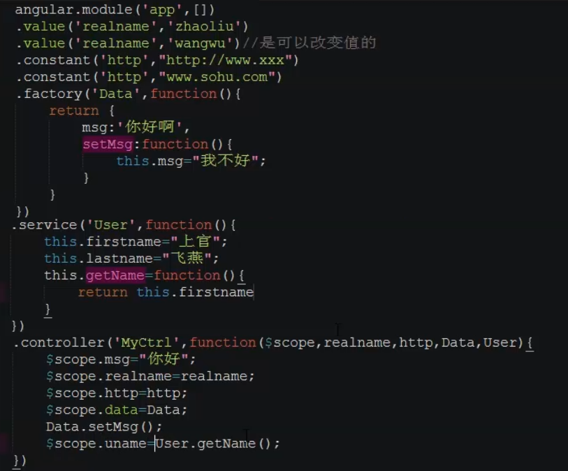
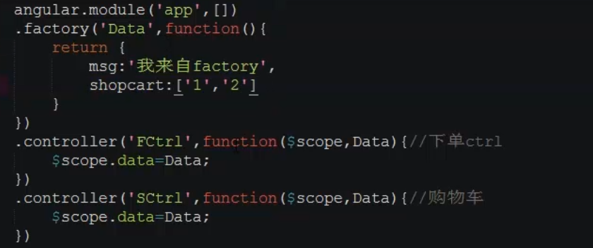
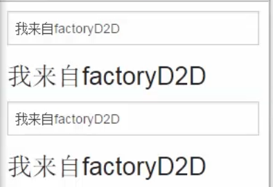
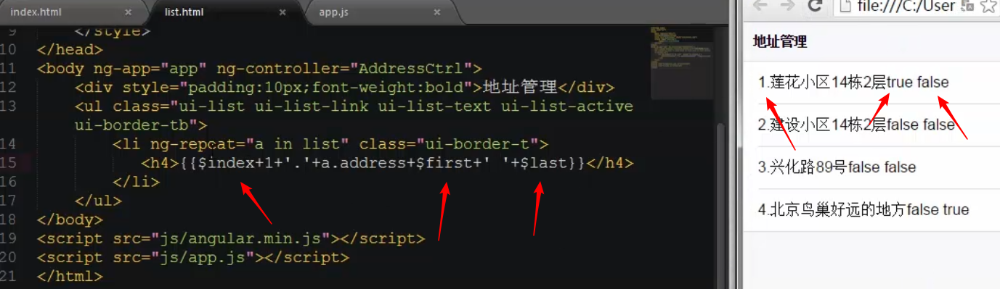
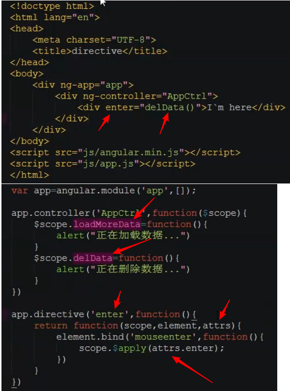

# 簡介

angular 1.3

<!--more-->
# 內容

## value constant factory service

## controller共享數據

> 數據來源相同

## 常用指令

- ng-disabled="form.$invalid" 
- required

- ng-submit="registor(user)" //scope中的綁定數據
- $scope.registor = function(){}

## ng-repeat
> $index $first $last

## $http

## Directive

# 參考資料
- [我的前端資料](https://github.com/yudady/note-book/tree/master/frontend)

