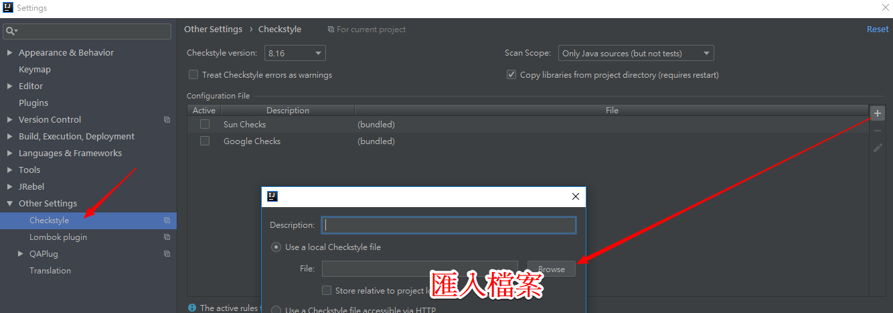
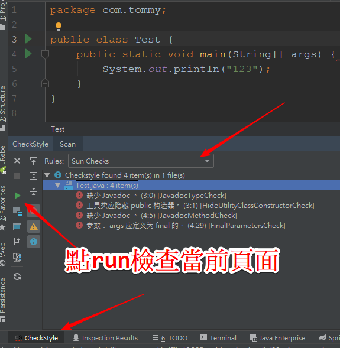

# intellij

## intellij-plugin

- TranslationPlugin
- Grep Console  :  .*(\Q[LOG]\E).*
- Lombok plugin
- Maven Helper
- Save Actions
- VisualVM Launcher
- String manipulation
- key promoter X
- Close Editor Tabs Left Right
- Material Theme UI
- .​env files support
- Atom Material Icons
- CheckStyle-IDEA
- Cloud Code
- Diagrams.​net Integration
- GitToolBox
- Indent Rainbow
- Quokka
- Return Highlighter
- SequenceDiagram
- IntelliJ Lombok plugin

## intellij code setting


## intellij-mouse-font-size

> ctrl + 滑鼠滾輪


## intellij-note-formater

> 修改 2 個地方


## intellij-save-action

## 修改後 tab 會有 星號


## 修改自動保存時間


## intellij-settings

## 消除 intellij `import *`


## Intellij codeStyle






## Intellij Java Properties File Transfer

> 編碼自動轉換


## 把 Intellij 設定檔同步到 Github，可以在其他地方匯入


- 看到一個同步的聯結網址
- github 創建一個目錄，貼上去
- 要求取得 "Personal access tokens"


- https://github.com/yudady/intellijSettings.git
- 開始同步數據，你懂得！ 


# 變更設定目錄

> idea.properties

```java
#---------------------------------------------------------------------
# Uncomment this option if you want to customize path to IDE config folder. Make sure you're using forward slashes.
#---------------------------------------------------------------------
# idea.config.path=${user.home}/.IntelliJIdea/config
idea.config.path=D:/install/JetBrains/ideaIU-2018.2.2/.IntelliJIdea2018.2/config
#---------------------------------------------------------------------
# Uncomment this option if you want to customize path to IDE system folder. Make sure you're using forward slashes.
#---------------------------------------------------------------------
# idea.system.path=${user.home}/.IntelliJIdea/system
idea.system.path=D:/install/JetBrains/ideaIU-2018.2.2/.IntelliJIdea2018.2/system
#---------------------------------------------------------------------

```

## intellij-key

紀錄熱鍵

### Switching Between Open Projects

> Ctrl+Alt+]
> Ctrl+Alt+[

### 自動補全返回值

> ctrl + alt + v

### 在行尾增加分號

> Ctrl + Shift + Enter - 本身的含義是自動完成，如果需要的話，會在行尾添加分號或是大括號；

### 打開繼承樹

> ctrl + alt + U

### 如何找目錄

> ctrl + shift + n 後，使用/

### 自動翻譯選中文字

> ctrl + shift + Y

### 尋找頁面方法

> ctrl + F12

### 代碼提示不區分大小寫

> 將 Case sensitive completion 設置為 None 就可以了

### 開啟自動 import 包的功能

### 去掉導航欄

> 使用 alt+v，然後去掉 Navigation bar 即可
