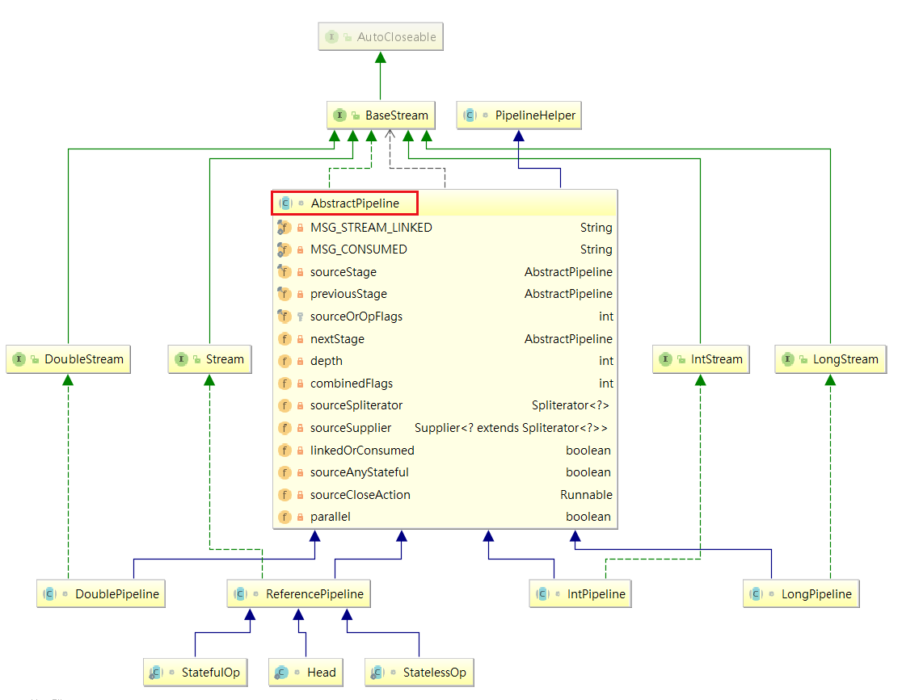
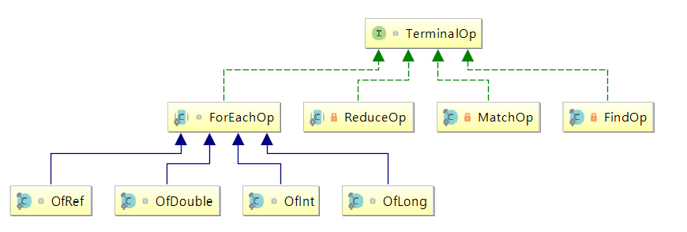

# 簡介

> public interface BaseStream<T, `S` extends BaseStream<T, S>> extends AutoCloseable 
> public interface Stream<T> extends BaseStream<T, `Stream<T>`>

> `S`同樣是stream，裡面不同（新的流對象）=> `Stream<T>`


```java
S sequential();  // 調用sequential，返回一個新流
Stream<T> peek(Consumer<? super T> action); // 調用peek，返回一個新流
```

- A sequence of elements supporting `sequential` and `parallel` aggregate operations.

<!--more-->
# 內容

## AutoCloseable

```java
try (Stream<String> stream = list.stream()) {
  stream.onClose(() -> {
    System.out.println("1");
    throw new NullPointerException("1 exception");
  }).onClose(() -> {
    System.out.println("2");
    throw new NullPointerException("2 exception");
  }).forEach(System.out::println);
}
```


## AbstractPipeline
> Abstract base class for "pipeline" classes, which are the core implementations of the Stream interface and its primitive specializations. Manages construction and evaluation of stream pipelines.



## TerminalOp


# 參考資料


