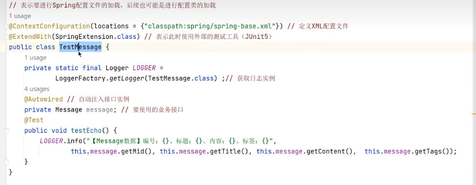
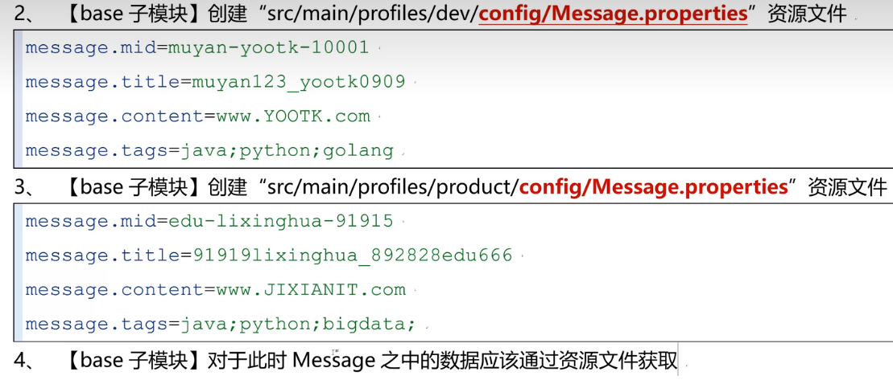

# Spring-SpEL

`SpelExpressionParser`, `EvaluationContext`, `parseExpression`, `@Value("#{ <expression string> }")`

`#{ <expression string> }`, `${<property>}`, `T(<javaclass>)`

> SpEL see `tutorial`

```xml
<?xml version="1.0" encoding="UTF-8"?>
 
<beans xmlns="http://www.springframework.org/schema/beans"
    xmlns:xsi="http://www.w3.org/2001/XMLSchema-instance"
    xmlns:context="http://www.springframework.org/schema/context"
    xsi:schemaLocation="http://www.springframework.org/schema/beans http://www.springframework.org/schema/beans/spring-beans.xsd
    http://www.springframework.org/schema/context http://www.springframework.org/schema/context/spring-context-2.5.xsd">
 
     <context:component-scan base-package="com.geeksforgeeks.spring" />
 
    <bean id="tutorial" class="com.geeksforgeeks.spring.Tutorial">
        <property name="topicsList">
           <ref local="javaCore" />
           <ref local="scalaBasics" />
        </property>
    </bean>
         
    <bean id="javaCore" class="com.geeksforgeeks.spring.Topic">
        <property name="name" value="JavaCore" />
    </bean>
     
    <bean id="scalaBasics" class="com.geeksforgeeks.spring.Topic">
        <property name="name" value="ScalaBasics" />
    </bean>   
     
    <bean id="training" class="com.geeksforgeeks.spring.Training">
        <property name="topic" value="#{tutorial.topicsList[1]}"/>
    </bean>
     
</beans>
```

> SpEL see @Value("#{tutorial.topicsList[0]}")

```java
public class Training
{
    private Topic topic;
      
    @Value("#{tutorial.topicsList[0]}")
    private Topic defaultTopic;
  
  //getters and setters
    public Topic getTopic()
    {
        return topic;
    }
  
    public void setTopic(Topic topic)
    {
        this.topic = topic;
    }
      
    public Topic getDefaultTopic()
    {
        return defaultTopic;
    }
}
```

[Spring表达式编程入门](https://www.bilibili.com/video/BV18U4y127M1/?spm_id_from=333.999.0.0&vd_source=6bd04a20c72eb5cca642210346af7081)


> answer : 


> 圖 :


## [ParserContext表达式分隔符](https://www.bilibili.com/video/BV15Y4y1B7h5/?spm_id_from=333.999.0.0&vd_source=6bd04a20c72eb5cca642210346af7081)

> default 分割符號 ===#{  xxx  }===


### 一般情況使用 ==#{ xxx }==


## [SpEL字面表达式](https://www.bilibili.com/video/BV1EA4y1Z7hx/?spm_id_from=333.999.0.0)

### [SpEL字面表达式](https://www.bilibili.com/video/BV1EA4y1Z7hx?p=1&vd_source=6bd04a20c72eb5cca642210346af7081)


### [SpEL数学表达式](https://www.bilibili.com/video/BV1EA4y1Z7hx?p=2&vd_source=6bd04a20c72eb5cca642210346af7081)


### [SpEL关系表达式](https://www.bilibili.com/video/BV1EA4y1Z7hx?p=3&vd_source=6bd04a20c72eb5cca642210346af7081)


### [SpEL逻辑表达式](https://www.bilibili.com/video/BV1EA4y1Z7hx?p=4&spm_id_from=pageDriver&vd_source=6bd04a20c72eb5cca642210346af7081)


### [SpEL三目运算符](https://www.bilibili.com/video/BV1EA4y1Z7hx?p=5&spm_id_from=pageDriver&vd_source=6bd04a20c72eb5cca642210346af7081)


## [SpEL解析原理](https://www.bilibili.com/video/BV16U4y127iz/?spm_id_from=333.999.0.0&vd_source=6bd04a20c72eb5cca642210346af7081)


### parseExpression


### getValue


## [SpEL与反射处理](https://www.bilibili.com/video/BV1F5411Q7g7/?spm_id_from=333.999.0.0&vd_source=6bd04a20c72eb5cca642210346af7081)

```java
public static void main(String[] args)throws Exception{//该抛就抛
	L0G6ER.info("【#{T(java.lang.String).}\"】Class表达式：{}"，
	spel(content:"#T(java.lang.String)}").getclass())
}
public static Object spel(String content){//实现了SpEL处理
	ExpressionParser parser=new SpelExpressionParser();//定义SpEL解析器
	Expression exp=parser.parseExpression(content,ParserContext.TEMPLATE_EXPRESSION);//表达式解析
	EvaluationContext context=new StandardEvaluationContext();//表达式上下文配置
	return exp.getValue(context);
}
```

### 呼叫靜態方法


### new Bean


### 方法


## [SpEL变量操作](https://www.bilibili.com/video/BV1tg411R7Tb/?spm_id_from=333.999.0.0&vd_source=6bd04a20c72eb5cca642210346af7081)

### 傳入參數


#### ans:


### 根變量


### 方法引用


### 實現類屬性方法調用


### [SpEL定义List集合表达式](https://www.bilibili.com/video/BV1zS4y1q7bs/?spm_id_from=333.999.0.0&vd_source=6bd04a20c72eb5cca642210346af7081)


### [SpEL定义Map集合](https://www.bilibili.com/video/BV1A5411Q7Pg/?spm_id_from=autoNext&vd_source=6bd04a20c72eb5cca642210346af7081)


> 修改 map 內容


> map to list


### [Spring配置文件使用SpEL处理字符串](https://www.bilibili.com/video/BV1Wv4y1w7Bo/?spm_id_from=333.999.0.0&vd_source=6bd04a20c72eb5cca642210346af7081)




### [Annotation整合SpEL](https://www.bilibili.com/video/BV1HZ4y147Az/?spm_id_from=333.999.0.0&vd_source=6bd04a20c72eb5cca642210346af7081)


## [Profile与SpEL](https://www.bilibili.com/video/BV1h34y177ie/?spm_id_from=333.999.0.0&vd_source=6bd04a20c72eb5cca642210346af7081)





### [PropertySource属性源](https://www.bilibili.com/video/BV1H3411g71p/?spm_id_from=333.999.0.0&vd_source=6bd04a20c72eb5cca642210346af7081)


> mapProperties


## [PropertyResolver属性解析](https://www.bilibili.com/video/BV1R34y1L7Kw/?spm_id_from=333.999.0.0&vd_source=6bd04a20c72eb5cca642210346af7081)


> 解析


### [PropertySourcesPlaceholderConfigurer属性资源配置](https://www.bilibili.com/video/BV1US4y1n7uo/?spm_id_from=333.999.0.0&vd_source=6bd04a20c72eb5cca642210346af7081)


---
