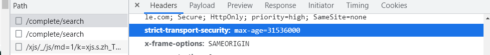
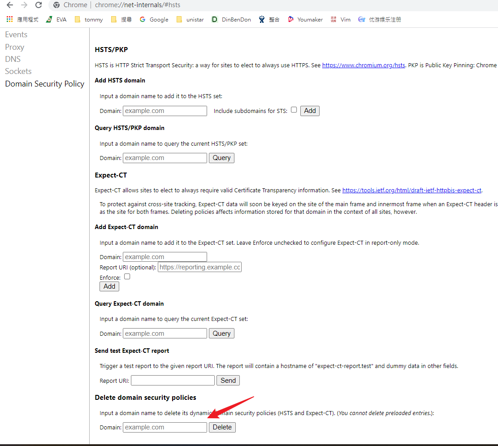

# HTTP強制安全傳輸技術(Strict-Transport-Security)



[HTTP強制安全傳輸技術 - 維基百科，自由的百科全書](https://zh.wikipedia.org/wiki/HTTP%E4%B8%A5%E6%A0%BC%E4%BC%A0%E8%BE%93%E5%AE%89%E5%85%A8)

> clean HSTS
```chrome
chrome://net-internals/#hsts
```




HSTS的作用是強制客戶端（如瀏覽器）使用HTTPS與伺服器建立連接。
伺服器開啟HSTS的方法是，當客戶端通過HTTPS發出請求時，在伺服器返回的超文字傳輸協定（HTTP）回應頭中包含Strict-Transport-Security欄位。非加密傳輸時設定的HSTS欄位無效。

比如，https://example.com/ 的回應頭含有Strict-Transport-Security: max-age=31536000; includeSubDomains。這意味著兩點：

在接下來的31536000秒（即一年）中，瀏覽器向example.com或其子域名傳送HTTP請求時，必須採用HTTPS來發起連接。

比如，使用者點擊超連結或在網址列輸入 http://www.example.com/ ，瀏覽器應當自動將 http 轉寫成 https，然後直接向 https://www.example.com/ 傳送請求。
在接下來的一年中，如果 example.com 伺服器傳送的TLS憑證無效，使用者不能忽略瀏覽器警告繼續存取網站。


### 增加安全性的 HTTP Headers
- [Analyse your HTTP response headers](https://securityheaders.com/)
- [增加安全性的 HTTP Headers - 技術雜記 Technology Notes - Jack Yu | 傑克](https://yu-jack.github.io/2017/10/20/secure-header/#reference)


#### Set-Cookie 設置方式

防禦面向為: XSS

`Set-Cookie` 基本上是最多人使用的，但是 `Set-Cookie` 的設置方式如果沒有設定好是不安全的  
`Set-Cookie` 有以下兩個 header 可以設定

1.  HttpOnly  
    設置 `HttpOnly` 的 cookie 之後，會沒辦法用 `document.cookie` 的方式(任何 javascript)去存取 cookie
    
2.  Secure  
    強制 cookie 只能在 HTTPS protocol 的環境下進行傳遞  
    簡單來說設置 `Secure` 的 cookie 之後在非 HTTPS 的環境底下是會失效的
    
```js
res.cookie('cookie_name', 'jack', {  
    httpOnly: true,  
    secure: true  
})  
```


#### X-XSS-Protection

防禦面向為: XSS

設定之後，如果瀏覽器偵測到 XSS 的攻擊，會根據設置的屬性做不同的反應  
p.s. 這個是舊有的屬性，基本上可以被 `Content-Security-Policy` 取代  
但是還是可以為那些沒有支援 `Content-Security-Policy` 的瀏覽器提供一層保護

`X-XSS-Protection` 有以下四個值可以設定

1.  0  
    關閉 XSS 過濾功能
    
2.  1  
    開啟 XSS 過濾功能，如果偵測到 XSS 攻擊的話，瀏覽器會刪除不安全的部分
    
3.  1; mode=block  
    開啟 XSS 過濾功能，如果偵測到 XSS 攻擊的話，瀏覽器不會把網頁給渲染出來
    
4.  1;report= (Chromium only)  
    開啟 XSS 過濾功能，如果偵測到 XSS 攻擊的話，瀏覽器會回報到指定的 URI

```js
res.setHeader('X-XSS-Protection', '0')  
res.setHeader('X-XSS-Protection', '1')  
res.setHeader('X-XSS-Protection', '1; mode=block')  
res.setHeader('X-XSS-Protection', '1;report=[https://www.example.com](https://www.example.com/)')  
```


#### Content-Security-Policy

防禦面向為: XSS

`Content-Security-Policy` 是一個可以限制網站的 `script` `object` `style` `font` 的來源  
主要是用白名單的方式限制，甚至可以限制不允許 `eval` 這種東西出現  
簡單來說設定 `Content-Security-Policy` 之後，只有白名單內的 resource 可以存取  
因為值很多種，所以以下用例子來解釋，詳細可以參考 [Content-Security-Policy](https://developer.mozilla.org/zh-TW/docs/Web/HTTP/Headers/Content-Security-Policy)  
但基本上有以下幾種可以設定

1.  default-src
2.  script-src
3.  img-src
4.  font-src
5.  frame-src

```js
res.setHeader('Content-Security-Policy', "default-src 'self'; script-src 'self' *.[google.com](http://google.com/) 'unsafe-eval'; img-src 'self' *.[amazonaws.com](http://amazonaws.com/) data:")  


以上面的例子來說  
default-src ‘self’ 代表網站 resource 只能讀取自己網站的，default 代表如果在其他設置欄位沒找到的話，會根據 default-src 為主  
script-src ‘self’ _.[google.com](http://google.com/) ‘unsafe-eval’ 代表我用的 `script` src 可以存取自己網站以及_ .[google.com](http://google.com/) 底下，以及可以允許 `eval`  
img-src ‘self’ _.[amazonaws.com](http://amazonaws.com/) data:代表我用的 `script` src 可以存取自己網站以及_ .[amazonaws.com](http://amazonaws.com/) 底下，以及比較特別的是可以存取 base64 格式的 image data
```  


#### X-Frame-Options

防禦面向為: Clickjacking

`X-Frame-Options` 主要是設定網站是否能被其他網站透過 `iframe` `frame` 的方式遷入  
`X-Frame-Options` 有以下三個值可以設定

1.  DENY  
    不允許被任何網站用 `iframe` 的形式嵌入的  
    假設在 [www.example.com](http://www.example.com/) 設置了 `X-Frame-Options: DENY` 的話  
    在 [www.google.com](http://www.google.com/) 的話，是不能 html 裡面嵌入 `<iframe src="www.example.com"></iframe>`
    
2.  SAMEORIGIN  
    允許同源底下的網站，用 `iframe` 方式嵌入
    
3.  ALLOW-FROM  
    設定白名單的 list
    

```js
res.setHeader('X-Frame-Options', 'DENY')  
res.setHeader('X-Frame-Options', 'SAMEORIGIN')  
res.setHeader('X-Frame-Options', 'ALLOW-FROM [https://example.com](https://example.com/)')  
```


#### X-Content-Type-Options

用途: 避免瀏覽器誤判文件形態

`X-Content-Type-Options` 是拿來防止 Content-Type 被竄改  
比較要注意的是，這個屬性只會套用在 `script` `style`  
如果 `style` 的 `content-type` 不是 `text/css` 就會被拒絕  
如果 `script` 的 `content-type` 不是 [javascript MIME type](https://html.spec.whatwg.org/multipage/scripting.html#javascript-mime-type) 就會被拒絕

```js
res.setHeader('X-Content-Type-Options', 'nosniff')  
```


#### Strict-Transport-Security

防禦面向: 強迫用戶使用 HTTPS，防範 MITM 攻擊

`Strict-Transport-Security` 是強化 HTTPS 機智的一種方式  
設置之後，即使是用 HTTP 連線，還是會被轉去使用 HTTPS 連線

```js
res.setHeader('Strict-Transport-Security', 'max-age=16070400; includeSubDomains')  
``` 


#### Referrer-Policy

防禦面向: 增加隱私權

`Referrer` 代表的是你從 A 網站跳到 B 網站的時候，這個欄位會被記錄為 A  
簡單來說，他是記錄你上一個瀏覽的地方的東西

他有以下幾個值可以設定，詳細可以參考[這裏](https://developer.mozilla.org/en-US/docs/Web/HTTP/Headers/Referrer-Policy)

1.  no-referrer  
    不允許被記錄下來
2.  origin  
    只有紀錄 origin，例如在 [https://example.com/a.html](https://example.com/a.html) 底下，只會傳送 [https://example.com](https://example.com/)
3.  strict-origin  
    只有在 HTTPS->HTTPS 之間才會被記錄下來
4.  no-referrer-when-downgrade (default)  
    跟 strict-origin 一樣
5.  origin-when-cross-origin  
    只有在 CORS 的時候, `referrer` 才會被送出，但只有 origin
6.  same-origin  
    CORS 的時候, `referrer` 不會被記錄，同源的時候會有 `origin`
7.  strict-origin-when-cross-origin  
    只有在同源的時候才會送出 `referrer`，而且還是要 HTTPS -> HTTPS
8.  unsafe-url  
    不管怎樣都送就對拉
    

```js
res.setHeader('Referrer-Policy', 'no-referrer')  
res.setHeader('Referrer-Policy', 'unsafe-url')  
```


#### Public-Key-Pins

防禦面向: 中間人攻擊

設定 `Public-Key-Pins` 之後，可以給予我們是否要主動信任 CA (憑證頒發機構) 的權利  
可以防止攻擊者透過 CA 錯誤的簽署憑證並進行中間人攻擊的安全機制

```js
// 裡面的 base64== 是要透過用自己的憑證，產出的 public keu  
// 產出的 public key 配合 openssl 產出 fingerprint  
// 把 fingerprint 貼上來取代掉 base64== 即可  
res.setHeader('Public-Key-Pins', 'pin-sha256="base64=="; max-age=2592000; includeSubDomains')  
``` 


### [[筆記]如何關閉瀏覽器的HSTS避免強制轉https妨礙開發 - iT 邦幫忙::一起幫忙解決難題，拯救 IT 人的一天](https://ithelp.ithome.com.tw/articles/10232459)

如何關閉瀏覽器的HSTS功能

**Safari 瀏覽器**  
完全關閉 Safari  
刪除 `~/Library/Cookies/HSTS.plist` 這個文件  
重新打開 Safari 即可  
極少數情況下，需要重啟系統

**Chrome 瀏覽器**  
地址欄中輸入 `chrome://net-internals/#hsts`  
在 `Delete domain` 中輸入項目的域名，並 `Delete` 刪除  
可以在 `Query domain` 測試是否刪除成功

**Opera 瀏覽器**  
和 Chrome 方法一樣

**Firefox 瀏覽器**  
關閉所有已打開的頁面  
清空歷史記錄和緩存  
地址欄輸入 `about:permissions`  
搜索項目域名，並點擊 `Forget About This Site`


