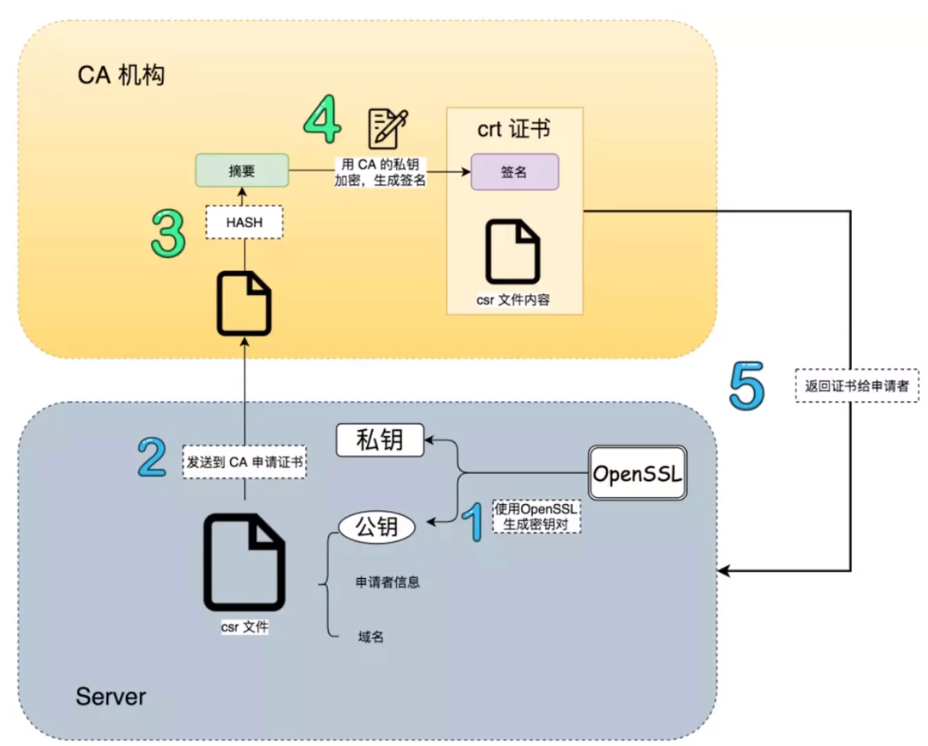

# 證書（Certificate）

證書（Certificate） = c （public key） +元數據(指紋指紋/簽章CA /序列號/證書有效日期/登錄用戶等）

[证书（Certificate）的那些事 - 熊喵君的博客 | PANDAYCHEN](https://pandaychen.github.io/2019/07/24/auth/)

[OpenSSH Certificate 证书最佳实践 - 熊喵君的博客 | PANDAYCHEN](https://pandaychen.github.io/2020/04/09/OPENSSH-CERT-BEST-PRACTISE/)

[写给开发人员的实用密码学（一）—— 概览 - This Cute World](https://thiscute.world/posts/practical-cryptography-basics-1/)

[(9) 00 尚硅谷JAVA 密码学前言 - YouTube](https://www.youtube.com/watch?v=Vo9iAy-dUR8&list=PLmOn9nNkQxJH8OIZlbTE_a91OaO3XREPp)

  
  
[在 Windows 中讓 Chrome 信任自簽憑證](https://people.cs.nctu.edu.tw/~fyli/post/self-signed-certficate-in-chrome-windows/)  

