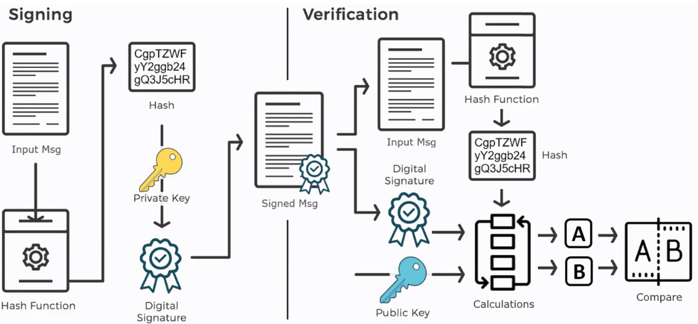

# Openssl 命令

## 數字簽名（signed Msg = Input Msg + Digital signature）
> 解決：證明 `input msg` 是`private key` 擁有者，發出的

> 方法：使用 `public key` 驗證 `input msg`

### 公鑰分發問題
> `public key`是透過網路拿到的，如何證明是正確的（這邊引出 [CA](CA.md) ）

### OpenSSL 建立自簽憑證(自己是CA機構)
[如何使用 OpenSSL 建立開發測試用途的自簽憑證 (Self-Signed Certificate)](https://blog.miniasp.com/post/2019/02/25/Creating-Self-signed-Certificate-using-OpenSSL)

- 使用 OpenSSL 建立自簽憑證
- 匯入自簽憑證到「受信任的根憑證授權單位」

[使用 OpenSSL 與 cURL 檢查網站伺服器支援哪幾種 Cipher Suites | The Will Will Web](https://blog.miniasp.com/post/2021/05/12/Checking-Cipher-Suites-using-OpenSSL-and-cURL)

  
[使用 OpenSSL 製作萬用字元 SSL 憑證](https://blog.darkthread.net/blog/issue-wildcard-ssl-cert-with-openssl/)  
  
  

  
第一步是要取得 OpenSSL。在 Windows 上過去需自行下載安裝，若為 Windows 10， 可考慮使用 Windows 上 Ubuntu 的 Bash， 但我最建議的做法是使用 Windows 工程師必備神器 Cmder 最省事， 下面也會以 Cmder 此示範。(還沒用過 Cmder 的同學可以試試，相信你也會愛上它的)  
準備一個目錄放置產生的憑證，在此以 D:\SSL 示範  
執行openssl genrsa -des3 -out rootCA.key 4096產生 rootCA.key，過程需設定密碼，稍後會用到  
執行openssl req -x509 -new -nodes -key rootCA.key -sha256 -days 36500 -out rootCA.crt 產生 CA 憑證 rootCA.crt  

