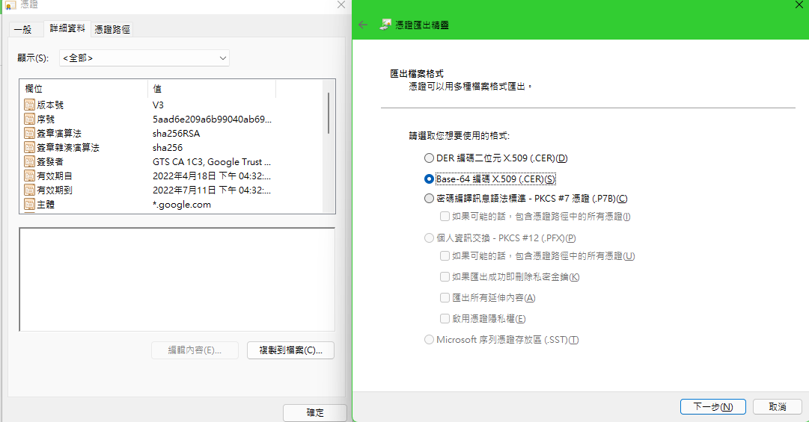
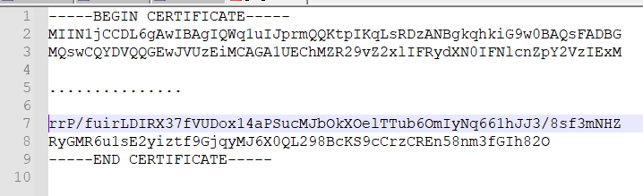
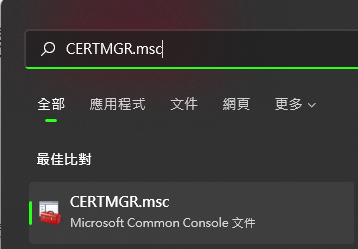
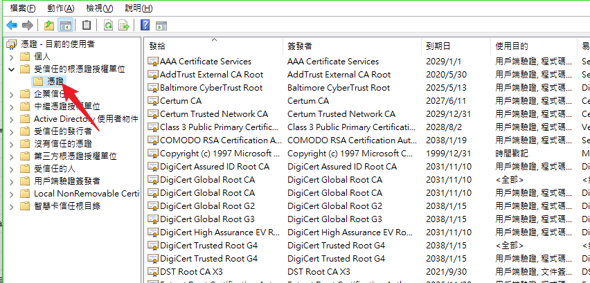
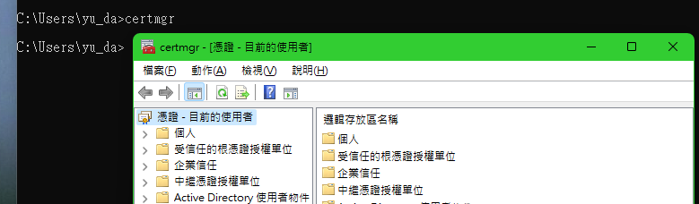

# 密碼學-檔案擴展名

### **SSL 憑證說明 .P7B (PKCS#7) .PFX/.P12 (PKCS#12) .PEM, .DER, .CRT, .CER**

```txt
PEM Format

It is the most common format used for certificates
Most servers (Ex: Apache) expects the certificates and private key to be in a separate files
-   Usually they are Base64 encoded ASCII files
-   Extensions used for PEM certificates are .cer, .crt, .pem, .key files
-   Apache and similar server uses PEM format certificates


DER Format
 
The DER format is the binary form of the certificate
All types of certificates & private keys can be encoded in DER format
DER formatted certificates do not contain the "BEGIN CERTIFICATE/END CERTIFICATE" statements
DER formatted certificates most often use the ‘.cer’ and '.der' extensions
DER is typically used in Java Platforms
 


P7B/PKCS#7 Format
 
The PKCS#7 or P7B format is stored in Base64 ASCII format and has a file extension of .p7b or .p7c
A P7B file only contains certificates and chain certificates (Intermediate CAs), not the private key
The most common platforms that support P7B files are Microsoft Windows and Java Tomcat
 

PFX/P12/PKCS#12 Format 
 
The PKCS#12 or PFX/P12 format is a binary format for storing the server certificate, intermediate certificates, and the private key in one encryptable file
These files usually have extensions such as .pfx and .p12
They are typically used on Windows machines to import and export certificates and private keys
```


### CSR(CERTIFICATE SIGNING REQUEST)是甚麼?

在我們申請要購買SSL憑證的時候,廠商都會要求要您製作CSR檔案,然後上傳到廠商提供的網頁介面上,才開始後續的申請流程,可以說是第一步,那CSR檔案是甚麼呢?以下簡單說明:

CSR(Certificate Signing Request)我們翻譯成憑證簽發請求文件(檔案),簡稱憑證請求檔,裡面有包含以下的一些欄位,必須填好後製作成CSR檔案,然後提供給廠商:

CN:Common Name :此欄位為你要保護的網域名稱 : www.sslbuyer.com,www.sslbuyer2.com,..等等,如果是萬用網域則可寫*.domain.com
Organization [O]:您組織的名稱,此名稱要與您合法登記的名稱一樣  
Organizational Unit:[OU]:公司部門,若沒填寫則跟Common Name相同  
Locality [L]:公司所在地的城市名稱  
State [ST]:公司所在地的州或郡  
Country [C]:公司所在地的國家  
Key Size:憑證演算法與金鑰長度


```sh
openssl req -new -newkey rsa:2048 -nodes -out xxxx.csr -keyout xxxx.key -subj "/C=tw/ST=xxxx/L=xxxx/O=xxxx/OU=xxxx/CN=xxx.xxx.xxx"
```

- 私密金鑰(Private Key),,私密金鑰自行保存
- CSR則給發證商進行憑證製作


> CA廠商 , 使用證書頒發機構（CA）金鑰對伺服器證書進行簽名：

[CA-簽名](CA.md)

```sh
openssl ca -in tempreq.pem -out server_crt.pem
```

> `.pem`,`.cer`並且`.der`都是可能包含 X.509 v3 證書的文件的文件擴展名。







### PKCS#12 副檔名為`.p12`或者 `.pfx`,windows專用副檔名

> Windows Ssl 工具 (dotnet Dev-certs https)

由於透過 `dotnet dev-certs https` 所建立的憑證都是以 PKCS#12 的格式儲存的 (`*.pfx`)，一般在 Linux 都是用 PEM 格式為主，所以需要做一次格式轉換。透過以下命令可以將憑證的 **公開金鑰** (Public Key) 改用 PEM 格式儲存成 `localhost.crt` 檔案：

```sh
openssl pkcs12 -in localhost.pfx -out localhost.crt -nokeys -nodes
```


### 透過 OpenSSL 命令產生 PKCS#12 憑證檔案 (*.pfx 或 *.p12)

> 如果你想將建立好的 **私密金鑰** (`server.key`) 與 **憑證檔案** (`server.crt`) 組合成一個 PFX 憑證檔案 (PKCS#12)，可以透過以下命令產生 `server.pfx` 檔案。由於 `*.pfx` 格式的檔案必須設定一組密碼，因此在執行過程中會需要輸入密碼，用以保護這個 `*.pfx` 檔案。

> key + crt => pfx
```sh
openssl pkcs12 -export -in server.crt -inkey server.key -out server.pfx
```

- `server.key` (私密金鑰) (使用 PEM 格式) (無密碼保護)
- `server.crt` (憑證檔案) (使用 PEM 格式)
- `server.pfx` (PFX 檔案) (使用 PKCS#12 格式)


### 證書 `.crt`
如果你已經拿到 `localhost.crt` 憑證檔，就可以透過 curl 的 `--cacert` 參數直接指定該憑證，這個就可以用來驗證伺服器所使用的 TLS/SSL 加密連線：

```sh
curl https://localhost:5001/ --cacert localhost.crt
```


### **憑證授權單位**(CA機構)
> **根授權憑證** (Root CA) 的 **公開金鑰** (Public Key) 檔案，這些證書是內置在windows系統中(信認的基礎)

>  命令：打開windows 證書視窗:  CERTMGR.msc





### 將網站憑證儲存到檔案中
> 網站憑證是由CA機構頒發的證書
```shell
openssl s_client -connect example.com:443 -servername example.com -showcerts </dev/null 2>/dev/null | sed -n '/^-----BEGIN CERT/,/^-----END CERT/p' > example.crt
```


### Curl: (60) SSL Certificate Problem: Unable to Get Local Issuer Certificate

> 這個錯誤主要是告訴你，它找不到 local issuer certificate (本地發行者憑證)，所以無法「驗證」遠端加密連線的安全性，這是一種「信任」問題，並不是真的連不上，最簡單的解法，就是忽略「驗證」步驟，直接加上 `--insecure` 參數即可：

```sh
curl https://localhost:5001/ --insecure

#如果你已經拿到 `localhost.crt` 憑證檔
curl https://localhost:5001/ --cacert localhost.crt
```


### 打開windows憑證管理系統（certmgr）



