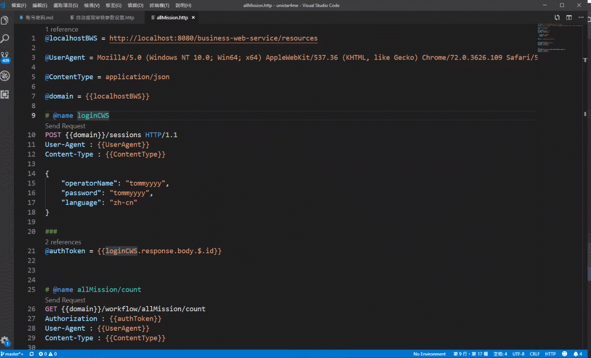
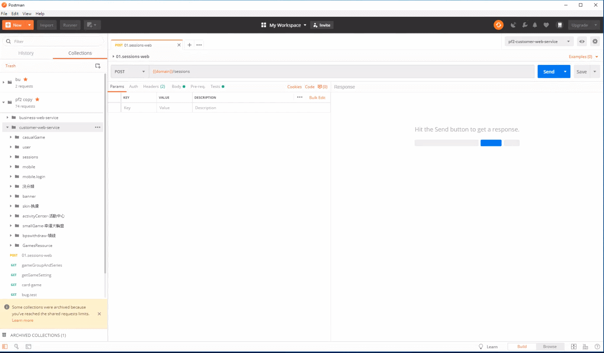

# 簡介

rest api 工具
- vscode rest client
- postman

<!--more-->
# 內容

## vscode rest client
[REST Client](https://marketplace.visualstudio.com/items?itemName=humao.rest-client)

```rest
@localhostBWS = http://localhost:8080/business-web-service/resources

@UserAgent = Mozilla/5.0 (Windows NT 10.0; Win64; x64) AppleWebKit/537.36 (KHTML, like Gecko) Chrome/72.0.3626.109 Safari/537.36

@ContentType = application/json

@domain = {{localhostBWS}}

# @name loginCWS
POST {{domain}}/sessions HTTP/1.1
User-Agent : {{UserAgent}}
Content-Type : {{ContentType}}

{
    "operatorName": "tommyyyy",
    "password": "tommyyyy",
    "language": "zh-cn"
}

###
@authToken = {{loginCWS.response.body.$.id}}


# @name allMission/count
GET {{domain}}/workflow/allMission/count
Authorization : {{authToken}}
User-Agent : {{UserAgent}}
Content-Type : {{ContentType}}


### 
# @name history
GET {{domain}}/workflow/history/AD190524120259694?pageNumber=1&pageSize=10
Authorization : {{authToken}}
User-Agent : {{UserAgent}}
Content-Type : {{ContentType}}


```




## postman

> 處理回傳訊息

```js
// 将返回信息解析成对象
var responseData = JSON.parse(responseBody);

var id = responseData.id;
console.log(id);
// 设置全局变量
pm.environment.set("id",id);
var token = responseData.token;
console.log(token);
// 设置全局变量
pm.environment.set("token",token);


var clientUuid = responseData.clientUuid;
console.log(clientUuid);
// 设置全局变量
pm.environment.set("clientUuid",clientUuid);


var customerId = responseData.customerId;
console.log(customerId);
// 设置全局变量
pm.environment.set("customerId",customerId);
```





# 參考資料


