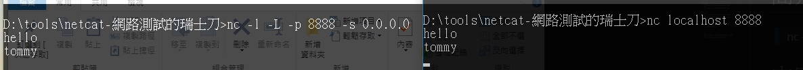
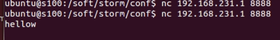
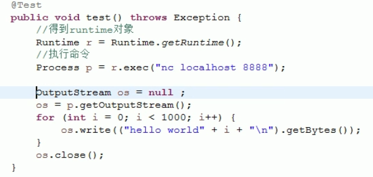
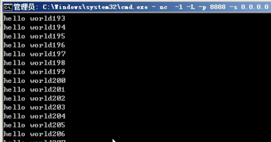
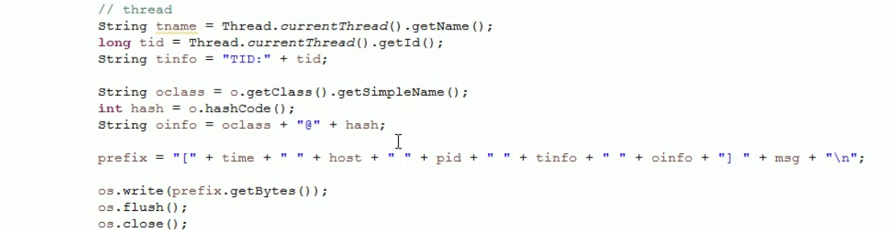

# 簡介

> nc -l -L -p 8888 -s 0.0.0.0

<!--more-->
# 內容

## 通訊1
> 發出

> 收到

---

## 通訊2
> 發出

> 收到

---
## outLog2NC

# 參考資料
- [netcat](https://github.com/diegocr/netcat)
- [網路測試的瑞士刀 Netcat 的10+種使用方法](https://www.qa-knowhow.com/?p=3110)

