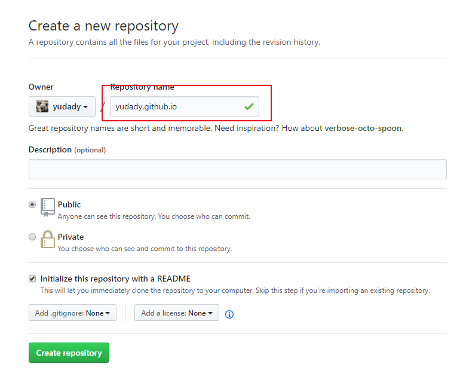
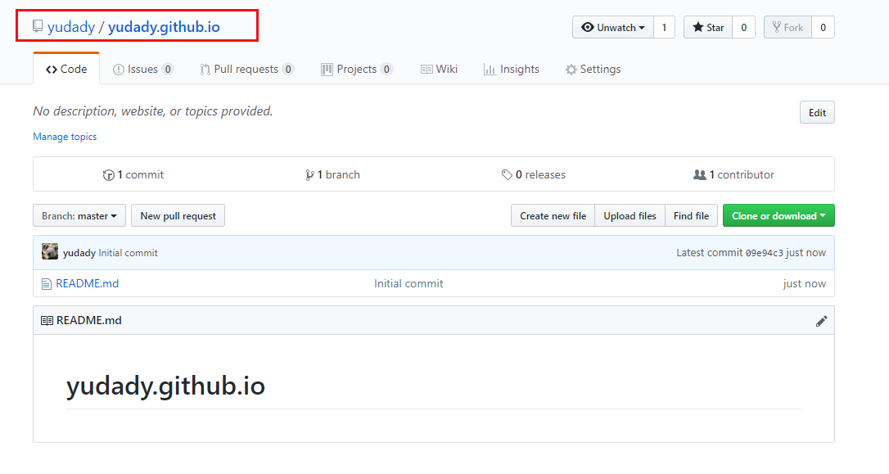
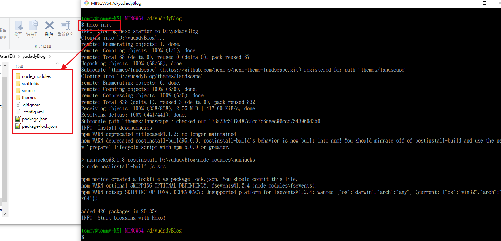
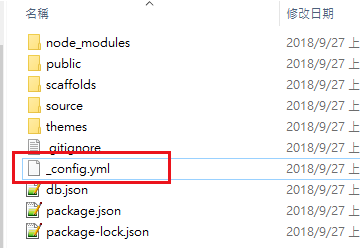
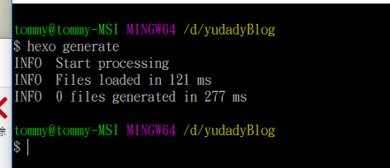
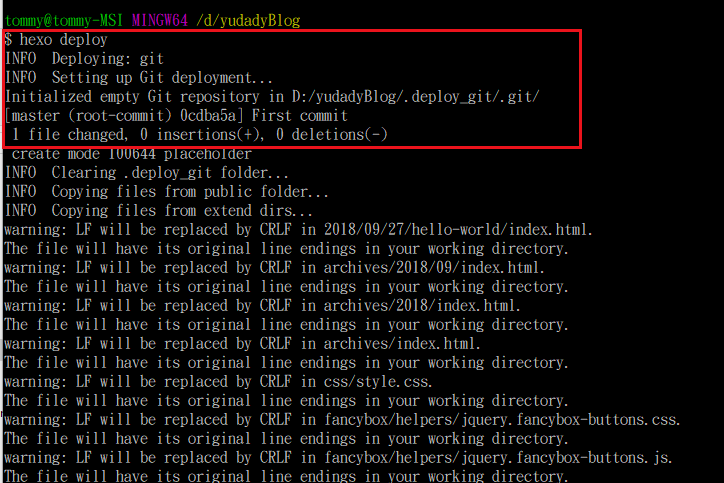
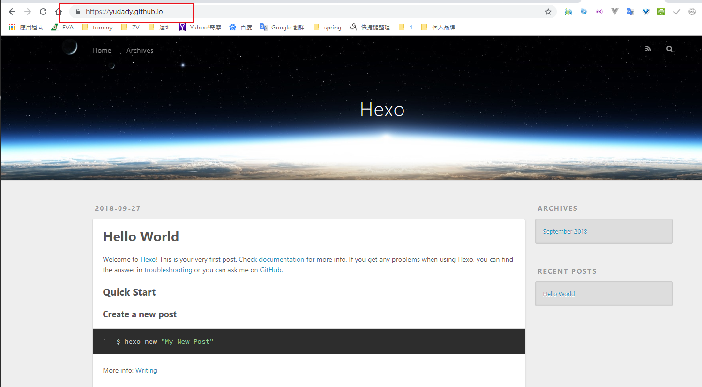

# 使用github建立Blog
[源码](https://github.com/yudady/yudadyBlog)
<!--more-->

## github

> 我的github賬號 yudady


> 創建一個 yudady.github.io



## Hexo
> mkdir yudadyBlog
> cd yudadyBlog
> npm install -g hexo

> hexo init

> npm install

> hexo generate


## 修改要部署到github的URL（_config.yml）



## [hexo-tag-cloud](https://github.com/MikeCoder/hexo-tag-cloud/blob/master/README.ZH.md)
> npm install hexo-tag-cloud@^2.0.* --save 

## Hexo 图片相对路径
> npm install hexo-asset-image --save

## Hexo 页面自动刷新与移动端调试
> npm install -g browser-sync
> npm install hexo-browsersync --save

## RSS
> npm install hexo-migrator-rss --save

## sitemap
> npm install hexo-generator-sitemap --save


npm install hexo-generator-search --save
npm install hexo-generator-searchdb --save

npm install hexo-generator-feed --save


## 準備depoly 
> [Hexo depoly doc](https://hexo.io/zh-tw/docs/deployment.html)
> npm install hexo-deployer-git --save


> hexo generate

> hexo deploy



## 我的網址  https://yudady.github.io/



# 設定
> https://yogapan.github.io/2017/08/11/%E7%94%A8Hexo-Github-Pages%E6%90%AD%E5%BB%BA%E5%80%8B%E4%BA%BA%E9%83%A8%E8%90%BD%E6%A0%BC/
## 启动server
> hexo generate
> hexo server
> hexo deploy
## 目錄結構

```
blog/
  _config.yml            -> 最主要的設定檔
  public/                -> 生成的靜態網站資源
  source/
    _posts               -> 你寫的文章都放在這裡面
      hello-world.md     -> 文章
  themes/                -> 網站主題都放裡面
    landscape/
      _config.yml        -> 主題設定檔
```


## 更換主題

  - https://github.com/iissnan/hexo-theme-next/blob/master/README.cn.md
 

## 語言設定
在_config.yml中找到language欄位，設定為zh-tw
language: zh-tw

## 頭像
```
blog/
    theme/next/_config.yml
```


```
blog/
    source/uploads/
                    avatar.jpg
```                    


## npm command (package.json)
```
{
  "name": "hexo-site",
  "version": "0.0.0",
  "private": true,
  "hexo": {
    "version": "3.7.1"
  },
  "scripts": {
    "clean": "hexo clean",
    "deploy": "hexo generate && hexo deploy",
    "dev": "hexo generate && hexo server -w --debug --drafts"
  },
  "dependencies": {
    "hexo": "^3.7.0",
    "hexo-asset-image": "0.0.3",
    "hexo-browsersync": "^0.3.0",
    "hexo-deployer-git": "^0.3.1",
    "hexo-generator-archive": "^0.1.5",
    "hexo-generator-category": "^0.1.3",
    "hexo-generator-feed": "^1.2.2",
    "hexo-generator-index": "^0.2.1",
    "hexo-generator-search": "^2.3.0",
    "hexo-generator-sitemap": "^1.2.0",
    "hexo-generator-tag": "^0.2.0",
    "hexo-migrator-rss": "^0.1.4",
    "hexo-renderer-ejs": "^0.3.1",
    "hexo-renderer-marked": "^0.3.2",
    "hexo-renderer-stylus": "^0.3.3",
    "hexo-server": "^0.3.1",
    "hexo-tag-cloud": "^2.0.11"
  }
}

```

## 配置忽略文件，不处理 _config.yml

> google console search

```
skip_render: 
  - google03a39b0d7e6dc409.html
```


