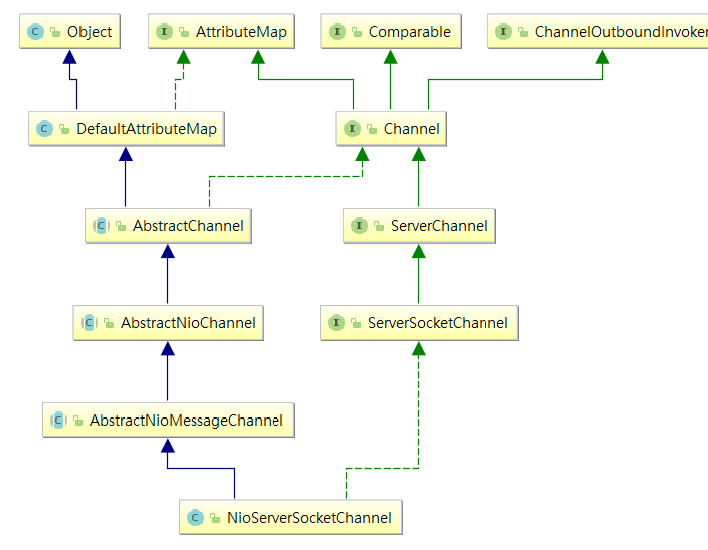

# 簡介

- A nexus to a network socket or a component which is capable of I/O operations such as read, write, connect, and bind.
- A channel provides a user:
- All I/O operations are asynchronous

<!--more-->
# 內容

- channel = channelFactory.newChannel(); // NioServerSocketChannel
- 當channel創建時候同時創建channelPipeline


```java
// AbstractChannel
/**
  * Creates a new instance.
  *
  * @param parent
  *        the parent of this channel. {@code null} if there's no parent.
  */
protected AbstractChannel(Channel parent) {
    this.parent = parent;
    id = newId();
    unsafe = newUnsafe();
    pipeline = newChannelPipeline();
}
```



# 參考資料


