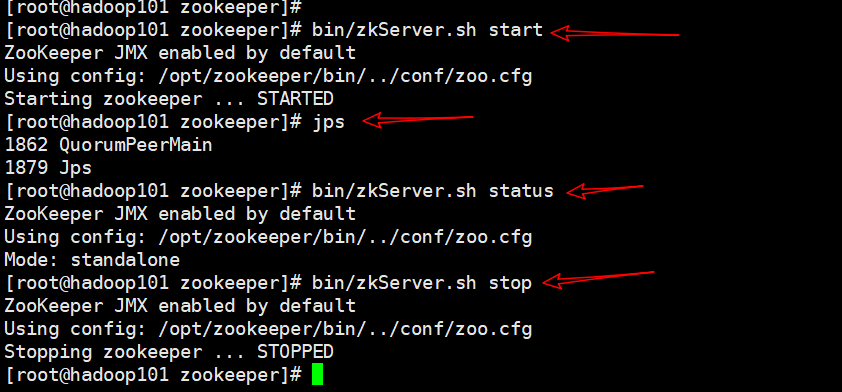

# 簡介

zookpeeeper
[ZooKeeper Administrator's Guide](http://zookeeper.apache.org/doc/current/zookeeperAdmin.html#sc_maintenance)
<!--more-->
# 內容

## 安裝
- tar -zxvf 
- cp /opt/zookeeper/conf/zoo_sample.cfg /opt/zookeeper/conf/zoo.cfg

```s
clientPort=2181
# the directory where the snapshot is stored.
# do not use /tmp for storage, /tmp here is just 
# example sakes.
# dataDir=/tmp/zookeeper
dataDir=/opt/zookeeper/data/zkData

```
> mkdir -p /opt/zookeeper/data/zkData


## zkServer.sh zkCli.sh
```s
bin/zkServer.sh start
jps
bin/zkServer.sh status
bin/zkServer.sh stop
```


# Clustered (Multi-Server) Setup

## /opt/zookeeper/conf/zoo.cfg
```s
tickTime=2000
dataDir=/var/lib/zookeeper/
clientPort=2181
initLimit=5
syncLimit=2
server.1=zoo1:2888:3888
server.2=zoo2:2888:3888
server.3=zoo3:2888:3888
```

## myid
> `dataDir` folder create filename `myid` => /opt/zookeeper/data/zkData/myid
```s
You attribute the server id to each machine by creating a file named myid, one for each server, which resides in that server's data directory, as specified by the configuration file parameter dataDir.
```


# java client
[bigdata](https://github.com/yudady/bigdata)

# 參考資料
- [zookeeper](http://zookeeper.apache.org/)

