# 簡介

- [Docker中文網](http://www.docker.org.cn/)
- [docker java](https://github.com/docker/labs/blob/master/developer-tools/java/readme.adoc)
- [docker hub](https://hub.docker.com/)


1. dockerfile:從無到有的構建鏡像
2. docker-compose:我所理解的docker-compose是編排容器的。docker-composer up

<!--more-->

# 內容

## docker架構圖
1. client:(linux tty 發出命令)
2. containers:(deamon 接收命令)
3. registry:是昌庫的服務器(hub.docker.com)

## docker的基本組成
1. 鏡像-image（鏡像、模版）
2. 容器-conatiner（實例:利用image啟動）
3. 昌庫-repository（存放鏡像的地方）


## windows(Hyper-V)
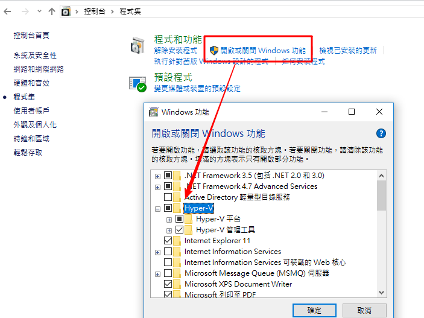
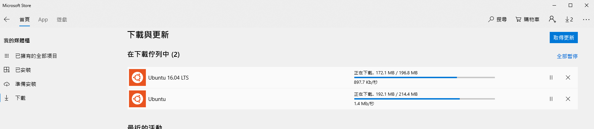
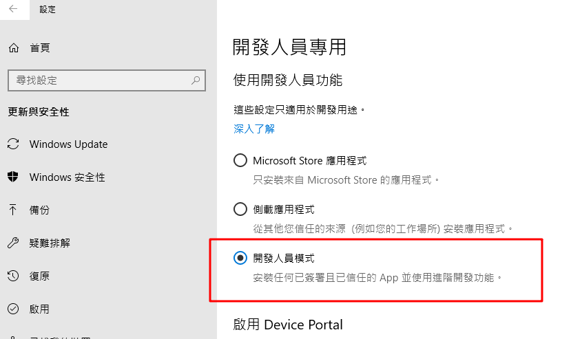


## linux 
1. yum update 
2. yum install -y docker
3. systemctl enable docker
4. systemctl start docker
5. 變更docker鏡像位置
```shell
// Docker 中国官方镜像加速

vim /etc/docker/daemon.json
{
   "registry-mirrors": [
      "https://hub.docker.com/",
      "https://registry.docker-cn.com"
   ]
}
```


### 測試docker

```shell
[root@cn50 docker]# docker run hello-world
Unable to find image 'hello-world:latest' locally
Trying to pull repository docker.io/library/hello-world ... 
latest: Pulling from docker.io/library/hello-world
d1725b59e92d: Pull complete 
Digest: sha256:0add3ace90ecb4adbf7777e9aacf18357296e799f81cabc9fde470971e499788
Status: Downloaded newer image for docker.io/hello-world:latest

Hello from Docker!
This message shows that your installation appears to be working correctly.

To generate this message, Docker took the following steps:
 1. The Docker client contacted the Docker daemon.
 2. The Docker daemon pulled the "hello-world" image from the Docker Hub.
    (amd64)
 3. The Docker daemon created a new container from that image which runs the
    executable that produces the output you are currently reading.
 4. The Docker daemon streamed that output to the Docker client, which sent it
    to your terminal.

To try something more ambitious, you can run an Ubuntu container with:
 $ docker run -it ubuntu bash

Share images, automate workflows, and more with a free Docker ID:
 https://hub.docker.com/

For more examples and ideas, visit:
 https://docs.docker.com/get-started/

[root@cn50 docker]# 

```


### 查看docker版本

```s
[root@cn50 docker]# docker version
Client:
 Version:         1.13.1
 API version:     1.26
 Package version: docker-1.13.1-75.git8633870.el7.centos.x86_64
 Go version:      go1.9.4
 Git commit:      8633870/1.13.1
 Built:           Fri Sep 28 19:45:08 2018
 OS/Arch:         linux/amd64

Server:
 Version:         1.13.1
 API version:     1.26 (minimum version 1.12)
 Package version: docker-1.13.1-75.git8633870.el7.centos.x86_64
 Go version:      go1.9.4
 Git commit:      8633870/1.13.1
 Built:           Fri Sep 28 19:45:08 2018
 OS/Arch:         linux/amd64
 Experimental:    false
[root@cn50 docker]# 

```
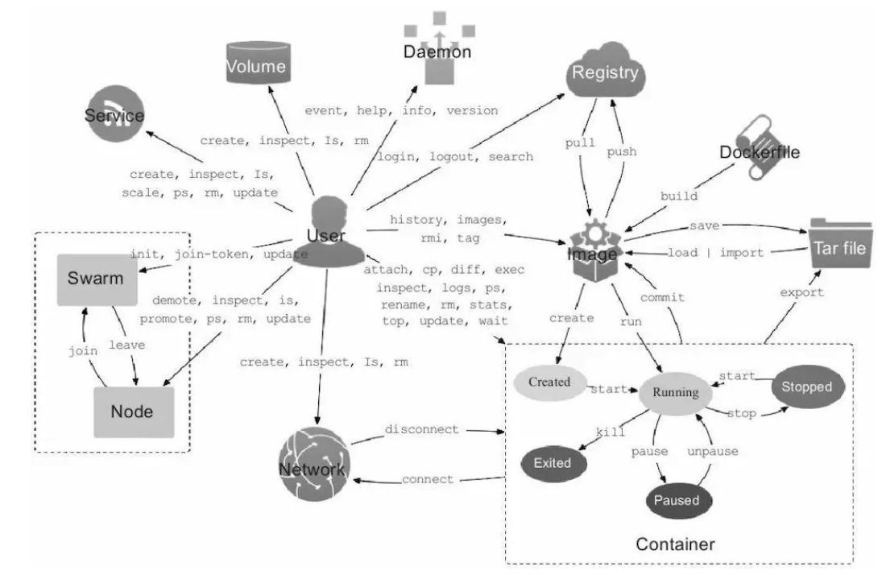


## docker login


### 練習

```shell
察看docker鏡像
[root@cn50 docker]# docker images
REPOSITORY              TAG                 IMAGE ID            CREATED             SIZE
docker.io/hello-world   latest              4ab4c602aa5e        2 months ago        1.84 kB


打上標籤
[root@cn50 docker]# docker tag docker.io/hello-world yudady/hello


[root@cn50 docker]# docker images
REPOSITORY              TAG                 IMAGE ID            CREATED             SIZE
docker.io/hello-world   latest              4ab4c602aa5e        2 months ago        1.84 kB
yudady/hello            latest              4ab4c602aa5e        2 months ago        1.84 kB


[root@cn50 docker]# docker push yudady/hello
The push refers to a repository [docker.io/yudady/hello]
428c97da766c: Mounted from library/hello-world 
latest: digest: sha256:1a6fd470b9ce10849be79e99529a88371dff60c60aab424c077007f6979b4812 size: 524

[root@cn50 docker]# docker images
REPOSITORY              TAG                 IMAGE ID            CREATED             SIZE
docker.io/hello-world   latest              4ab4c602aa5e        2 months ago        1.84 kB
yudady/hello            latest              4ab4c602aa5e        2 months ago        1.84 kB


[root@cn50 docker]# docker rmi docker.io/hello-world
Untagged: docker.io/hello-world:latest
Untagged: docker.io/hello-world@sha256:0add3ace90ecb4adbf7777e9aacf18357296e799f81cabc9fde470971e499788


[root@cn50 docker]# docker images
REPOSITORY          TAG                 IMAGE ID            CREATED             SIZE
yudady/hello        latest              4ab4c602aa5e        2 months ago        1.84 kB


```


## 先檢查container是否有再運行目標image，沒有才能用rmi移除鏡像

docker ps 
docker rmi "image id" 

```shell
tommy@tommy-MSI MINGW64 ~/OneDrive/Desktop/work02/mysql/5.7
$ docker images  //查看有哪些image
REPOSITORY          TAG                 IMAGE ID            CREATED             SIZE
<none>              <none>              8c3faa478f82        12 minutes ago      65.8MB
debian              stretch-slim        e9e49a465deb        2 weeks ago         55.3MB
yudady/hello        latest              4ab4c602aa5e        2 months ago        1.84kB


tommy@tommy-MSI MINGW64 ~/OneDrive/Desktop/work02/mysql/5.7
$ docker rmi 8c3faa478f82	// 移除鏡像
Error response from daemon: conflict: unable to delete 8c3faa478f82 (must be forced) - image is being used by stopped container 67fe512a4fe5


tommy@tommy-MSI MINGW64 ~/OneDrive/Desktop/work02/mysql/5.7
$ docker ps -a		//已經執行過的鏡像
CONTAINER ID        IMAGE               COMMAND                  CREATED             STATUS                        PORTS               NAMES
67fe512a4fe5        8c3faa478f82        "/bin/sh -c 'set -x ▒€▒"   15 minutes ago      Exited (100) 14 minutes ago                       nostalgic_kapitsa


tommy@tommy-MSI MINGW64 ~/OneDrive/Desktop/work02/mysql/5.7
$ docker rm 67fe512a4fe5
67fe512a4fe5


tommy@tommy-MSI MINGW64 ~/OneDrive/Desktop/work02/mysql/5.7
$ docker ps			//正在執行的鏡像
CONTAINER ID        IMAGE               COMMAND             CREATED             STATUS              PORTS               NAMES


tommy@tommy-MSI MINGW64 ~/OneDrive/Desktop/work02/mysql/5.7
$ docker images
REPOSITORY          TAG                 IMAGE ID            CREATED             SIZE
<none>              <none>              8c3faa478f82        17 minutes ago      65.8MB
debian              stretch-slim        e9e49a465deb        2 weeks ago         55.3MB
yudady/hello        latest              4ab4c602aa5e        2 months ago        1.84kB


tommy@tommy-MSI MINGW64 ~/OneDrive/Desktop/work02/mysql/5.7
$ docker rmi 8c3faa478f82
Deleted: sha256:8c3faa478f8255765a8103996f6a9c0866f60099783249dd1e3d37481c55af4e
Deleted: sha256:4be30ad09897858f1d7619db15aefd0e1fd48494d6817add26d0e0eaa641f7c2
Deleted: sha256:105713dab01702d4a779a71981d1dbd69d90b40c5a9a335c429eb170fae3a284
Deleted: sha256:d75f428ad43cd65d0efd630939353f4e6f1c37a8579aaba84ef5657badf639c6
Deleted: sha256:e65a2fa2d4e2a9265840a3dc8fef040e4e4c7c7a6e4bc1ddc0ffd6796f018aea


```


## docker命令


```shell
docker build -t friendlyhello .  # Create image using this directory's Dockerfile
docker run -p 4000:80 friendlyhello  # Run "friendlyname" mapping port 4000 to 80
docker run -d -p 4000:80 friendlyhello         # Same thing, but in detached mode
docker container ls                                # List all running containers
docker container ls -a             # List all containers, even those not running
docker container stop <hash>           # Gracefully stop the specified container
docker container kill <hash>         # Force shutdown of the specified container
docker container rm <hash>        # Remove specified container from this machine
docker container rm $(docker container ls -a -q)         # Remove all containers
docker image ls -a                             # List all images on this machine
docker image rm <image id>            # Remove specified image from this machine
docker image rm $(docker image ls -a -q)   # Remove all images from this machine
docker login             # Log in this CLI session using your Docker credentials
docker tag <image> username/repository:tag  # Tag <image> for upload to registry
docker push username/repository:tag            # Upload tagged image to registry
docker run username/repository:tag                   # Run image from a registry
```


- docker version

- docker info
- docker --help


>  docker run -d centos /bin/bash -c "while true;do echo 123; sleep 2; done"

docker run  -d 容器ID

docker logs -t -f --tail 3 容器ID

docker top  容器ID

docer inspect 容器ID

docker attach 容器ID

docker exec -t 容器ID    "ls -l /tmp"

docker exec -t 容器ID   /bin/bash


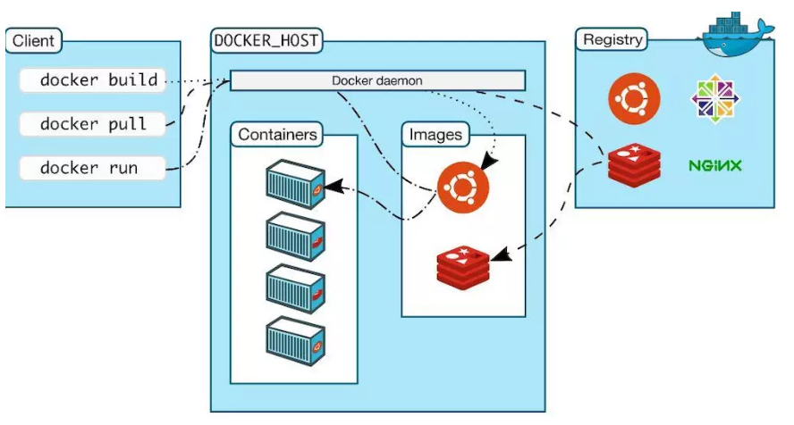

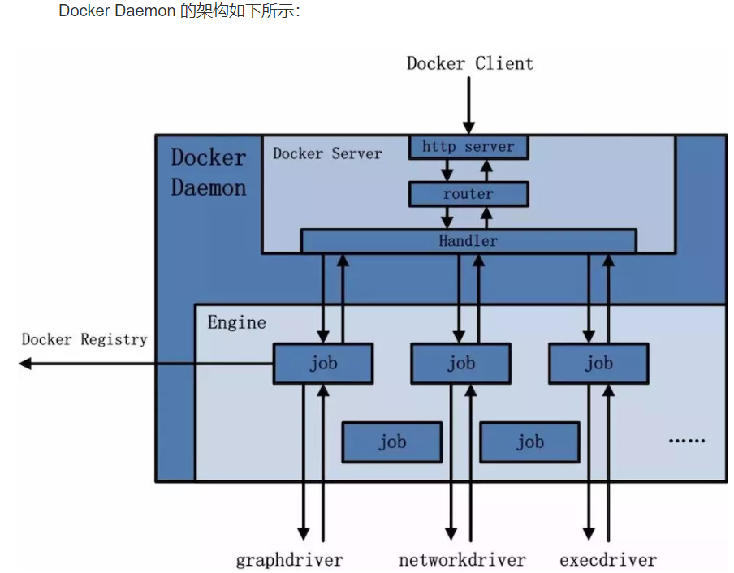

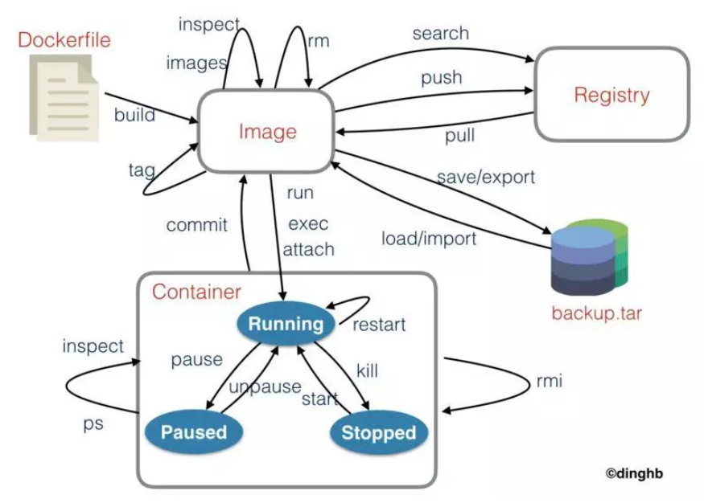

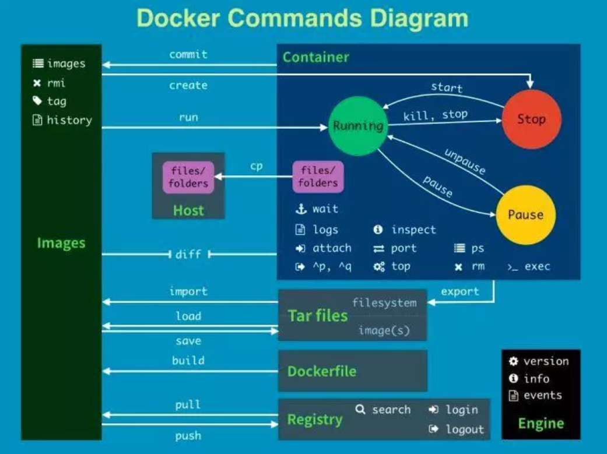

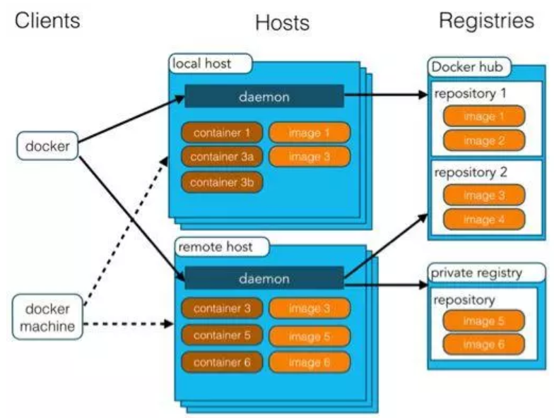

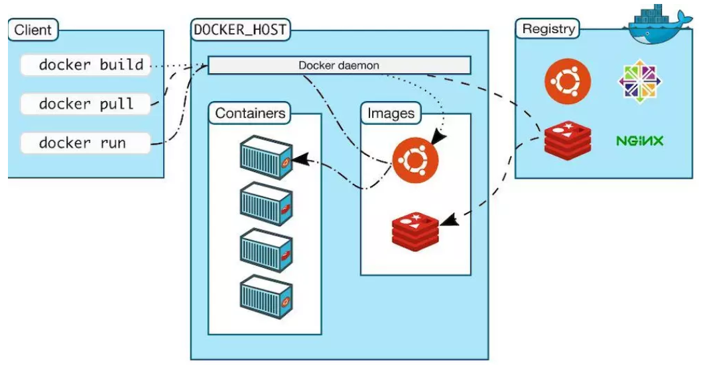

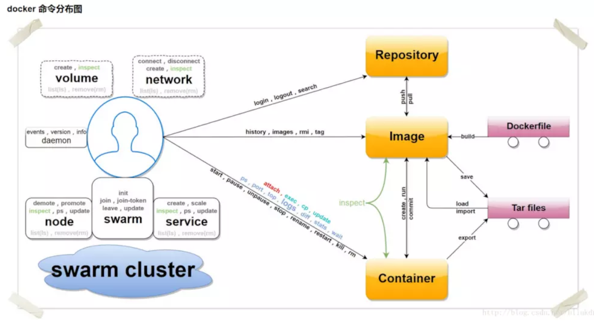


- [dicker for windows download](https://store.docker.com/editions/community/docker-ce-desktop-windows)
- [docker ce](https://download.docker.com/win/stable/Docker%20for%20Windows%20Installer.exe)


# 強制執行
```sh
// 強制停調全部的containers
docker ps -a -f status=exited

// 強制幹掉全部的containers
docker rm $(docker ps -a -f status=exited -q)
```


# 參考資料
- [Docker Cheat Sheet](https://www.jianshu.com/p/b6c7a4ca3e0e)
- [Docker使用手册](https://www.jianshu.com/p/3844b8e2a7ea)
- [Docker入门](https://www.jianshu.com/p/b6c7a4ca3e0e)
- [Docker总结](https://www.jianshu.com/p/e97cab73de92)
- [一小時Docker教程](https://blog.csphere.cn/archives/22)
- [10张图带你深入理解Docker容器和镜像](https://my.oschina.net/cloudsoar/blog/792768)
- [Docker for Java Developers](https://github.com/docker/labs/blob/master/developer-tools/java/readme.adoc)

