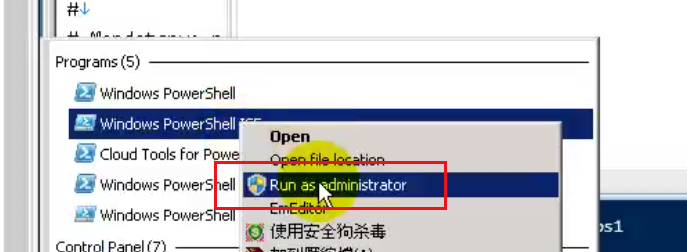
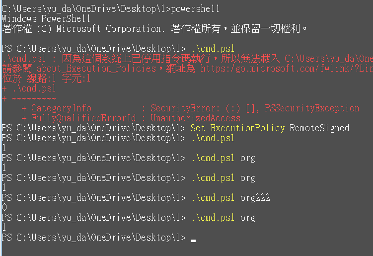
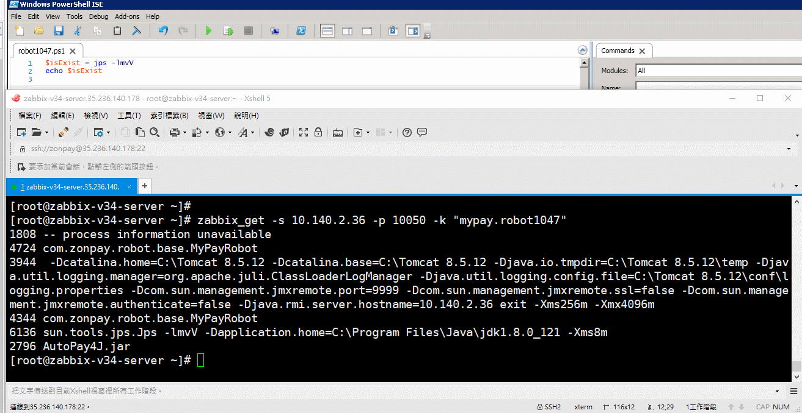
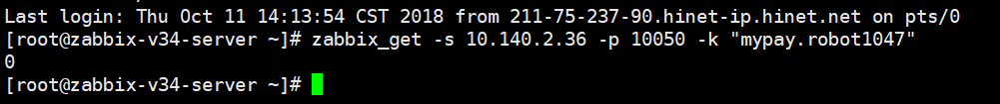

# 簡介

## 需求windows環境要偵測多個jvm的main方法，檢查是否啟動
> windows Zabbix UserParameter

<!--more-->
# 內容

> powershell 路徑 C:\Windows\System32\WindowsPowerShell\v1.0\

```PowerShell
# windows報錯，“檔案無法載入，因為這個系統已停用指令碼執行”
# 用管理員權限打開 PowerShell

Set-ExecutionPolicy RemoteSigned
```


> .\cmd.ps1 org



```PowerShell
$isExist = jps -lm  | Select-String -Pattern $args[0] -CaseSensitive 
if ($isExist.length -gt 0) {
    Write-Host "1"
}
else {
    Write-Host "0"
}
```

```PowerShell
$isExist = jps -lm | Select-String -include string "com.zonpay.robot.base.MyPayRobot" -CaseSensitive 
if ($isExist.length -gt 0) {
    Write-Host "1"
}
else {
    Write-Host "0"
}
```


```powershell
$all = Get-Process -Name java | select -expand id
$mark = 0
foreach ($i in $all) {
    $queryCondition = jinfo $i

    $jinfoArr = $queryCondition.split(' ')

    $isExist = $jinfoArr | Select-String -include string "C:\\myPayRobot\\robot1134" -CaseSensitive 
    if ($isExist.length -gt 0) {
        $mark = "1"
    }
    
}
Write-Host $mark
```


```powershell
$mark = 0
Get-Process -Name java | select -expand id | ForEach {
    $queryCondition = jinfo $_
    $jinfoArr = $queryCondition.split(' ')
    $isExist = $jinfoArr | Select-String -include string "robot1047" -CaseSensitive 
    if ($isExist.length -gt 0) {
        $mark = "1"
    }
}
Write-Host $mark
```


```powershell
$mark = 0
Get-Process -Name java | select -expand id | ForEach {
    $queryCondition = jinfo $_
    $jinfoArr = $queryCondition.split(' ')
    $isExist = $jinfoArr | Select-String -include string "C:\\myPayRobot\\robot1134" -CaseSensitive 
    if ($isExist.length -gt 0) {
        $mark = "1"
    }
}
Write-Host $mark
```

---


```conf
### Option: EnableRemoteCommands
#	Whether remote commands from Zabbix server are allowed.
#	0 - not allowed
#	1 - allowed
#
# Mandatory: no
# Default:
# EnableRemoteCommands=0
EnableRemoteCommands=1

####### USER-DEFINED MONITORED PARAMETERS #######

### Option: UnsafeUserParameters
#	Allow all characters to be passed in arguments to user-defined parameters.
#	The following characters are not allowed:
#	\ ' " ` * ? [ ] { } ~ $ ! & ; ( ) < > | # @
#	Additionally, newline characters are not allowed.
#	0 - do not allow
#	1 - allow
#
# Mandatory: no
# Range: 0-1
# Default:
UnsafeUserParameters=1

### Option: UserParameter
#	User-defined parameter to monitor. There can be several user-defined parameters.
#	Format: UserParameter=<key>,<shell command>
#
# Mandatory: no
# Default:
UserParameter=mypay.robot[*],C:\Windows\System32\WindowsPowerShell\v1.0\powershell.exe -File C:\Zabbix\robot.ps1 $1 $2 $3 $4 $5 $6 $7 $8 $9

```

## How to debug



---


> 要找mark "robot1047" 
```powershell
$arr = $args[0]
$mark = 0
Get-Process -Name java | select -expand id | ForEach {
    $queryCondition = jinfo $_
    $isExist = $queryCondition.split(' ') | Select-String -include string $arr -CaseSensitive 
    if ($isExist.length -gt 0) {
        $mark += 1
    }
}
echo $mark
```

## zabbix_get run shell Timeout，需要在客戶端修改
[root@zabbix-v34-server zabbix]# /usr/bin/zabbix_get -s 10.140.0.156 -p 10050 -k "mypay.robot[robot1162]"
ZBX_NOTSUPPORTED: Timeout while executing a shell script.
> Timeout=30

---

# 安裝步驟

## 修改權限
```
Set-ExecutionPolicy RemoteSigned
```
## 添加-自定義powershell 
> robot.ps1

## 修改conf
```conf
Timeout=30
StartAgents=50
EnableRemoteCommands=1
UnsafeUserParameters=1
UserParameter=mypay.robot[*],C:\Windows\System32\WindowsPowerShell\v1.0\powershell.exe -File C:\Zabbix\robot.ps1 $1 $2 $3 $4 $5 $6 $7 $8 $9

```
## 重起service

## zabbix_get測試

### 138-ACH
```
/usr/bin/zabbix_get -s 10.140.0.252 -p 10050 -k "mypay.robot[robot902]"
```
### 172-AGB
```
/usr/bin/zabbix_get -s 10.140.1.129 -p 10050 -k "mypay.robot[robot1134]"
/usr/bin/zabbix_get -s 10.140.1.129 -p 10050 -k "mypay.robot[robot726]"
```
### 175-AGE
```
/usr/bin/zabbix_get -s 10.140.1.134 -p 10050 -k "mypay.robot[robot1047]"
/usr/bin/zabbix_get -s 10.140.1.134 -p 10050 -k "mypay.robot[robot1134]"
/usr/bin/zabbix_get -s 10.140.1.134 -p 10050 -k "mypay.robot[robot726]"
```


## 添加template


## zbx_export_templates.xml
```xml
<?xml version="1.0" encoding="UTF-8"?>
<zabbix_export>
    <version>3.4</version>
    <date>2018-10-15T03:08:30Z</date>
    <groups>
        <group>
            <name>MYPAY-Windows</name>
        </group>
    </groups>
    <templates>
        <template>
            <template>mypay-robot</template>
            <name>MYPAY-ROBOT</name>
            <description>固碼機器人模版</description>
            <groups>
                <group>
                    <name>MYPAY-Windows</name>
                </group>
            </groups>
            <applications>
                <application>
                    <name>機器人</name>
                </application>
            </applications>
            <items>
                <item>
                    <name>固碼機器人監控</name>
                    <type>0</type>
                    <snmp_community/>
                    <snmp_oid/>
                    <key>mypay.robot[robot1047]</key>
                    <delay>30s</delay>
                    <history>90d</history>
                    <trends>365d</trends>
                    <status>0</status>
                    <value_type>3</value_type>
                    <allowed_hosts/>
                    <units>個</units>
                    <snmpv3_contextname/>
                    <snmpv3_securityname/>
                    <snmpv3_securitylevel>0</snmpv3_securitylevel>
                    <snmpv3_authprotocol>0</snmpv3_authprotocol>
                    <snmpv3_authpassphrase/>
                    <snmpv3_privprotocol>0</snmpv3_privprotocol>
                    <snmpv3_privpassphrase/>
                    <params/>
                    <ipmi_sensor/>
                    <authtype>0</authtype>
                    <username/>
                    <password/>
                    <publickey/>
                    <privatekey/>
                    <port/>
                    <description/>
                    <inventory_link>0</inventory_link>
                    <applications>
                        <application>
                            <name>機器人</name>
                        </application>
                    </applications>
                    <valuemap/>
                    <logtimefmt/>
                    <preprocessing/>
                    <jmx_endpoint/>
                    <master_item/>
                </item>
            </items>
            <discovery_rules/>
            <httptests/>
            <macros/>
            <templates/>
            <screens/>
        </template>
    </templates>
    <graphs>
        <graph>
            <name>robot-1047</name>
            <width>900</width>
            <height>200</height>
            <yaxismin>0.0000</yaxismin>
            <yaxismax>100.0000</yaxismax>
            <show_work_period>1</show_work_period>
            <show_triggers>1</show_triggers>
            <type>0</type>
            <show_legend>1</show_legend>
            <show_3d>0</show_3d>
            <percent_left>0.0000</percent_left>
            <percent_right>0.0000</percent_right>
            <ymin_type_1>0</ymin_type_1>
            <ymax_type_1>0</ymax_type_1>
            <ymin_item_1>0</ymin_item_1>
            <ymax_item_1>0</ymax_item_1>
            <graph_items>
                <graph_item>
                    <sortorder>0</sortorder>
                    <drawtype>0</drawtype>
                    <color>1A7C11</color>
                    <yaxisside>0</yaxisside>
                    <calc_fnc>7</calc_fnc>
                    <type>0</type>
                    <item>
                        <host>mypay-robot</host>
                        <key>mypay.robot[robot1047]</key>
                    </item>
                </graph_item>
            </graph_items>
        </graph>
    </graphs>
</zabbix_export>

```


# jcmd

> help

```
C:\Users\yu_da>jcmd -h
Usage: jcmd <pid | main class> <command ...|PerfCounter.print|-f file>
   or: jcmd -l
   or: jcmd -h

  command must be a valid jcmd command for the selected jvm.
  Use the command "help" to see which commands are available.
  If the pid is 0, commands will be sent to all Java processes.
  The main class argument will be used to match (either partially
  or fully) the class used to start Java.
  If no options are given, lists Java processes (same as -p).

  PerfCounter.print display the counters exposed by this process
  -f  read and execute commands from the file
  -l  list JVM processes on the local machine
  -h  this help
```

---

> 使用pid加上help

```
C:\Users\yu_da>jcmd 16428 help
16428:
The following commands are available:
JFR.stop
JFR.start
JFR.dump
JFR.check
VM.native_memory
VM.check_commercial_features
VM.unlock_commercial_features
ManagementAgent.stop
ManagementAgent.start_local
ManagementAgent.start
GC.rotate_log
Thread.print
GC.class_stats
GC.class_histogram
GC.heap_dump
GC.run_finalization
GC.run
VM.uptime
VM.flags 
VM.system_properties
VM.command_line
VM.version
help

For more information about a specific command use 'help <command>'.

C:\Users\yu_da>
```


> 查詢JVM參數

```
C:\Users\yu_da>jcmd 16428 VM.command_line
16428:
VM Arguments:
jvm_args: -Xmx700m -Djava.awt.headless=true -Djava.endorsed.dirs="" -Djdt.compiler.useSingleThread=true -Dpreload.project.path=D:/zonvan/coding/myPayRobot 
...
java_class_path (initial): D:/install/JetBrains/ideaIU-2017.2.7/lib/jps-launcher.jar;C:/Program Files/Java/jdk1.8.0_161/lib/tools.jar;D:/install/JetBrains/ideaIU-2017.2.7/lib/optimizedFileManager.jar
Launcher Type: SUN_STANDARD

C:\Users\yu_da>

```


# jinfo

```
C:\Users\yu_da>
C:\Users\yu_da>jinfo 16428
Attaching to process ID 16428, please wait...
Debugger attached successfully.
Server compiler detected.
JVM version is 25.161-b12
Java System Properties:

java.vendor = Oracle Corporation
preload.project.path = D:/zonvan/coding/myPayRobot
sun.java.launcher = SUN_STANDARD
idea.config.path = D:/install/JetBrains/ideaIU-2017.2.7/.IntelliJIdea2017.2/config
sun.management.compiler = HotSpot 64-Bit Tiered Compilers
sun.nio.ch.bugLevel =
idea.paths.selector = IntelliJIdea2017.2
jps.file.types.component.name = FileTypeManager
kotlin.daemon.client.alive.path = "C:\Users\yu_da\AppData\Local\Temp\kotlin-idea-9068951628187305651-is-running"
os.name = Windows 10
sun.boot.class.path = C:\Program Files\Java\jdk1.8.0_161\jre\lib\resources.jar;C:\Program Files\Java\jdk1.8.0_161\jre\lib\rt.jar;C:\Program Files\Java\jdk1.8.0_161\jre\lib\sunrsasign.jar;C:\Program Files\Java\jdk1.8.0_161\jre\lib\jsse.jar;C:\Program Files\Java\jdk1.8.0_161\jre\lib\jce.jar;C:\Program Files\Java\jdk1.8.0_161\jre\lib\charsets.jar;C:\Program Files\Java\jdk1.8.0_161\jre\lib\jfr.jar;C:\Program Files\Java\jdk1.8.0_161\jre\classes
sun.desktop = windows
idea.plugins.path = D:/install/JetBrains/ideaIU-2017.2.7/.IntelliJIdea2017.2/config\plugins
java.vm.specification.vendor = Oracle Corporation
java.runtime.version = 1.8.0_161-b12
io.netty.serviceThreadPrefix = Netty
user.name = tommy
idea.home.path = D:\install\JetBrains\ideaIU-2017.2.7
user.language = en
jdt.compiler.useSingleThread = true
sun.boot.library.path = C:\Program Files\Java\jdk1.8.0_161\jre\bin
java.version = 1.8.0_161
user.timezone = Asia/Taipei
java.net.preferIPv4Stack = true
kotlin.daemon.enabled =
sun.arch.data.model = 64
io.netty.initialSeedUniquifier = -413575156224806991
java.endorsed.dirs = ""
sun.cpu.isalist = amd64
sun.jnu.encoding = MS950
file.encoding.pkg = sun.io
file.separator = \
java.specification.name = Java Platform API Specification
java.class.version = 52.0
user.country = TW
java.home = C:\Program Files\Java\jdk1.8.0_161\jre
kotlin.incremental.compilation.experimental = true
java.vm.info = mixed mode
os.version = 10.0
path.separator = ;
java.vm.version = 25.161-b12
user.variant =
jps.fallback.jdk.version = 1.8.0_152-release
java.awt.printerjob = sun.awt.windows.WPrinterJob
sun.io.unicode.encoding = UnicodeLittle
awt.toolkit = sun.awt.windows.WToolkit
jps.log.dir = D:/install/JetBrains/ideaIU-2017.2.7/.IntelliJIdea2017.2/system/log/build-log
io.netty.processId = 27257
user.script =
user.home = C:\Users\yu_da
java.specification.vendor = Oracle Corporation
java.library.path = C:\Program Files\Java\jdk1.8.0_161\bin; C:\Users\yu_da\AppData\Roaming\npm;.
java.vendor.url = http://java.oracle.com/
jps.fallback.jdk.home = D:/install/JetBrains/ideaIU-2017.2.7/jre64
java.vm.vendor = Oracle Corporation
java.runtime.name = Java(TM) SE Runtime Environment
sun.java.command = org.jetbrains.jps.cmdline.Launcher D:/install/JetBrains/ideaIU-2017.2.7/lib/jna-platform.jar;D:/install/JetBrains/ideaIU-2017.2.7/lib/jps-builders.jar;...D:/install/JetBrains/ideaIU-2017.2.7/.IntelliJIdea2017.2/system/compile-server
java.class.path = D:/install/JetBrains/ideaIU-2017.2.7/lib/jps-launcher.jar;C:/Program Files/Java/jdk1.8.0_161/lib/tools.jar;D:/install/JetBrains/ideaIU-2017.2.7/lib/optimizedFileManager.jar
io.netty.machineId = 28:f0:76:ff:fe:16:65:0e
java.vm.specification.name = Java Virtual Machine Specification
jps.backward.ref.index.builder = true
java.vm.specification.version = 1.8
preload.config.path = D:/install/JetBrains/ideaIU-2017.2.7/.IntelliJIdea2017.2/config/options
sun.cpu.endian = little
sun.os.patch.level =
java.awt.headless = true
java.io.tmpdir = D:/install/JetBrains/ideaIU-2017.2.7/.IntelliJIdea2017.2/system/compile-server/mypayrobot_809d945d/_temp_
java.vendor.url.bug = http://bugreport.sun.com/bugreport/
os.arch = amd64
java.awt.graphicsenv = sun.awt.Win32GraphicsEnvironment
java.ext.dirs = C:\Program Files\Java\jdk1.8.0_161\jre\lib\ext;C:\WINDOWS\Sun\Java\lib\ext
rebuild.on.dependency.change = true
user.dir = D:\install\JetBrains\ideaIU-2017.2.7\.IntelliJIdea2017.2\system\compile-server
line.separator =

java.vm.name = Java HotSpot(TM) 64-Bit Server VM
file.encoding = UTF-8
java.specification.version = 1.8
compile.parallel = false
io.netty.noUnsafe = true

VM Flags:
Non-default VM flags: -XX:CICompilerCount=4 -XX:InitialHeapSize=536870912 -XX:MaxHeapSize=734003200 -XX:MaxNewSize=244318208 -XX:MinHeapDeltaBytes=524288 -XX:NewSize=178782208 -XX:OldSize=358088704 -XX:+UseCompressedClassPointers -XX:+UseCompressedOops -XX:+UseFastUnorderedTimeStamps -XX:-UseLargePagesIndividualAllocation -XX:+UseParallelGC
Command line:  -Xmx700m -Djava.awt.headless=true -Djava.endorsed.dirs="" -Djdt.compiler.useSingleThread=true -Dpreload.project.path=D:/zonvan/coding/myPayRobot -Dpreload.config.path=D:/install/JetBrains/ideaIU-2017.2.7/.IntelliJIdea2017.2/config/options -Dcompile.parallel=false -Drebuild.on.dependency.change=true -Djava.net.preferIPv4Stack=true -Dio.netty.initialSeedUniquifier=-413575156224806991 -Dfile.encoding=UTF-8 -Djps.file.types.component.name=FileTypeManager -Duser.language=en -Duser.country=TW -Didea.paths.selector=IntelliJIdea2017.2 -Didea.home.path=D:\install\JetBrains\ideaIU-2017.2.7 -Didea.config.path=D:/install/JetBrains/ideaIU-2017.2.7/.IntelliJIdea2017.2/config -Didea.plugins.path=D:/install/JetBrains/ideaIU-2017.2.7/.IntelliJIdea2017.2/config\plugins -Djps.log.dir=D:/install/JetBrains/ideaIU-2017.2.7/.IntelliJIdea2017.2/system/log/build-log -Djps.fallback.jdk.home=D:/install/JetBrains/ideaIU-2017.2.7/jre64 -Djps.fallback.jdk.version=1.8.0_152-release -Dio.netty.noUnsafe=true -Djava.io.tmpdir=D:/install/JetBrains/ideaIU-2017.2.7/.IntelliJIdea2017.2/system/compile-server/mypayrobot_809d945d/_temp_ -Djps.backward.ref.index.builder=true -Dkotlin.incremental.compilation.experimental=true -Dkotlin.daemon.enabled -Dkotlin.daemon.client.alive.path="C:\Users\yu_da\AppData\Local\Temp\kotlin-idea-9068951628187305651-is-running"


C:\Users\yu_da>

```





# 參考資料
- [S小魚仔S Zabbix 3.2 善用 UserParameter 回傳 Windows PowerShell 值](http://my-fish-it.blogspot.com/2017/03/ss-zabbix-32-userparameter-windows.html)
- [zabbix-scripts](https://github.com/sm4sh1k/zabbix-scripts)
