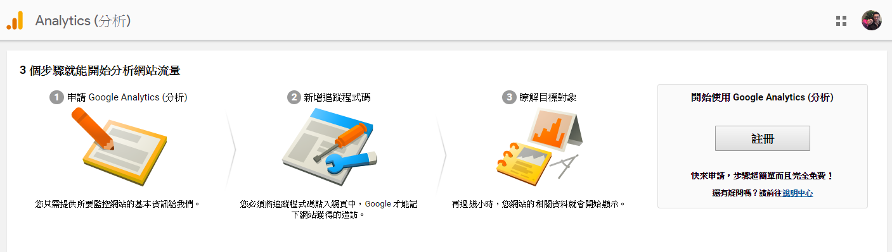
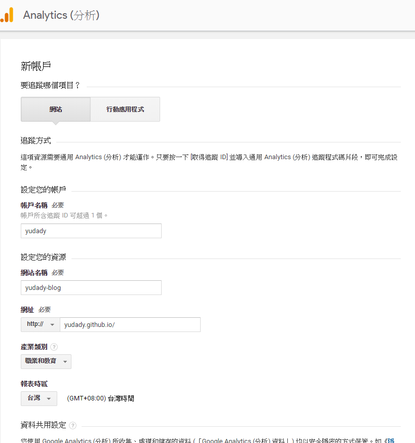
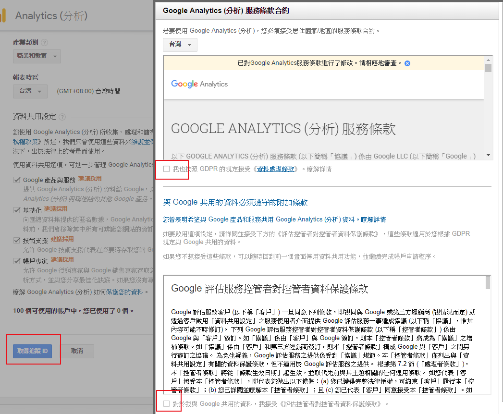
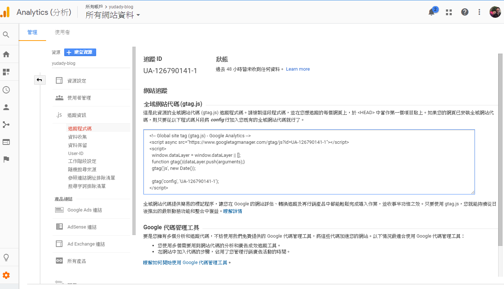
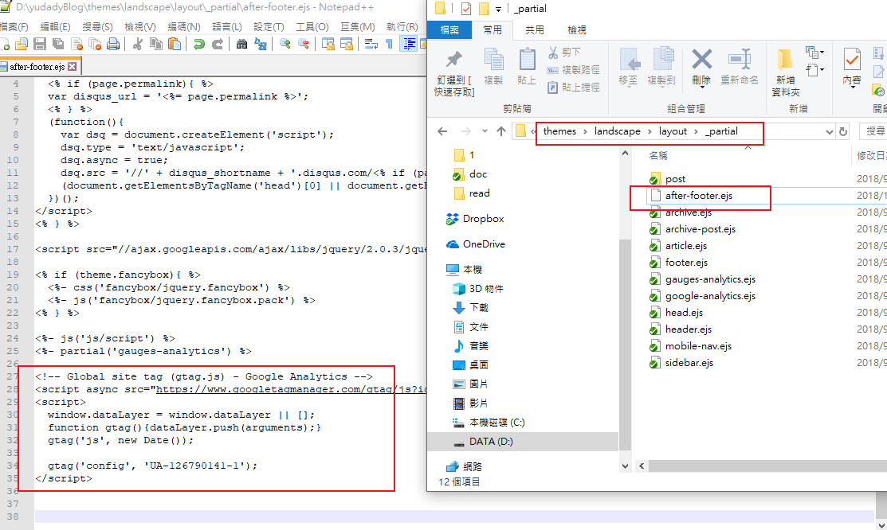
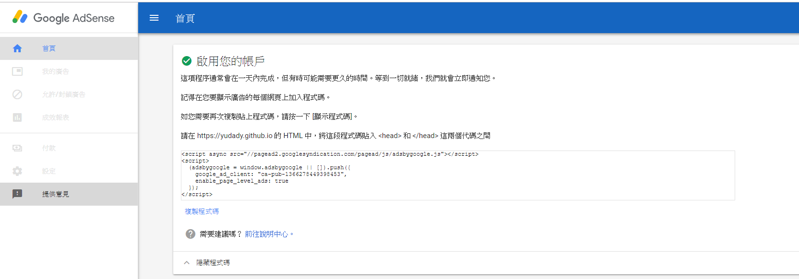

# 簡介
加入Google網站分析
[Google-Analytics](https://marketingplatform.google.com/about/analytics/)

<!--more-->
# 內容








追蹤 ID
UA-126790141-1

```
<!-- Global site tag (gtag.js) - Google Analytics -->
<script async src="https://www.googletagmanager.com/gtag/js?id=UA-126790141-1"></script>
<script>
  window.dataLayer = window.dataLayer || [];
  function gtag(){dataLayer.push(arguments);}
  gtag('js', new Date());

  gtag('config', 'UA-126790141-1');
</script>

```
# 添加js在footer



```
themes/landscape/layout/_partial/
  `after-footer.ejs`

```





# Google與AdSense


```
<script async src="//pagead2.googlesyndication.com/pagead/js/adsbygoogle.js"></script>
<script>
  (adsbygoogle = window.adsbygoogle || []).push({
    google_ad_client: "ca-pub-1366278449398453",
    enable_page_level_ads: true
  });
</script>
```


# 參考資料
[azyukei](http://azyukei.github.io/2015/04/Hexo-Google/)

