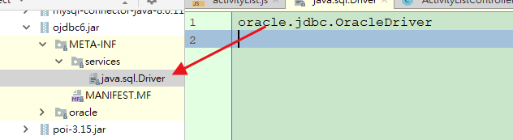

# 簡介

java服務發現機制


<!--more-->
# 內容

## java.util.ServiceLoader
- A simple service-provider loading facility.
- META-INF/services/目录里同时创建一个以服务接口命名的文件。该文件里就是实现该服务接口的具体实现类
- jdk提供服务实现查找的一个工具类：java.util.ServiceLoader


## oracle.jar




```java
public class DriverManager {
      /**
     * Load the initial JDBC drivers by checking the System property
     * jdbc.properties and then use the {@code ServiceLoader} mechanism
     */
    static {
        loadInitialDrivers();
        println("JDBC DriverManager initialized");
    }


    private static void loadInitialDrivers() {
        String drivers;
        try {
            drivers = AccessController.doPrivileged(new PrivilegedAction<String>() {
                public String run() {
                    return System.getProperty("jdbc.drivers");
                }
            });
        } catch (Exception ex) {
            drivers = null;
        }
        // If the driver is packaged as a Service Provider, load it.
        // Get all the drivers through the classloader
        // exposed as a java.sql.Driver.class service.
        // ServiceLoader.load() replaces the sun.misc.Providers()

        AccessController.doPrivileged(new PrivilegedAction<Void>() {
            public Void run() {


                // ＊＊＊＊加載"META-INF/services/"＊＊＊＊＊＊   察看  ServiceLoader類
                
                
                // 利用ServiceLoader找出真正的實現類，然後執行class.forName("XXXXXXXXXXX")


                // 找出要執行的類
                ServiceLoader<Driver> loadedDrivers = ServiceLoader.load(Driver.class);
                Iterator<Driver> driversIterator = loadedDrivers.iterator();

                /* Load these drivers, so that they can be instantiated.
                 * It may be the case that the driver class may not be there
                 * i.e. there may be a packaged driver with the service class
                 * as implementation of java.sql.Driver but the actual class
                 * may be missing. In that case a java.util.ServiceConfigurationError
                 * will be thrown at runtime by the VM trying to locate
                 * and load the service.
                 *
                 * Adding a try catch block to catch those runtime errors
                 * if driver not available in classpath but it's
                 * packaged as service and that service is there in classpath.
                 */
                try{
                    while(driversIterator.hasNext()) {
                        driversIterator.next();
                    }
                } catch(Throwable t) {
                // Do nothing
                }
                return null;
            }
        });
        println("DriverManager.initialize: jdbc.drivers = " + drivers);

        if (drivers == null || drivers.equals("")) {
            return;
        }
        String[] driversList = drivers.split(":");
        println("number of Drivers:" + driversList.length);
        for (String aDriver : driversList) {
            try {
                println("DriverManager.Initialize: loading " + aDriver);


                // `Class.forName`
                Class.forName(aDriver, true, ClassLoader.getSystemClassLoader());


            } catch (Exception ex) {
                println("DriverManager.Initialize: load failed: " + ex);
            }
        }
        
    }
   
}


public final class ServiceLoader<S> implements Iterable<S> {
    private static final String PREFIX = "META-INF/services/";
}

```


# 參考資料


