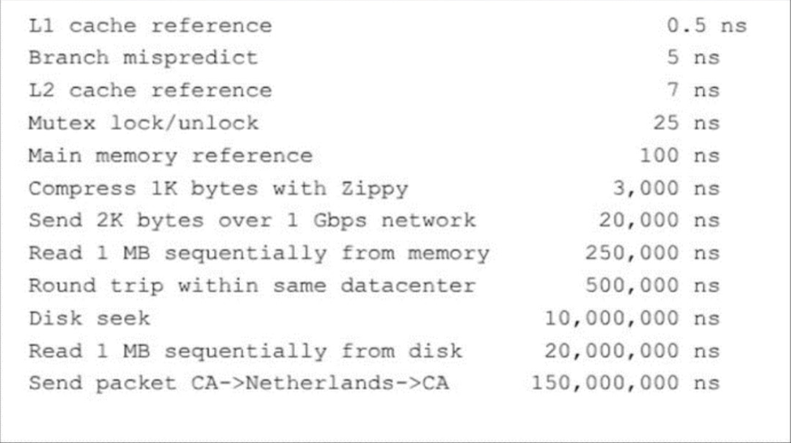

# 簡介

內存->網路 (慢100倍)
`硬碟尋道一次` vs 讀取1M資料 = 1 : 2 (時間)
<!--more-->
# 內容

- [Caffeine缓存](https://www.jianshu.com/p/9a80c662dac4)
- [Spring Boot缓存实战 Redis + Caffeine 实现多级缓存](https://www.jianshu.com/p/ef9042c068fd)

# 參考資料

