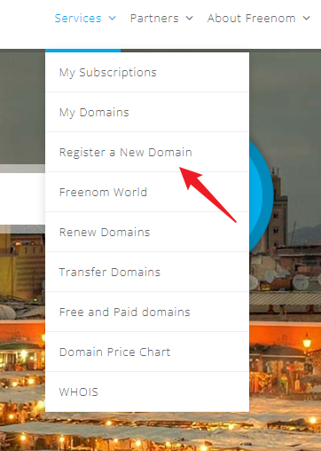
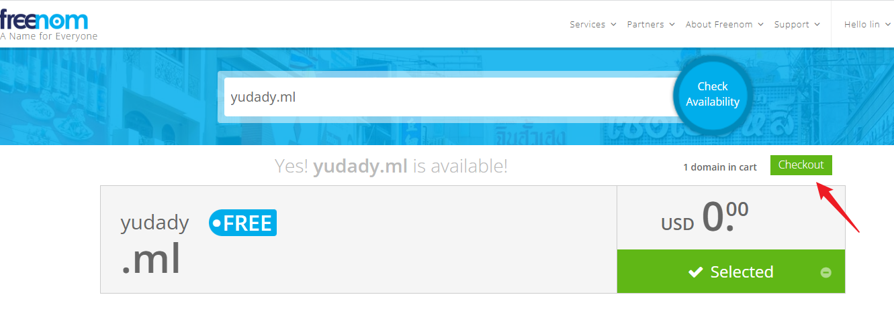
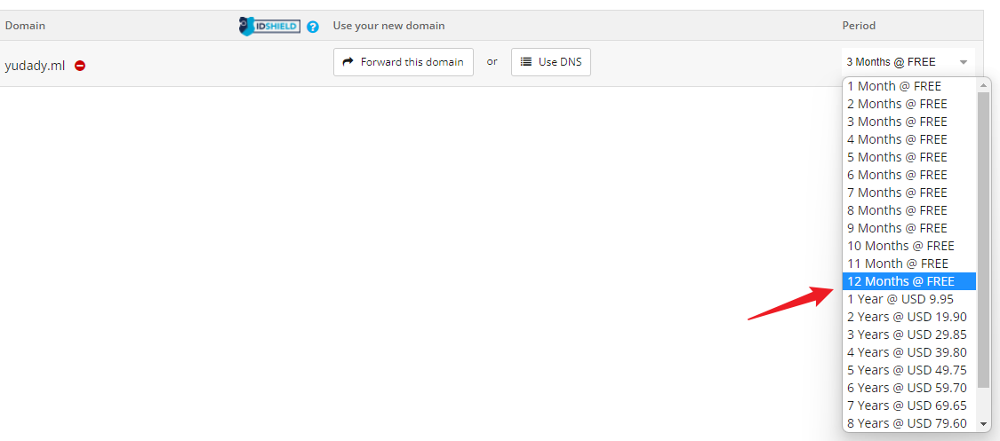
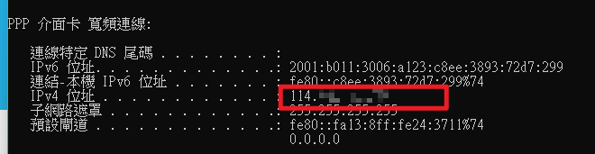
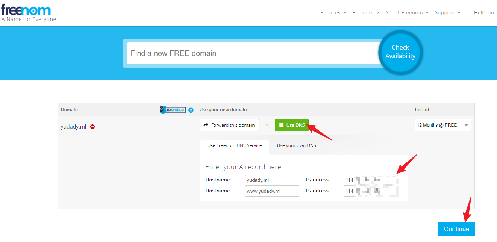
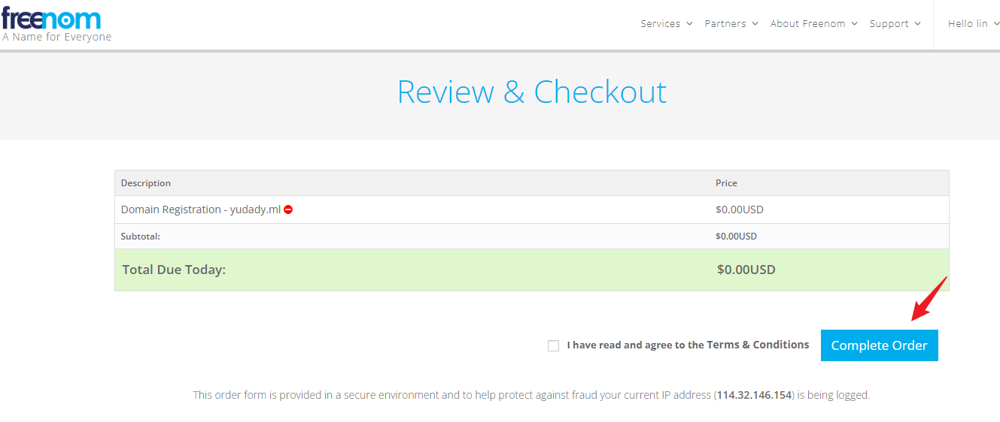
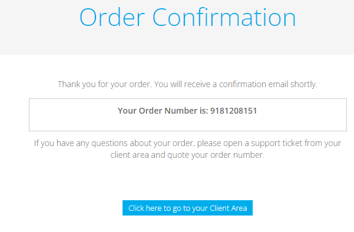
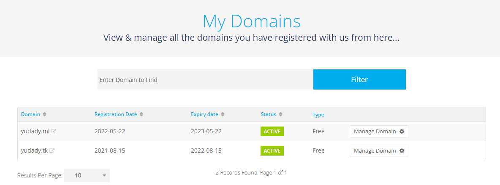

# 免費設定網站資源( free domain resource )

## [申請註冊域名-freenom](https://my.freenom.com/)

> 需要使用 firefox , login use gmail

* yudady.ml
* yudady.cf
* yudady.gq
* yudady.gq

> bind 114.32.146.154

> **Your Order Number is: 9181208151**

## DNS解析
[DNS解析-cloudflare](https://dash.cloudflare.com/)  

[API 權杖 | Cloudflare](https://dash.cloudflare.com/profile/api-tokens)

## SSL
[sslforfree](https://www.sslforfree.com/)  
  
  
  
*.yudady.tk  
github.yudady.tk

