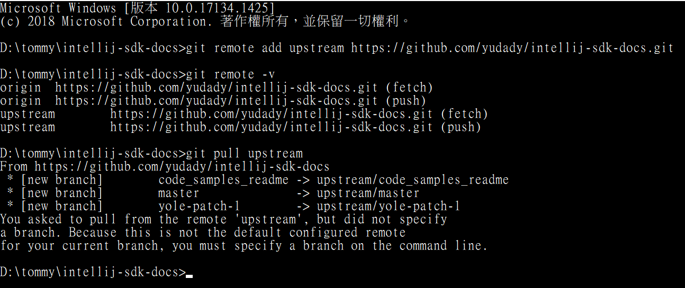

# 簡介
更新從 GitHub 上 fork 出來的 repository

```shell script
git remote add upstream https://github.com/yudady/intellij-sdk-docs.git

git remote set-url origin https://github.com/yudady/intellij-sdk-docs.git

git remote -v

git pull upstream
```

<!--more-->
# 內容


# 參考資料


