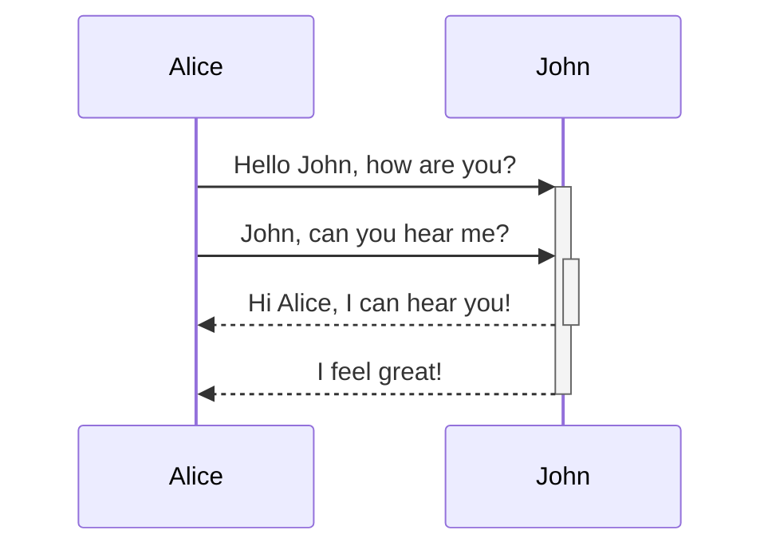
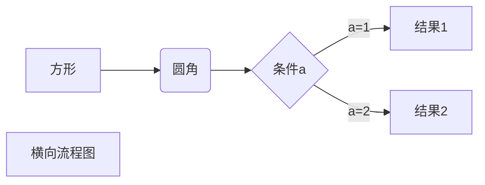
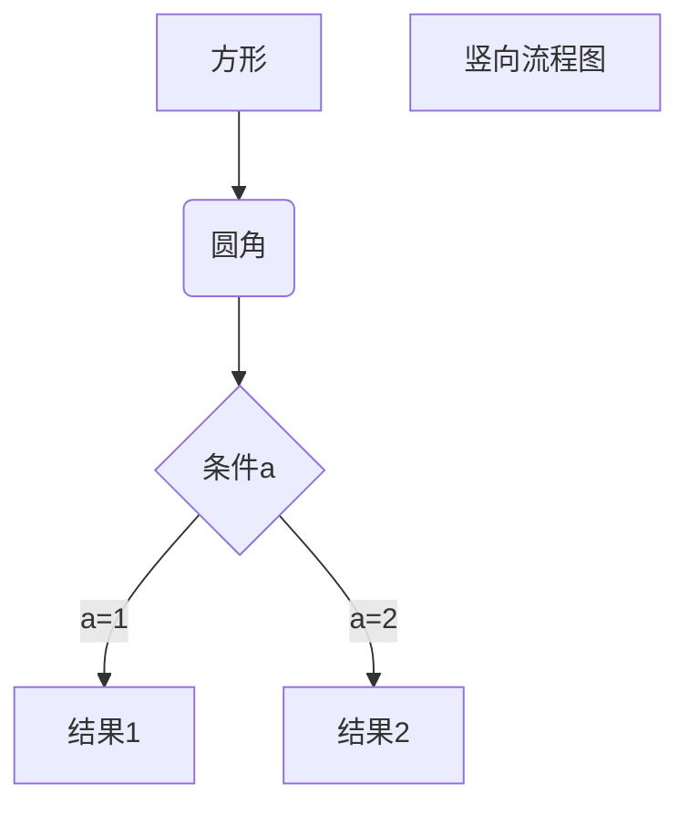
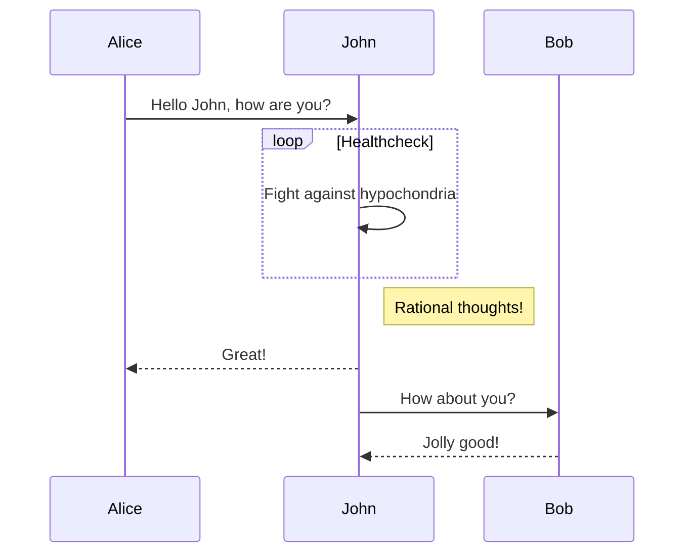
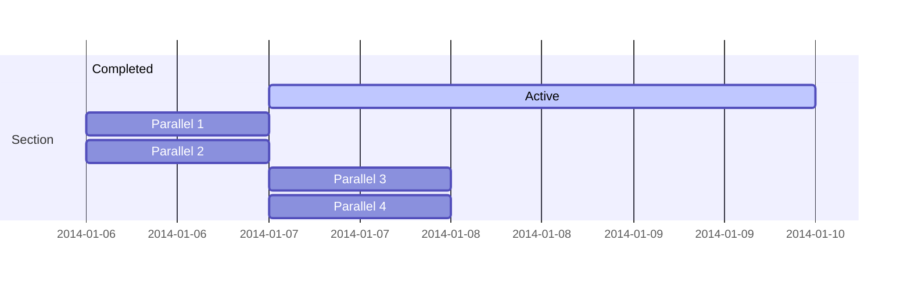

```ad-note
 title: [Johnny学OB 第37集 教你几招 - 如何在Obsidian中更好的使用Mermaid做流程图 Obsidian教程_哔哩哔哩_bilibili]
 collapse: open
 
 
```




 - [Markdown 高级技巧 | 菜鸟教程](https://www.runoob.com/markdown/md-advance.html?tdsourcetag=s_pctim_aiomsg)
 - [github mermaid](https://github.com/mermaid-js/mermaid/blob/develop/README.zh-CN.md)

## **1️⃣横向流程图源码格式：**



## **2️⃣竖向流程图源码格式：**



## **时序图**



## **甘特图**
