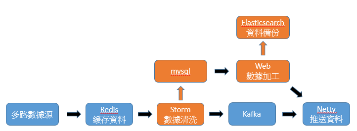
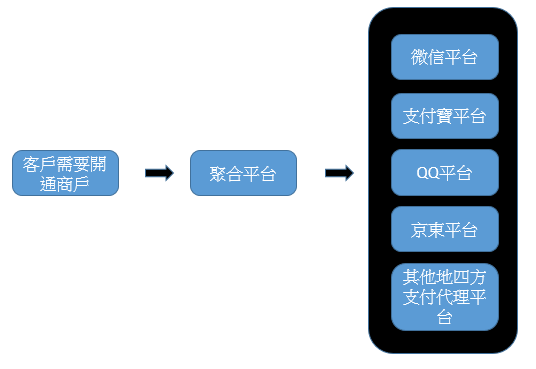
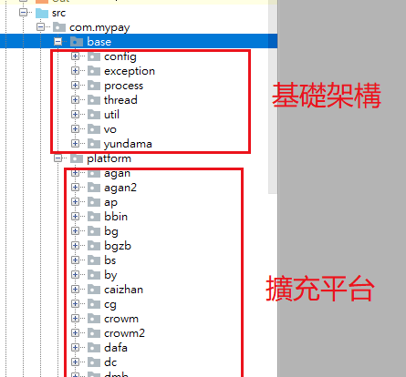
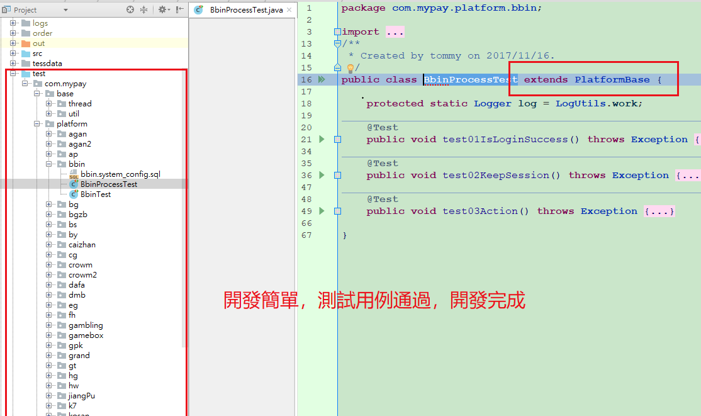
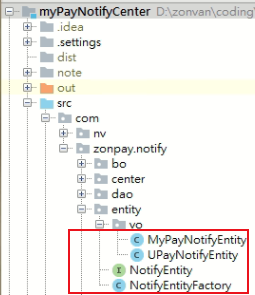

# 我的專長（JAVA）/ 全棧工程師 / Devops(自己開發自己維運)
- java web 開發
- 多執行序開發
- 測試維運可兼任

# 我的專業技能熟悉度

- `前端`：`vue2` (60%)、`es6`(80%)、html5(90%)、css3(70%)、bootstrap3(90%)、jquery(90%) 、zepto(90%)、jquery ui(85%)、jquery easy ui(60%)、chrome plugin(50%)
- `後端`：`java`(90%)、`mybatis`(80%)、`spring`(90%)、`springboot`(70%)、`springcloud`(50%)、spring security(60%)、stome(60%)、kafka(60%)、netty(50%)、struts 1(60%)、struts 2(70%)、apache shiro(50%)、webservice(70%)、websocket(70%)、hibernate(50%)、jbpm(50%)、jasperreport(50%)、crystal report(50%)、google drive api(50%)、tesseract(50%)、LDAP(50%)
-	`測試`：jmeter(80%)、selenium(90%)、postman(80%)、apache ab(70%)、junit(90%)、testNG(40%)、mockito(50%)、fiddler(50%)
-	`維運`：zabbix(70%)、Elastic search(80%)、jenkins
-	`資料庫`：oracle(70%)、mysql(70%)、plsql(60%)、mssql(40%)
- `工具`：docker、gradle、ant、maven、svn、git
- `其他`: vSphere、linux、windows 2008 server、linux shell、google cloud platform、ssl、tomcat、jetty、jboss、websphere

<!--more-->

# 我的經歷
- 聚力國際咨詢有限公司(2018.12-2019.01)體育數據清洗系統
- 縱網數碼科技有限公司(2016.11-2018.11)聚合支付系統
- 豐揚科技(2013.4-2016.11)電信業系統
- 億力(2011.6-2013.4)財稅系統、台灣大哥大維修物料系統
- 緯創(2009.5-2011.6)航運物料系統
- 創世紀(2005.3-2009.3)企業形象網站

## 工作內容 
聚力國際咨詢有限公司
 
體育系統:
  - 前台使用vue+php，後台使用springcloud搭建

數據清洗系統:
- Web:基礎架構使用AdminLTE搭建
- Web使用:thymeleaf、springboot、mybatis、mysql
- ElasticSearch:歷史資料備份
- Stome:拉取redis資料寫到mysql
- git、maven、docker(開發環境) 

縱網數碼科技有限公司
 

提供通用聚合支付平台、串接第4方支付（微信、支付寶、QQ、京東）
redis oracle mysql elasticsearch kibana logstash filebean maven gradle svn centos zabbix jenkins tesseract(OCR) jsoup html5 vue jquery css bootstrap websocket jmeter selenium 爬虫拉取第四方資料 

# 我的特殊經驗

## 大數據
  - storm

## 獨立設計開發機器人
  - 解決重複上分問題（不用再賠錢給客戶）
  - 設計，開發獨立完成
  - 多執行緒
  - OCR處理驗證碼
  - 擴展性好
  - 開發簡單

### 機器人架構

### 機器人開發簡單

## 獨立設計開發notifyCenter
  - 回調通知系統
  - 支援upay回調
  - 支援mycenter回調

## 獨立設計開發在windows利用gradle，發粄到linux系統

## oracle
  - 獨立安裝於Centos,windows2008
  - 無法啟動，spfile，pfile消失
  - 處理disk IO太大
  - 資料備份，回滾，誤刪

## 獨立安裝處理ELK
  - 收集LOG
  - 維運，統一LOG查詢

## 獨立安裝處理zabbx
  - 即時回報問題主機，資料庫
  - 即時line告警

## 獨立安裝處理jenkins
  - ant佈版
  - linux shell佈版
  - mail告警

# 我的技能

- 環境
  - [nginx](https://github.com/yudady/note-book/blob/master/os/%E6%88%91%E7%9A%84%E7%B6%B2%E8%B7%AF%E6%9E%B6%E8%A8%AD.md)，反向代、負載均衡，流量限制
  - [vSphere](https://github.com/yudady/skills/tree/master/doc/vSphere.docx)，虛擬主機
  - [jenkins](https://github.com/yudady/skills/tree/master/doc/Centos7.jenkins設定.doc)，自動發粄
  - [oracle](https://github.com/yudady/skills/tree/master/doc/Centos7.oracle設定.doc)，資料庫
    - [变更oracle记忆体大小](https://github.com/yudady/skills/tree/master/doc/变更oracle记忆体大小.pdf)
  - [tomcat](https://github.com/yudady/skills/tree/master/doc/Centos7.tomcat8設定.doc)，服務器
  - [EA](https://github.com/yudady/skills/tree/master/doc/EA.reverse.engineering.docx)，設計
  - ELK
    - [ElasticStack](https://github.com/yudady/skills/tree/master/doc/ElasticStack.docx)
    - [elasticsearch](https://github.com/yudady/skills/tree/master/doc/elasticsearch.docx)
    - [elasticsearch head](https://github.com/yudady/skills/tree/master/doc.elasticsearch.head.docx)
    - [删除过期的日志](https://github.com/yudady/skills/tree/master/doc/elk删除过期的日志.pdf)
    - [logstash](https://github.com/yudady/note-book/blob/master/%E7%B6%AD%E9%81%8B/ELK/logstash.md)
    - [logstash](https://github.com/yudady/skills/tree/master/doc/Logstash.docx)
    - [kibana](https://github.com/yudady/skills/tree/master/doc/kibana.docx)
    - [Network File System](https://github.com/yudady/skills/tree/master/doc/NetworkFileSystem.docx)
    - [filebeat](https://github.com/yudady/note-book/blob/master/%E7%B6%AD%E9%81%8B/ELK/filebeat.md)
  - [GoAccess](https://github.com/yudady/skills/tree/master/doc/GoAccess.docx)，access log圖形化
  - [ssl](https://github.com/yudady/skills/tree/master/doc/tomcat.8.5.ssl.docx)，tomcat ssl配置
  - [GoDaddy憑證產生方法](https://github.com/yudady/skills/tree/master/doc/GoDaddy憑證產生方法.docx)
  - [zabbix](https://github.com/yudady/skills/tree/master/doc/gcp.安装.zabbix版本3.4.pdf)
    - [doc](https://github.com/yudady/note-book/tree/master/%E7%B6%AD%E9%81%8B/zabbix)
    - 告警
    - orabbix
    

- 開發
  - [我的紀錄](https://github.com/yudady/note-book)
  - [舊資料](https://github.com/yudady/tommyInfoData)
  - [css](https://github.com/yudady/note-book/tree/master/frontend/css)
  - [html5](https://github.com/yudady/note-book/tree/master/frontend/html)
  - [javascript](https://github.com/yudady/note-book/tree/master/frontend/javascript)
    - [file upload](https://github.com/yudady/javaJqueryFileUpload)
    - [js](https://github.com/yudady/tommyDemo)
  - spring
    - [springboot-boot](https://github.com/yudady/springboot)
    - [springboot-dubbo](https://github.com/yudady/springboot-dubbo)
    - [file upload](https://github.com/yudady/SpringFileUploadHttpClient)
  - hibernate
  - webService
    - [server](https://github.com/yudady/myWebServiceServer)
    - [client](https://github.com/yudady/myWebServiceClient)
  - [WebSocket](https://github.com/yudady/skills/tree/master/doc/Server.push.meaaage.pdf)
  - [處理word.excel](https://github.com/yudady/word_to_pdforhtml)
  - [處理google driver](https://github.com/yudady/googleSheetTest)
  - 爬蟲
    - [autopay4j](https://github.com/yudady/skills/tree/master/doc/机器人開發SOP.docx)
    - [autopay4j.架構](https://github.com/yudady/skills/tree/master/doc/)
    - [簡易ocr](https://github.com/yudady/skills/tree/master/doc/voidcn.com-tesseract-ocr.tips.pdf)
    - [tess4j](https://github.com/yudady/tess4j)
    - [jsoup](https://github.com/yudady/jsoupTest)
    - [zvSpilder](https://github.com/yudady/zvSpilder)
    - [圖片處理](https://github.com/yudady/imgscalr)
  - 微信
    - [微信公眾號](https://github.com/yudady/skills/tree/master/doc/公众号开发.pdf)
    - [微信公眾號](https://github.com/yudady/note-book/tree/master/%E5%BE%AE%E4%BF%A1/%E5%BE%AE%E4%BF%A1%E5%85%AC%E4%BC%97%E5%8F%B7)
    - [小程序](https://github.com/yudady/note-book/tree/master/%E5%BE%AE%E4%BF%A1/%E5%B0%8F%E7%A8%8B%E5%BA%8F)
  - [文件pgp加密](https://github.com/yudady/gpg)
  - [表達示引擎](https://github.com/yudady/expression_energy)
  - google驗證碼
- 測試
  - jmeter
    - [测试GCP连线能力](https://github.com/yudady/skills/tree/master/doc/测试GCP连线能力.jmx)
    - [測試機壓力測試脚本](https://github.com/yudady/skills/tree/master/doc/測試機壓力測試脚本.jmx)
  - selenium
    - [selenium test 1](https://github.com/yudady/seleniumTestZonPay)
    - [selenium test 2](https://github.com/yudady/SeleniumTestHinet)
  - [postman](https://github.com/yudady/note-book/tree/master/frontend/postman)
  - [前端圖表](https://github.com/yudady/note-book/blob/master/frontend/%E5%89%8D%E7%AB%AF%E5%9C%96%E8%A1%A8/echarts.highcharts.md)
  - [前端自动化](https://github.com/yudady/note-book/tree/master/frontend/%E5%89%8D%E7%AB%AF%E8%87%AA%E5%8A%A8%E5%8C%96%E5%88%B7%E6%96%B0%E5%B7%A5%E5%85%B7)

---
