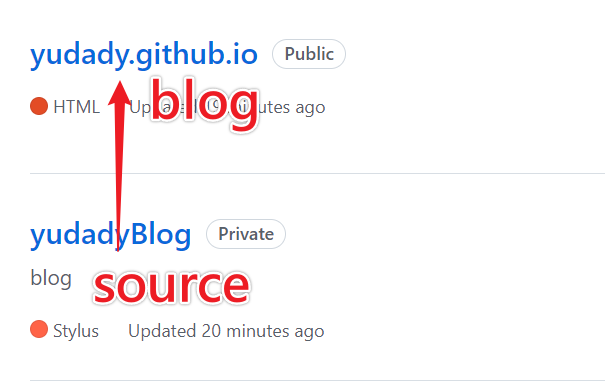

# 簡介

1.更新到新版: 注意 _config.yml 設定檔

2.auto deploy，使用 github action (path : .github/workflows/node.js.yml)

<!--more-->

# 內容

picture =

picture =

- git deploy: $ npm install hexo-deployer-git --save
- fix 圖片消失:  $ npm install hexo-renderer-marked --save
[hexo部落格中如何插入圖片](https://github.com/hexojs/hexo-renderer-marked)

# 參考資料

- [hexo](https://hexo.io/zh-tw/docs/commands.html)
