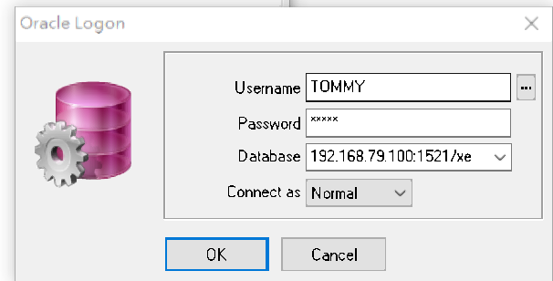
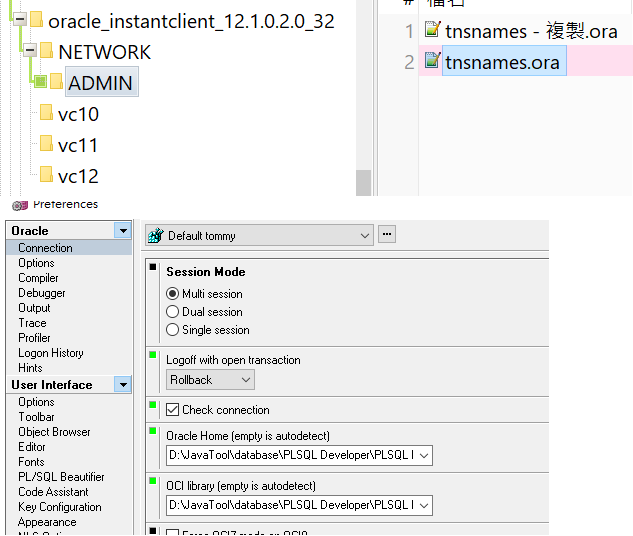
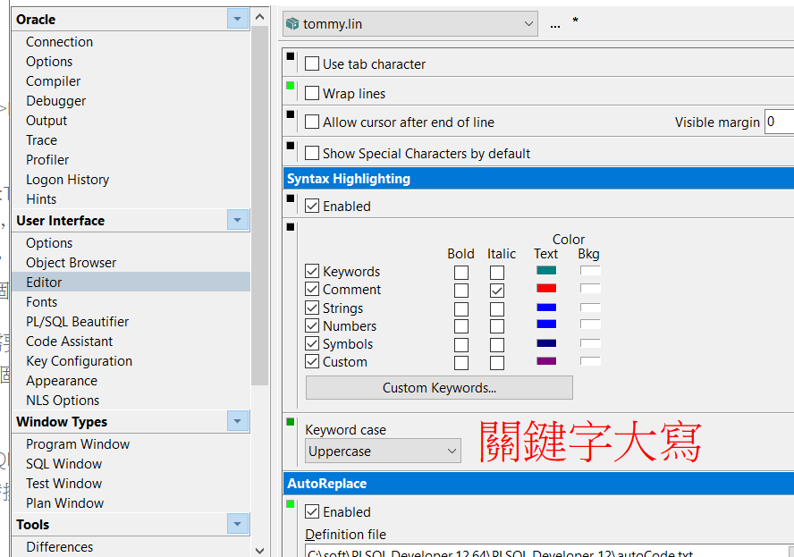
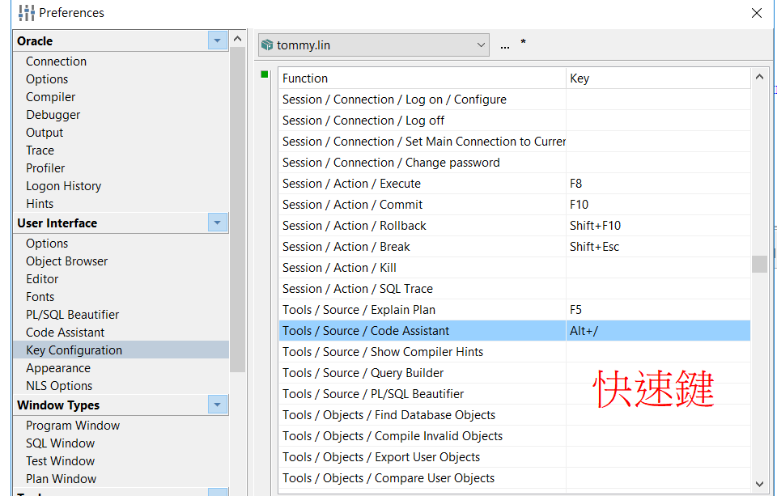
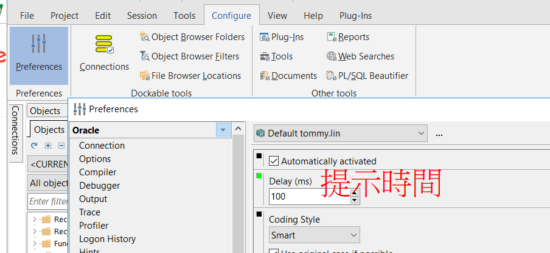

# 簡介

plsql

<!--more-->
# 內容

## 登入


> 192.168.79.100:1521/xe

## tnsnames.ora


> D:\JavaTool\database\PLSQL Developer\PLSQL Developer 9.0.0.1601\oracle_instantclient_12.1.0.2.0_32

> D:\JavaTool\database\PLSQL Developer\PLSQL Developer 9.0.0.1601\oracle_instantclient_12.1.0.2.0_32\oci.dll


```m
// SERVICE_NAME
DB1 =
  (DESCRIPTION =
    (ADDRESS_LIST =
    (ADDRESS = (PROTOCOL = TCP)(HOST = 10.xxx.xx.xx)(PORT = 1521))
  )
  (CONNECT_DATA =
    (SERVICE_NAME = sdb1)
  )
)


// SID
DB2 =
  (DESCRIPTION =
    (ADDRESS_LIST =
    (ADDRESS = (PROTOCOL = TCP)(HOST = 10.xxx.xx.xxx)(PORT = 1521))
  )
  (CONNECT_DATA =
    (SID =sdb2)
  )
)
```








## docker oracle

```docker
version: "3.5"
services:

  db:
    image: datagrip/oracle:11.2
    container_name: oracle11
    ports:
      - "1521:1521"
      - "8080:8080"
    volumes:
      - ./data:/u01/app/oracle
    restart: always

    
    
# https://hub.docker.com/r/datagrip/oracle
# docker run -d -p 8080:8080 -p 1521:1521 -v /my/oracle/data:/u01/app/oracle sath89/oracle-xe-11g
# OS users  =>  root/install  oracle/install
# DB users: SYS/oracle

# hostname: localhost
# port: 1521
# sid: xe
# username: system
# password: oracle

# SYS & SYSTEM:    oracle
```


# 參考資料


