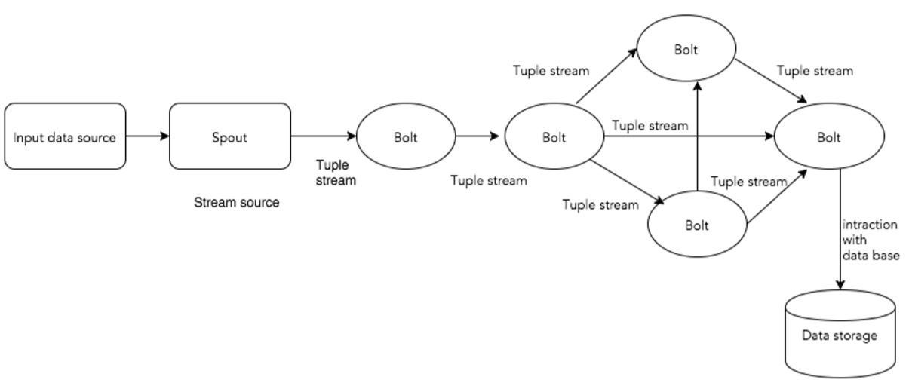
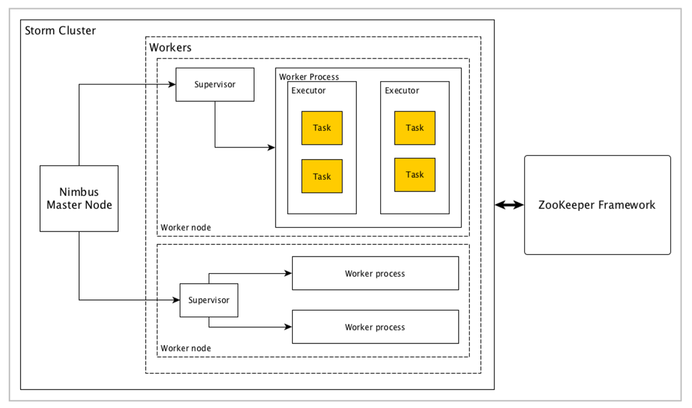
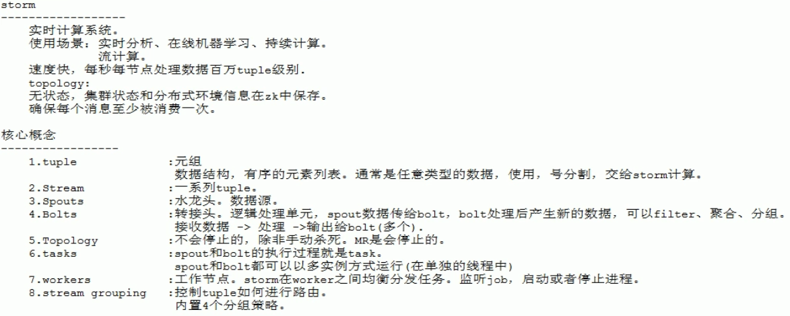
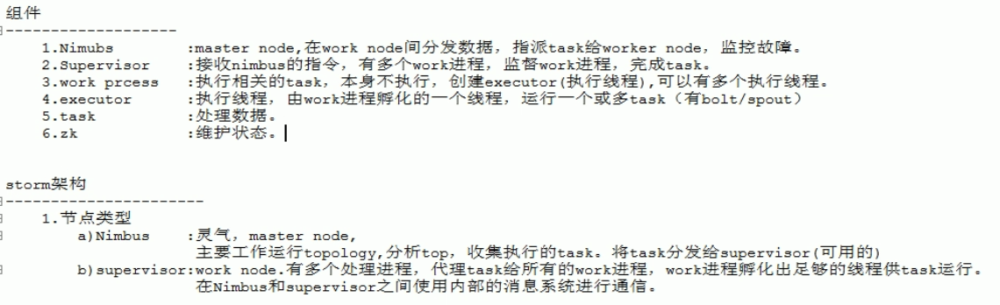
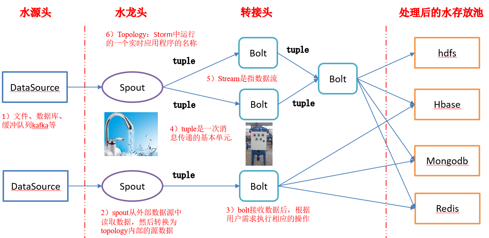
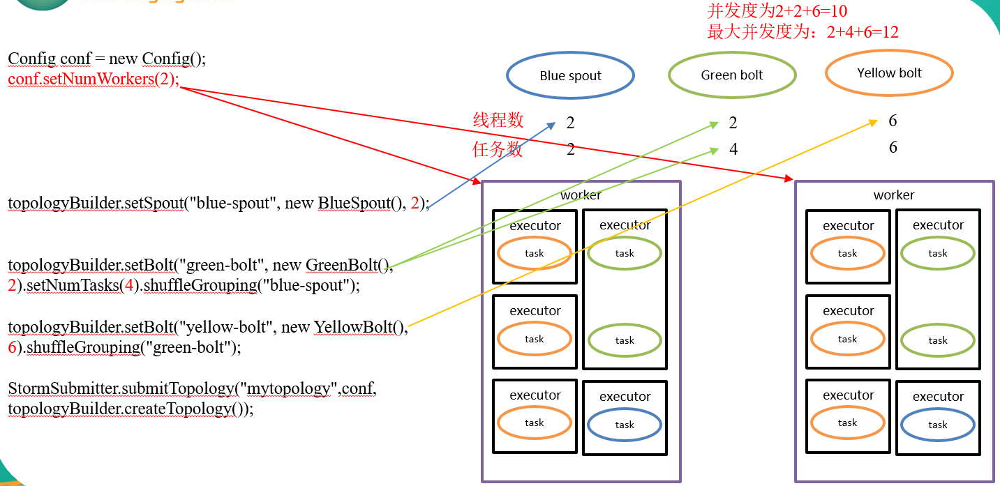

- Flume获取数据。
- Kafka临时保存数据。
- Strom计算数据。
- Redis是个内存数据库，用来保存数据。

# 簡介

> apache-storm-1.1.3


- Tuple : Tuple is the main data structure in Storm
- Stream : Stream is an unordered sequence of tuples
- Spouts : Source of stream
- Bolts : Bolts are logical processing units. 
- Topology : Spouts and bolts are connected together and they form a topology
- Tasks : a basic idea on spouts and bolts. 
- Workers : A topology runs in a distributed manner, on multiple worker nodes.
- Stream Grouping : Stream of data flows from spouts to bolts or from one bolt to another bolt. 
- Nimbus : Nimbus is a master node of Storm cluster
- Supervisor : The nodes that follow instructions given by the nimbus are called as Supervisors
- Worker process(JVMs) : A worker process will execute tasks related to a specific topology
- Executor : An executor is nothing but a single thread spawn by a worker process. 
- Task : A task performs actual data processing.


<!--more-->


# 內容

## diagram depicts the core concept of Apache Storm


## Apache Storm cluster is designed and its internal architecture







## Storm编程模型

## Storm核心组件

## Storm并发度案例



## storm.yaml
```s
########### These MUST be filled in for a storm configuration
storm.zookeeper.servers:
    - "hadoop101"
    - "hadoop102"
    - "hadoop103"
# 
nimbus.seeds: ["hadoop101", "hadoop102", "hadoop103"]

# storm.local.dir
storm.local.dir: "/opt/storm/date" 27  28 
# supervisor.slots.ports
supervisor.slots.ports:
    - 6700
    - 6701
    - 6702
    - 6703


```

## 啟動
```s
bin/storm nimbus &
bin/storm supervisor &
bin/storm ui &      (只需要啟動一台，http://hadoop101:8080/index.html  )
bin/storm logviewer &     (如果要在UI上面看到log，則需要起動)


```


## IRichSpout
> 讀取數據
```java
public class MySpout implements IRichSpout{
    private SpoutOutputCollector collector;

    @Override
    public void open(Map conf, TopologyContext context, SpoutOutputCollector collector) {
        this.collector = collector;
    }
    @Override
    public void nextTuple() {
        collector.emit(new Values(str));
    }

}
```
## IRichBolt
```java
public class WebLogBolt implements IRichBolt {
    private OutputCollector collector;
    @Override
    public void prepare(Map conf, TopologyContext context, OutputCollector collector) {
        this.collector = collector;
    }
    @Override
    public void execute(Tuple input) {
        // running
    }
    @Override
    public void declareOutputFields(OutputFieldsDeclarer declarer) {
        // next
    }
}
```


## depoly
### Example 1: Run the ExclamationTopology in local mode (LocalCluster)
> $ storm jar target/storm-starter-*.jar org.apache.storm.starter.ExclamationTopology -local

### Example 2: Run the RollingTopWords in remote/cluster mode,under the name "production-topology"
> $ storm jar target/storm-starter-*.jar org.apache.storm.starter.RollingTopWords production-topology


## parallelism並行度
> config 可以配置work process


# 參考資料
- [storm](http://storm.apache.org/)
- [Storm Kafka Integration](http://storm.apache.org/releases/1.2.2/storm-kafka-client.html)
- [Storm example](https://github.com/apache/storm)
