# 簡介
netty 最基本程序

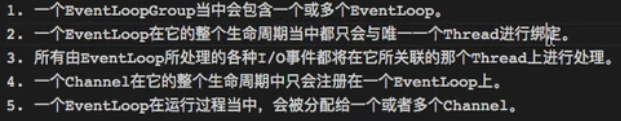

- 在Netty中，Channel的實現一定是線程安全
- 我們可以存放Channel引用，並且在需要得時候像遠程發送數據，不會出現多線程問題
- 不要將耗時任務放到EventLoop中執行，會使得IO卡住，可以使用業務線程池
    1. 在ChannelHander的回調方法自定義線程池
    2. pipeline.addLast("線程池","name", new Xxx());

<!--more-->
# 內容


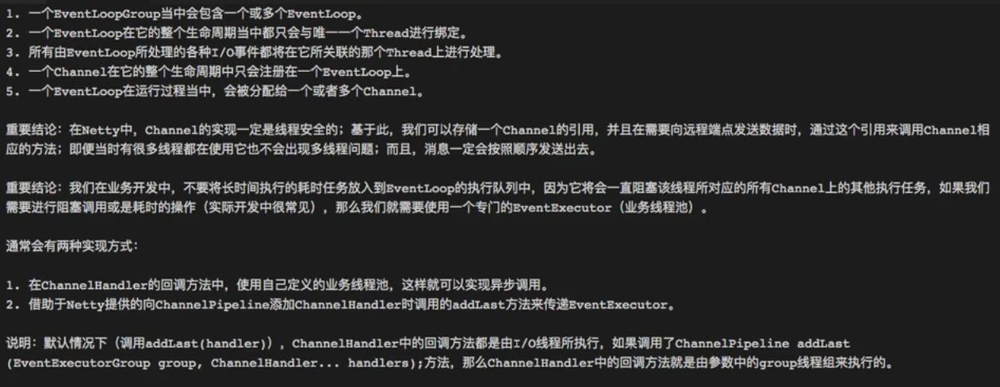

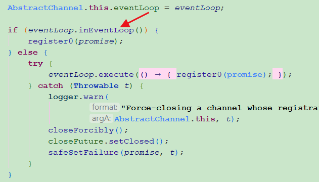


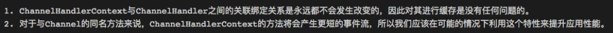


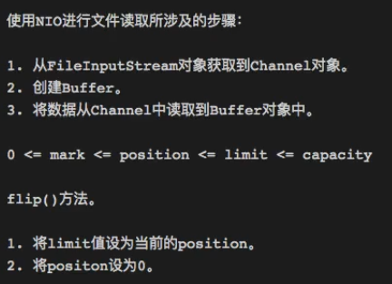
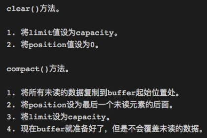

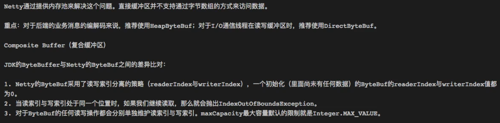
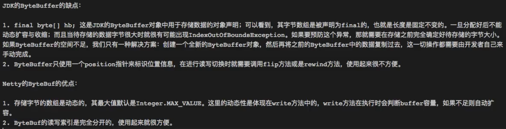
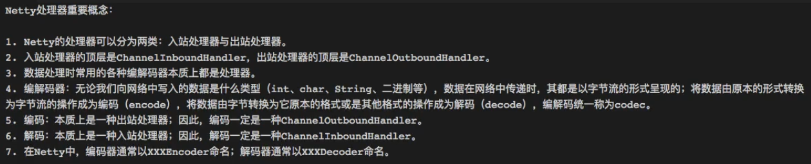


## 繼承圖
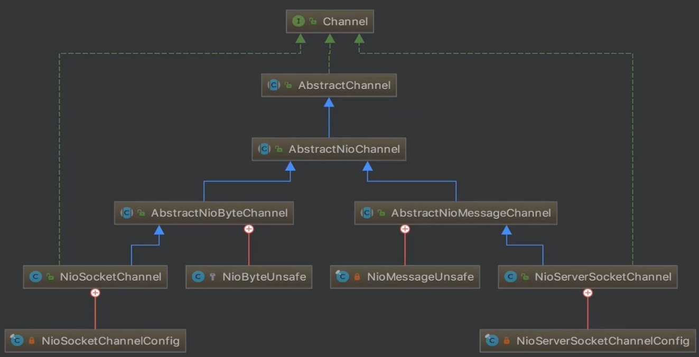
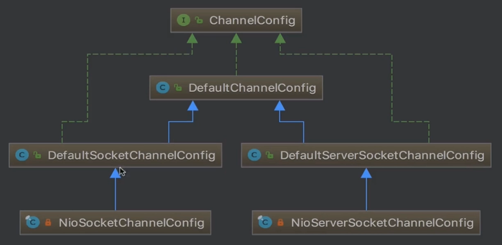
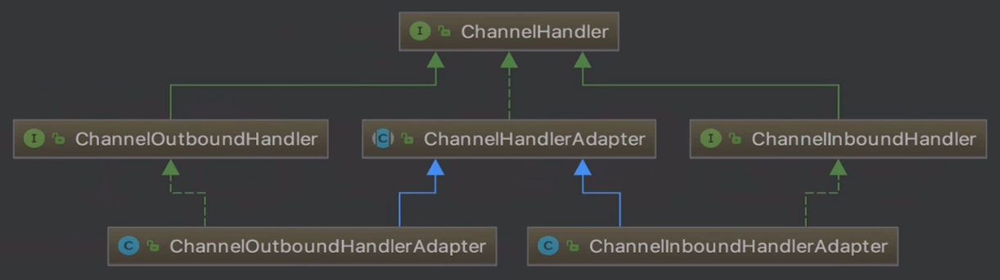

## server
```java
public class Netty01_Server {

    public static void main(String[] args) throws Exception {
        EventLoopGroup bossGroup = new NioEventLoopGroup();
        EventLoopGroup workerGroup = new NioEventLoopGroup();

        try {
            ServerBootstrap serverBootstrap = new ServerBootstrap();
            serverBootstrap
                    .group(bossGroup, workerGroup)
                    .channel(NioServerSocketChannel.class)
                    .childHandler(new MyChannelInitializer());

            ChannelFuture channelFuture = serverBootstrap.bind(8080).sync();
            channelFuture.channel().closeFuture().sync();
        } finally {
            bossGroup.shutdownGracefully();
            workerGroup.shutdownGracefully();
        }
    }
}

class MyChannelInitializer extends ChannelInitializer<SocketChannel> {

    @Override
    protected void initChannel(SocketChannel ch) throws Exception {
        ChannelPipeline pipeline = ch.pipeline();

        pipeline.addLast("HttpServerCodec", new HttpServerCodec());
        pipeline.addLast("MySimpleChannelInboundHandler", new MySimpleChannelInboundHandler());
    }
}

class MySimpleChannelInboundHandler extends SimpleChannelInboundHandler<HttpRequest> {

    @Override
    protected void channelRead0(ChannelHandlerContext ctx, HttpRequest httpRequest)
            throws Exception {

        ByteBuf content = Unpooled.copiedBuffer("Hello World", CharsetUtil.UTF_8);
        FullHttpResponse response =
                new DefaultFullHttpResponse(HttpVersion.HTTP_1_1, HttpResponseStatus.OK, content);
        response.headers().set(HttpHeaderNames.CONTENT_TYPE, "text/plain");
        response.headers().set(HttpHeaderNames.CONTENT_LENGTH, content.readableBytes());

        ctx.writeAndFlush(response);
        ctx.channel().close();
    }
}

```

## client
```java
public class Netty01_Client {

    public static void main(String[] args) throws Exception {
        EventLoopGroup eventLoopGroup = new NioEventLoopGroup();

        try {
            Bootstrap bootstrap = new Bootstrap();
            bootstrap
                    .group(eventLoopGroup)
                    .channel(NioSocketChannel.class)
                    .handler(new MyClientHandler());

            ChannelFuture channelFuture = bootstrap.connect("localhost", 8080).sync();
            channelFuture.channel().closeFuture().sync();
        } finally {
            eventLoopGroup.shutdownGracefully();
        }
    }
}

class MyClientInitializer extends ChannelInitializer<SocketChannel> {

    @Override
    protected void initChannel(SocketChannel ch) throws Exception {
        ChannelPipeline pipeline = ch.pipeline();
        pipeline.addLast("HttpServerCodec", new HttpServerCodec());
        pipeline.addLast(new MyClientHandler());
    }
}

class MyClientHandler extends SimpleChannelInboundHandler<String> {

    @Override
    protected void channelRead0(ChannelHandlerContext ctx, String msg) throws Exception {}
}

```


## netty 為何註冊0(NioServerSocketChannel,NioSocketChannel)
> 初始化完成設定為0，後來在fireEvent改變關心事件

```java
public abstract class SelectionKey
/**
 *   <li><p> The <i>ready set</i> identifies the operation categories for which
 *   the key's channel has been detected to be ready by the key's selector.
 *   The ready set is initialized to zero when the key is created; it may later
 *   be updated by the selector during a selection operation, but it cannot be
 *   updated directly. </p></li>
 */
```

## 一條SocketChannel 在某一時刻只會有一個readyOps()
```java
/**
 * {@link java.nio.channels.SelectionKey}
 */
public class Test01 {
    public static void main(String[] args) {
        System.out.println("OP_READ    : " + (1 << 0));
        System.out.println("OP_WRITE   : " + (1 << 2));
        System.out.println("OP_CONNECT : " + (1 << 3));
        System.out.println("OP_ACCEPT  : " + (1 << 4));
        System.out.println("================================================");
        int OP_READ = 1, OP_WRITE = 4, OP_CONNECT = 8, OP_ACCEPT = 16;
        System.out.println("readyOps() & OP_READ) != 0 :" + ((readyOps() & OP_READ) != 0));
        System.out.println("readyOps() & OP_WRITE) != 0 :" + ((readyOps() & OP_WRITE) != 0));
        System.out.println("readyOps() & OP_CONNECT) != 0 :" + ((readyOps() & OP_CONNECT) != 0));
        System.out.println("readyOps() & OP_ACCEPT) != 0 :" + ((readyOps() & OP_ACCEPT) != 0));
    }

    public static int readyOps() {
        return 4;
    }
}

================================================
OP_READ    : 1
OP_WRITE   : 4
OP_CONNECT : 8
OP_ACCEPT  : 16
================================================
readyOps() & OP_READ) != 0 :false
readyOps() & OP_WRITE) != 0 :true
readyOps() & OP_CONNECT) != 0 :false
readyOps() & OP_ACCEPT) != 0 :false

```

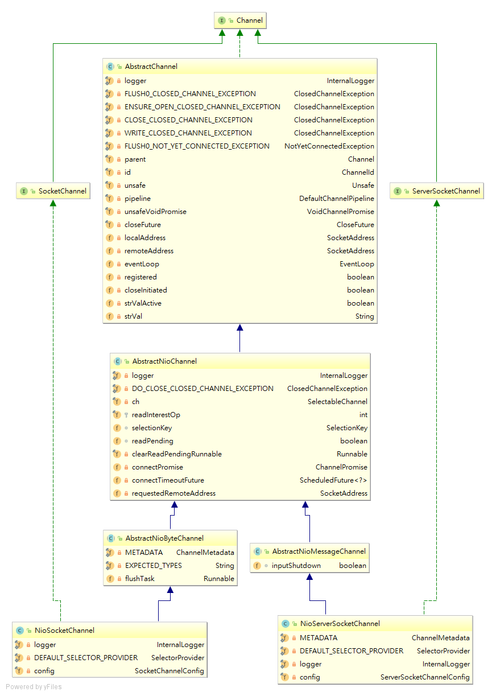


# 參考資料
- [一文理解Netty模型架构](https://juejin.im/post/5bea1d2e51882523d3163657)
- 


